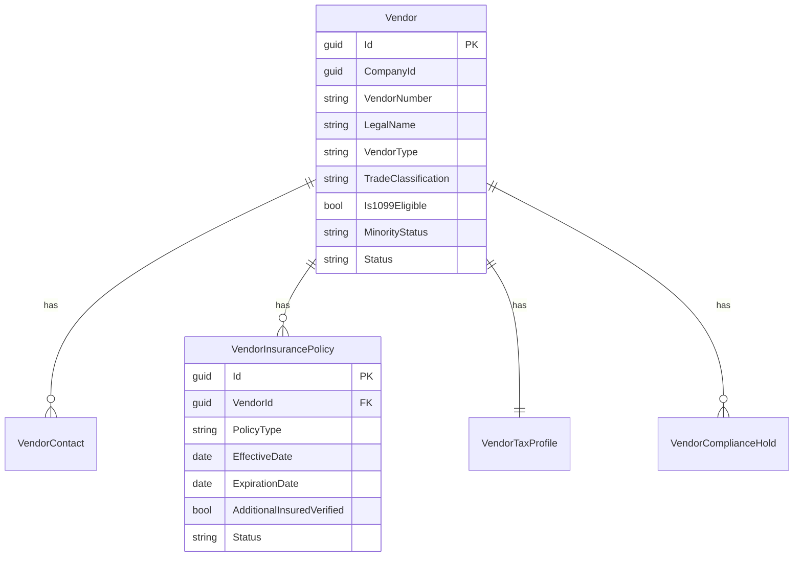
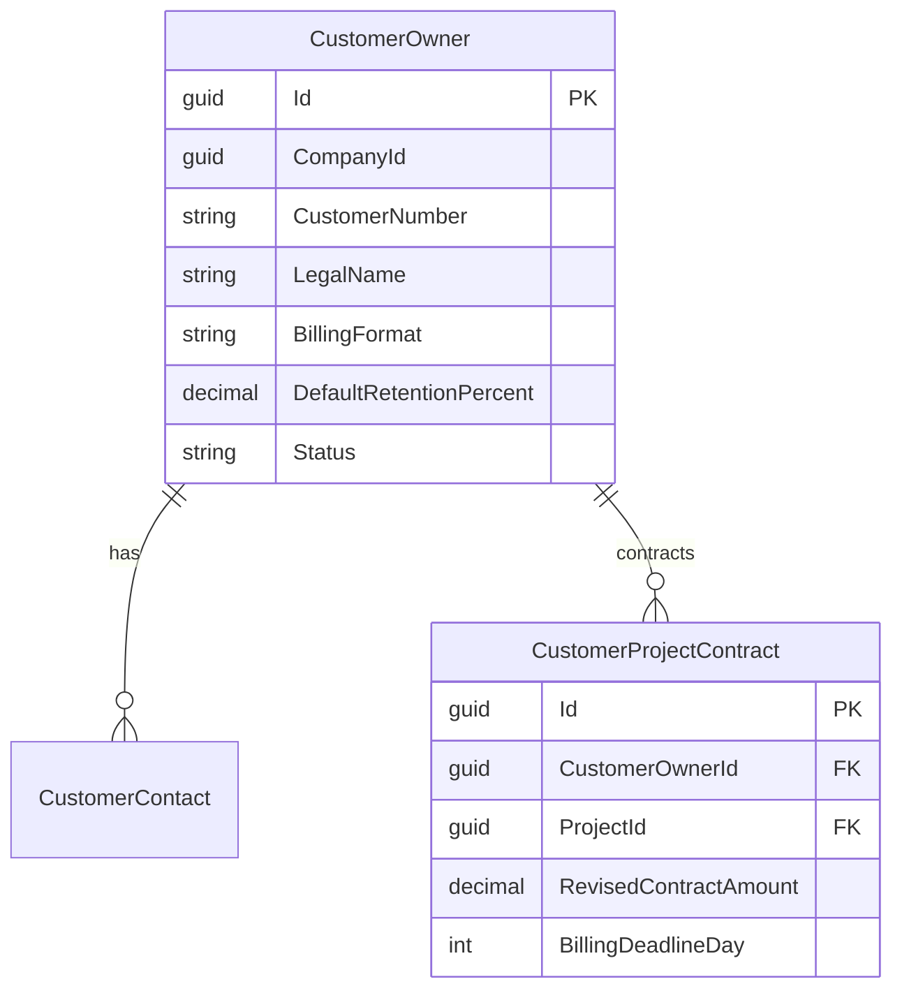
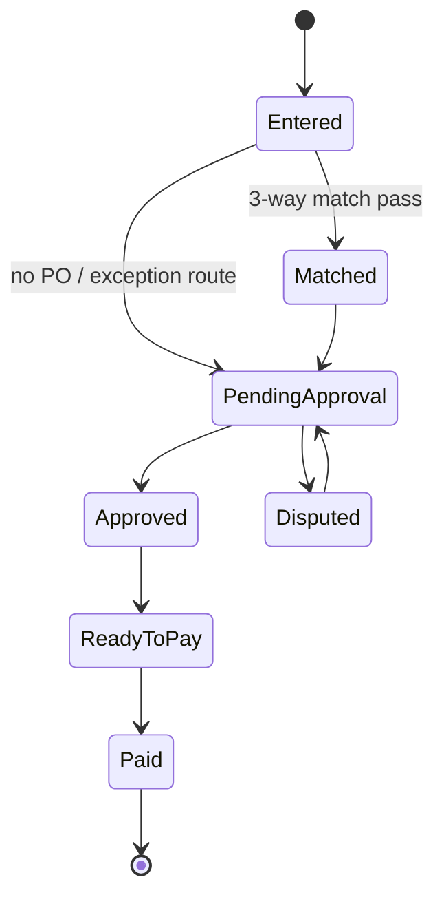
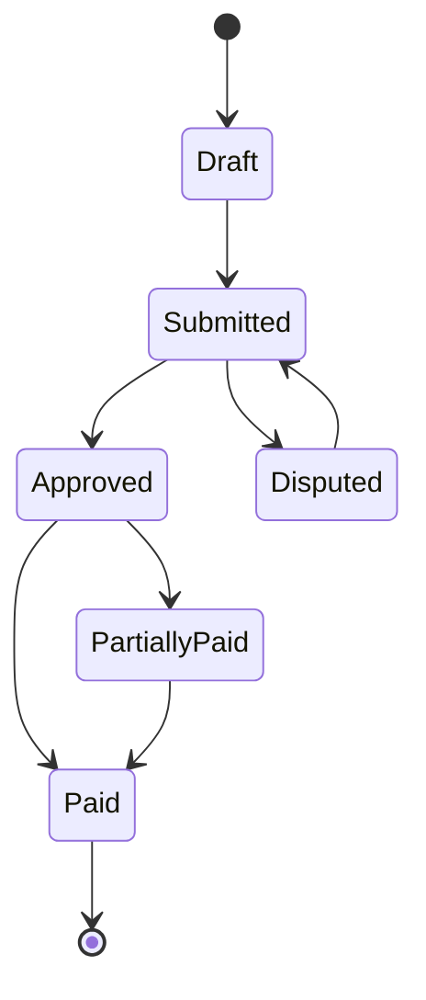
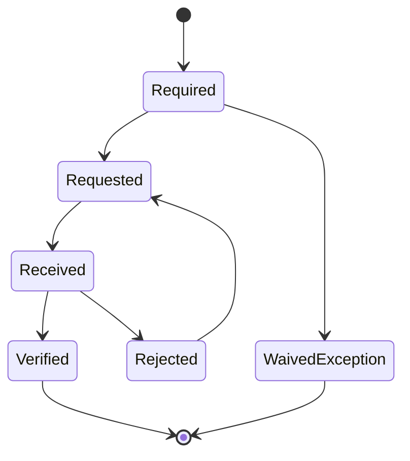

# AP/AR Foundation Spec

**Author:** Codex (for Pitbull team)  
**Date:** 2026-02-19  
**Status:** Ready for implementation planning  
**Target Modules:** `Pitbull.Billing` (new implementation), `Pitbull.Contracts`, `Pitbull.Projects`, `Pitbull.Core`, `Pitbull.TimeTracking`  
**Primary Domain References:** `docs/roles/AP-CLERK.md`, `docs/roles/AR-CLERK.md`

---

## 0) Purpose
Build a finance-grade AP/AR foundation so Pitbull can support daily cash operations for mid-size GCs, not just project operations. This spec defines the core masters, subledgers, retention model, lien waiver controls, integration points, and API contracts.

This is a design spec, not code.

---

## 1) Vendor Master Entity (Construction-Specific)

## 1.1 Objectives
1. Support AP workflows, compliance gating, and 1099 readiness.
2. Normalize subcontractor/vendor identity (instead of ad hoc string fields).
3. Provide configuration and state needed for payment holds and audit.

## 1.2 Entities
All entities inherit `BaseEntity`; company-scoped entities implement `ICompanyScoped`.

### `Vendor` (company-scoped)
- `CompanyId: Guid`
- `VendorNumber: string` (unique per company)
- `LegalName: string`
- `DbaName: string?`
- `Status: VendorStatus` (`Active`, `OnHold`, `Inactive`)
- `VendorType: VendorType` (`Subcontractor`, `MaterialSupplier`, `EquipmentLessor`, `ProfessionalService`, `Other`)
- `TradeClassification: string?` (CSI/trade tag, e.g. concrete, electrical)
- `TaxIdEncrypted: string?`
- `TaxClassification: TaxClassification` (W-9 basis)
- `Is1099Eligible: bool`
- `DefaultPaymentTerms: string` (`Net30`, etc.)
- `DefaultCostCodeId: Guid?`
- `DefaultGlAccountCode: string?`
- `MinorityStatus: MinorityStatus` (`None`, `MBE`, `WBE`, `DBE`, `SBE`, `Veteran`, `Other`)
- `MinorityCertificationNumber: string?`
- `MinorityCertificationExpiry: DateOnly?`
- `RemitAddressLine1/2, City, State, Zip, Country`
- `Notes: string?`

### `VendorContact` (company-scoped)
- `VendorId`, `Name`, `Title`, `Email`, `Phone`, `IsPrimary`

### `VendorInsurancePolicy` (company-scoped)
- `VendorId`
- `PolicyType` (`GeneralLiability`, `WorkersComp`, `Auto`, `Umbrella`, `Other`)
- `CarrierName`, `PolicyNumber`
- `EffectiveDate`, `ExpirationDate`
- `CoverageAmount`
- `AdditionalInsuredVerified: bool`
- `CertificateFileId: Guid?`
- `Status` (`Valid`, `ExpiringSoon`, `Expired`, `Missing`)

### `VendorTaxProfile` (company-scoped)
- `VendorId`
- `W9OnFile: bool`
- `W9ReceivedDate: DateOnly?`
- `W9FileId: Guid?`
- `TinMatchStatus` (`Unknown`, `Matched`, `Mismatch`, `Pending`)
- `BackupWithholdingRequired: bool`

### `VendorComplianceHold` (company-scoped)
- `VendorId`
- `HoldType` (`InsuranceExpired`, `MissingW9`, `MissingLienWaiver`, `Manual`, `Legal`)
- `Reason`, `StartAt`, `EndAt?`, `ReleasedBy?`, `ReleasedAt?`
- `IsBlockingPayments: bool`

## 1.3 Vendor Entity Diagram

## 1.4 Core rules
1. Payment cannot progress to `ReadyToPay` if vendor has active blocking hold.
2. `Is1099Eligible` is derived from tax classification but can be overridden with audit reason.
3. Insurance expiration auto-generates holds according to company settings.

---

## 2) Customer / Owner Master Entity

## 2.1 Objectives
1. Normalize owner/customer identity for AR.
2. Capture construction-specific billing terms and portal requirements.
3. Support retention receivable and collections workflows.

## 2.2 Entities
### `CustomerOwner` (company-scoped)
- `CompanyId`
- `CustomerNumber: string` (unique per company)
- `LegalName`, `DisplayName`
- `Status` (`Active`, `CreditHold`, `Inactive`)
- `BillingEmail`, `BillingPhone`
- `BillingAddress*`
- `PaymentTerms: string`
- `DefaultRetentionPercent: decimal`
- `BillingFormat: BillingFormat` (`AIA_G702_G703`, `Custom`, `PortalForm`)
- `PortalProvider: string?` (e.g. Textura, Procore, GCPay)
- `PortalUrl: string?`
- `PortalInstructions: string?`
- `RequiresNotarizedApplication: bool`
- `RequiresSubLienWaivers: bool`
- `ExpectedDaysToPay: int?`

### `CustomerProjectContract` (company-scoped)
- `CustomerOwnerId`, `ProjectId`
- `OriginalContractAmount`
- `ApprovedChangeOrderAmount`
- `RevisedContractAmount`
- `RetentionTermsJson`
- `BillingDeadlineDay`
- `SubmissionRequirementsJson`

### `CustomerContact`
- `CustomerOwnerId`, `Name`, `Role`, `Email`, `Phone`, `IsPrimary`

## 2.3 Customer Diagram

---

## 3) AP Subledger Design (Invoice -> Approval -> Payment, 3-Way Match)

## 3.1 Scope
Procure-to-pay with controls: invoice intake, PO/receipt matching, approval routing, payment execution, and posting.

## 3.2 AP Entities
### `PurchaseOrder`
- `CompanyId`, `ProjectId`, `VendorId`
- `PONumber`, `Status` (`Draft`, `Approved`, `PartiallyReceived`, `Closed`, `Voided`)
- `OrderDate`, `RequiredDate`
- `Subtotal`, `TaxAmount`, `TotalAmount`

### `PurchaseOrderLine`
- `PurchaseOrderId`, `LineNumber`, `Description`
- `CostCodeId`, `PhaseId?`
- `OrderedQty`, `UnitPrice`, `LineAmount`
- `ReceivedQty`, `InvoicedQty`

### `POReceipt`
- `PurchaseOrderId`, `ReceiptNumber`, `ReceiptDate`
- `ReceivedBy`, `Notes`

### `POReceiptLine`
- `POReceiptId`, `PurchaseOrderLineId`, `ReceivedQty`

### `ApInvoice`
- `CompanyId`, `VendorId`, `ProjectId?`, `PurchaseOrderId?`
- `InvoiceNumber`, `InvoiceDate`, `DueDate`
- `Status` (`Entered`, `Matched`, `PendingApproval`, `Approved`, `ReadyToPay`, `Paid`, `Voided`, `Disputed`)
- `Subtotal`, `TaxAmount`, `TotalAmount`, `BalanceAmount`
- `WorkflowState`, `SourceType` (`Manual`, `Upload`, `EDI`, `Agent`)

### `ApInvoiceLine`
- `ApInvoiceId`, `LineNumber`, `Description`
- `CostCodeId`, `PhaseId?`, `GlAccountCode?`
- `Qty`, `UnitPrice`, `LineAmount`
- `MatchedPoLineId?`, `MatchedReceiptLineId?`

### `ApMatchResult`
- `ApInvoiceId`
- `MatchStatus` (`FullMatch`, `WithinTolerance`, `Exception`)
- `QuantityVariancePct`, `PriceVariancePct`, `AmountVariance`
- `AutoMatchedAt`, `MatchedBy` (`UserId/AgentId`)

### `ApApprovalStep`
- `ApInvoiceId`, `StepOrder`, `ApproverRole`, `ApproverUserId?`
- `Status`, `DecisionAt`, `DecisionComment`

### `ApPaymentRun`
- `CompanyId`, `RunNumber`, `ScheduledPaymentDate`
- `Status` (`Draft`, `Approved`, `Executing`, `Completed`, `Cancelled`)
- `TotalAmount`, `PaymentMethodMixJson`

### `ApPayment`
- `ApPaymentRunId`, `VendorId`, `PaymentDate`
- `Method` (`Check`, `ACH`, `Wire`)
- `ReferenceNumber`, `GrossAmount`, `Status`

### `ApPaymentApplication`
- `ApPaymentId`, `ApInvoiceId`, `AppliedAmount`, `DiscountTaken`, `RetainageApplied`

## 3.3 AP workflow

### 3-way match rules
1. Match key: `Vendor + PO + line descriptors (+ qty/amount tolerance)`.
2. Full pass requires PO exists, receipt quantity sufficient, and variance <= configured tolerance.
3. Exception routes to approval with explicit variance reasons.

## 3.4 AP APIs
- `POST /api/vendors`
- `GET /api/vendors`
- `GET /api/vendors/{id}`
- `PUT /api/vendors/{id}`
- `POST /api/vendors/{id}/holds`
- `POST /api/purchase-orders`
- `POST /api/purchase-orders/{id}/approve`
- `POST /api/purchase-orders/{id}/receipts`
- `POST /api/ap/invoices`
- `POST /api/ap/invoices/{id}/match`
- `POST /api/ap/invoices/{id}/submit-approval`
- `POST /api/ap/invoices/{id}/approve`
- `POST /api/ap/invoices/{id}/reject`
- `POST /api/ap/payment-runs`
- `POST /api/ap/payment-runs/{id}/execute`
- `GET /api/ap/aging`

---

## 4) AR Subledger Design (Billing -> Cash Application -> Aging)

## 4.1 Scope
Owner billing ledger, cash receipts, receipt application, retention receivable, and collection visibility.

## 4.2 AR Entities
### `ArBilling`
- `CompanyId`, `ProjectId`, `CustomerOwnerId`
- `BillingNumber`, `BillingDate`, `PeriodThrough`
- `SourceType` (`PaymentApplication`, `TandM`, `Manual`)
- `Status` (`Draft`, `Submitted`, `Approved`, `PartiallyPaid`, `Paid`, `Disputed`, `Voided`)
- `GrossAmount`, `RetainageWithheld`, `NetDue`
- `DueDate`, `SubmittedAt`, `ApprovedAt`

### `ArBillingLine`
- `ArBillingId`, `LineNumber`, `Description`
- `SovLineItemId?`, `CostCodeId?`
- `Amount`, `RetainageAmount`

### `ArCashReceipt`
- `CompanyId`, `CustomerOwnerId`
- `ReceiptNumber`, `ReceiptDate`
- `Method`, `ReferenceNumber`
- `GrossAmount`, `UnappliedAmount`

### `ArCashApplication`
- `ArCashReceiptId`, `ArBillingId`
- `AppliedAmount`, `RetainageReleaseApplied`, `DiscountTaken`

### `ArCollectionActivity`
- `ArBillingId`, `ContactDate`, `Method`, `ContactName`, `Outcome`, `NextFollowUpDate`

## 4.3 AR workflow

## 4.4 Aging design
Standard aging buckets for AP/AR report consistency:
- `Current` (0)
- `1-30`
- `31-60`
- `61-90`
- `90+`

Aging computed on open balance by due date, with project/customer drill-down and retention split.

## 4.5 AR APIs
- `POST /api/customers`
- `GET /api/customers`
- `GET /api/customers/{id}`
- `PUT /api/customers/{id}`
- `POST /api/ar/billings`
- `GET /api/ar/billings`
- `POST /api/ar/billings/{id}/submit`
- `POST /api/ar/billings/{id}/approve`
- `POST /api/ar/cash-receipts`
- `POST /api/ar/cash-receipts/{id}/apply`
- `GET /api/ar/aging`
- `POST /api/ar/billings/{id}/collections`

---

## 5) Retention Tracking (Payable + Receivable)

## 5.1 Objectives
Track AR and AP retention as separate ledgers, not inferred values, with release workflows and audit trace.

## 5.2 Entities
### `RetentionLedger`
- `CompanyId`, `ProjectId`
- `CounterpartyType` (`OwnerReceivable`, `SubcontractorPayable`)
- `CounterpartyId` (`CustomerOwnerId` or `VendorId`)
- `SourceDocumentType`, `SourceDocumentId`
- `OriginalRetentionAmount`
- `ReleasedAmount`
- `BalanceAmount`
- `ExpectedReleaseDate`
- `Status` (`Open`, `EligibleForRelease`, `PartiallyReleased`, `Closed`, `Disputed`)

### `RetentionReleaseRequest`
- `RetentionLedgerId`
- `RequestedAmount`, `RequestedDate`
- `PrerequisiteChecklistJson`
- `Status` (`Draft`, `Submitted`, `Approved`, `Rejected`, `Paid`)

## 5.3 Rules
1. AP retention release requires lien waiver prerequisites if configured.
2. AR retention release requires closeout checklist completion as configured per owner contract.
3. Retention balances must reconcile to subledger detail and source documents.

---

## 6) Lien Waiver State Machine

## 6.1 Entities
### `LienWaiver`
- `CompanyId`, `ProjectId`, `VendorId`, `RelatedPaymentId?`
- `WaiverType` (`ConditionalProgress`, `UnconditionalProgress`, `ConditionalFinal`, `UnconditionalFinal`)
- `JurisdictionState`
- `WaiverThroughDate`
- `AmountCovered`
- `Status` (`Required`, `Requested`, `Received`, `Verified`, `Rejected`, `WaivedException`)
- `DocumentFileId?`, `VerifiedBy?`, `VerifiedAt?`

### `LienWaiverRequirement`
- `CompanyId`, `ContractId/SubcontractId`, `RuleJson`
- controls when waiver is required and gating strictness

## 6.2 State machine

## 6.3 Gating behavior
- AP payment cannot transition `Approved -> Paid` when required waiver is not `Verified` unless authorized exception recorded.
- Exception requires elevated approval and mandatory reason code.

---

## 7) Integration with Existing Modules

## 7.1 Projects (`Pitbull.Projects`)
- Link AP/AR documents to `ProjectId` for job-cost rollups and project cash forecasting.
- Reuse existing cost code/phase references.

## 7.2 Contracts (`Pitbull.Contracts`)
- `Subcontract` should reference normalized `VendorId` (retain backward compatibility field during migration).
- `PaymentApplication` can become upstream source for AP sub payables and AR owner billings.
- `ChangeOrder` approved amount auto-adjusts both subcontract commitments and owner contract billing base.

## 7.3 Payment Apps (`PaymentApplicationsController`)
- When sub pay app is approved, create AP payable candidate and update AP retention ledger.
- When owner pay app is approved/submitted, create AR billing entry and update AR retention ledger.

## 7.4 Change Orders (`ChangeOrdersController`)
- Approved CO triggers revised contract/subcontract values and future billing baselines.
- Pending CO tracked separately (forecast-only, no ledger posting).

## 7.5 TimeTracking / Reports
- AP/AR/Retention postings should feed finance reporting (AR/AP aging, retention summaries, cash forecast).
- Keep current labor/equipment reports intact; add financial report endpoints in `Pitbull.Reports`.

## 7.6 Data migration strategy
1. Add masters and ledgers first without breaking existing contracts/payment-app flows.
2. Backfill `Vendor` from `Subcontract.SubcontractorName` and mark confidence/audit trail.
3. Introduce dual-write during transition; cut over reads once parity validated.

---

## 8) AI Agent Opportunities

## 8.1 AP intelligence
1. Invoice OCR + line extraction -> suggested `ApInvoice` draft.
2. 3-way auto-match with confidence score and exception reasoning.
3. Duplicate invoice detection (`vendor + invoice_number + amount` exact/fuzzy).
4. Compliance gap detection (insurance expiry, missing W-9, missing waiver) with auto-hold suggestions.

## 8.2 AR intelligence
1. Predict collection date from owner payment history and project characteristics.
2. Auto-match receipts to open billings using remittance text + amount clustering.
3. Prioritize collections queue by amount, aging, and lien deadline risk.

## 8.3 Agent governance requirements
- AI writes must use policy gates and immutable audit (`ActorType=Agent`, correlation IDs, confidence, reason).
- High-impact actions (payment release, waiver exceptions) require human approval.

---

## API Design Notes

## Auth / security
- All endpoints require `[Authorize]`.
- Role scopes: `AP_CLERK`, `AR_CLERK`, `CONTROLLER`, `PM`, `ADMIN`.
- Enforce tenant/company scope by RLS + `X-Company-Id` context.

## Response pattern
- List endpoints return `PagedResult<T>`.
- Mutations return DTO + status metadata (`workflowState`, `warnings[]`, `blockingRules[]`).

## Idempotency
- Payment run execution, cash application import, and agent-originated matching endpoints should support idempotency keys.

---

## Implementation Phases

1. **Phase 1: Masters + basic ledgers**
- Vendor/customer masters, AP/AR core entities, read/write APIs, basic aging.

2. **Phase 2: Matching + approvals + retention**
- 3-way match engine, approval workflows, retention ledgers and release requests.

3. **Phase 3: Lien waiver + integration hardening**
- Lien state machine, payment gating, full Contracts/PaymentApps/CO integration.

4. **Phase 4: AI assist and optimization**
- Auto-match, prediction, compliance alerting, supervised agent actions.

---

## Acceptance Criteria

1. AP clerk can complete invoice-to-payment flow with 3-way match and exception routing.
2. AR clerk can complete billing-to-cash-application flow with aging visibility.
3. Retention payable/receivable balances are explicit, reconciled, and reportable.
4. Lien waiver gating blocks non-compliant payments by policy.
5. Contracts/payment apps/change orders feed AP/AR ledgers without manual re-entry.
6. AI suggestions are available for matching and risk flags, with human oversight.

