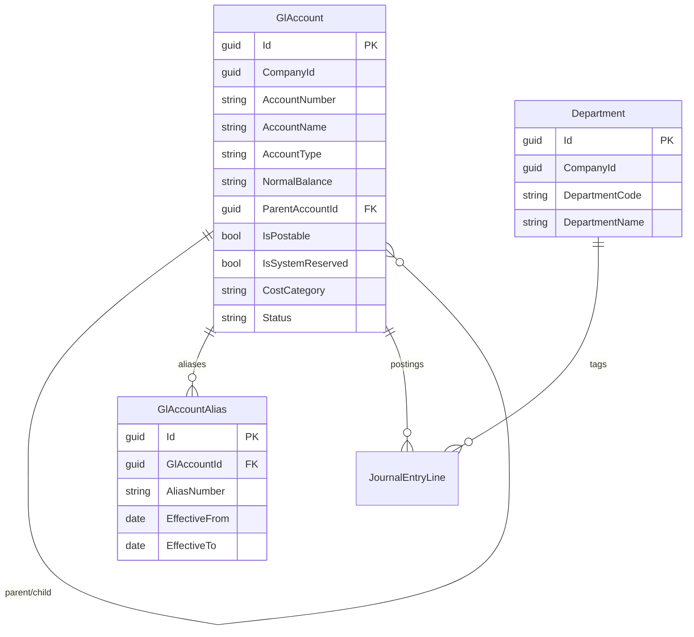
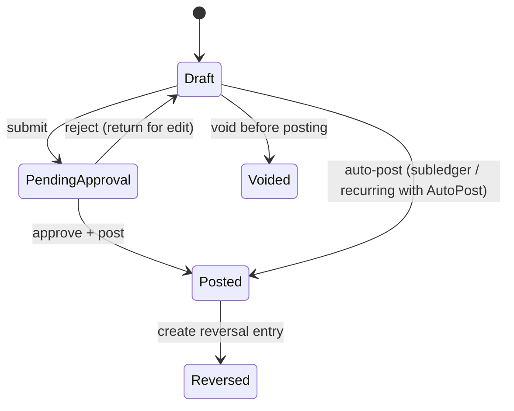
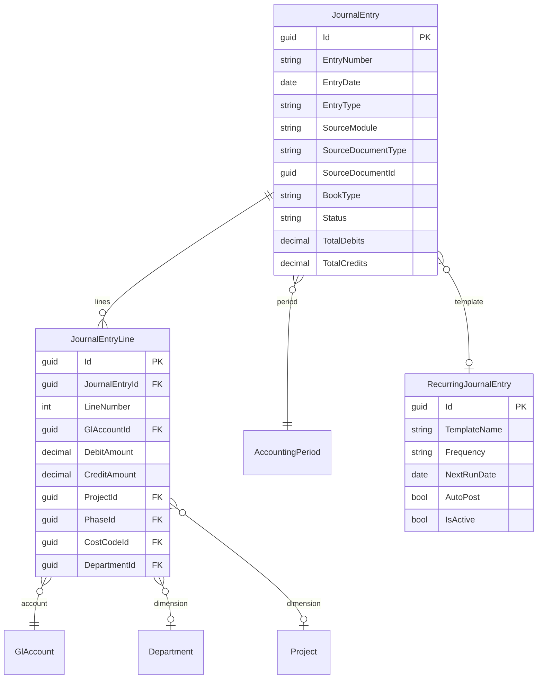
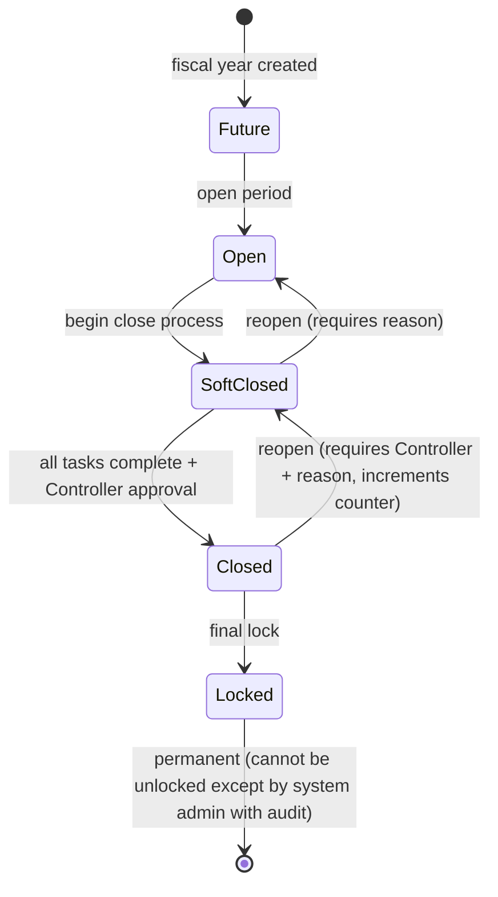
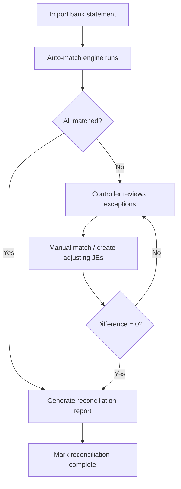
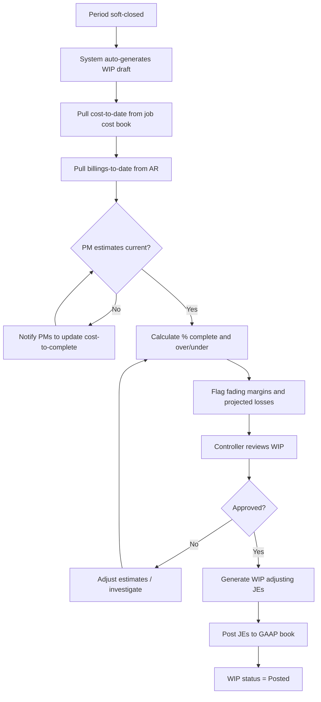

# General Ledger & Accounting Module — Design Spec

**Author:** Codex (for Pitbull team)
**Date:** 2026-02-19
**Status:** Design — ready for architecture review
**Target Module:** `Pitbull.Accounting` (new)
**Dependencies:** `Pitbull.Core`, `Pitbull.Contracts`, `Pitbull.TimeTracking`, `Pitbull.Billing` (AP/AR), `Pitbull.Projects`
**Domain References:** `docs/roles/CONTROLLER-CFO.md`, `docs/plans/AP-AR-FOUNDATION-SPEC.md`, `docs/PRODUCT-REVIEW-CODEX.md`

---

## Table of Contents

1. [Purpose & Strategic Context](#1-purpose--strategic-context)
2. [Chart of Accounts](#2-chart-of-accounts)
3. [Journal Entry & Posting Engine](#3-journal-entry--posting-engine)
4. [Accounting Periods](#4-accounting-periods)
5. [Dual-Book Architecture](#5-dual-book-architecture)
6. [Financial Statement Generation](#6-financial-statement-generation)
7. [Bank Reconciliation](#7-bank-reconciliation)
8. [Module Integration (Transaction Sources)](#8-module-integration-transaction-sources)
9. [WIP Schedule & Over/Under Billing](#9-wip-schedule--overunder-billing)
10. [AI Agent Opportunities](#10-ai-agent-opportunities)
11. [Predictive Features](#11-predictive-features)
12. [API Surface](#12-api-surface)
13. [Implementation Phases](#13-implementation-phases)
14. [Acceptance Criteria](#14-acceptance-criteria)

---

## 1) Purpose & Strategic Context

### Why this module exists

The Codex product review identified the absence of a general ledger as the single biggest blocker preventing CFO/Controller adoption:

> "If Pitbull can produce trusted WIP/over-under/close outputs with full source traceability and materially reduce close effort, CFOs will sponsor replacement even if some edge features lag."

Every transaction in Pitbull — a timecard, an AP invoice, a change order, a billing — eventually must post to the GL. Without this module, Pitbull is a strong PM + field operations platform. With it, Pitbull becomes a financial system of record.

### Design principles

1. **Single transaction, dual view.** Every posting simultaneously records to GAAP financial books AND job cost books. No reconciliation detective work.
2. **No orphan transactions.** Every GL line traces to a source module + source document. Manual JEs require supporting documentation.
3. **Debits must equal credits.** The system enforces balanced entries at the database level.
4. **Periods are sacred.** Once closed, a period cannot accept postings without Controller override + audit trail.
5. **Controller is the gatekeeper.** AI can draft, suggest, and automate — but the Controller approves all material entries and period-end actions.

### Existing foundation

The `PaymentApplicationBookEntry` entity in `Pitbull.Contracts` already implements dual-book tracking with `AccountingBookType` (`GAAP`, `BonusJobCost`). This spec generalizes that pattern into a full posting engine that all modules feed into.

---

## 2) Chart of Accounts

### 2.1 Objectives

1. Provide a flexible, construction-standard account structure that supports GAAP reporting and job costing.
2. Support multi-dimensional posting (account + department + project) without requiring separate accounts per project.
3. Allow account aliasing and restructuring without losing historical drill-down.
4. Enforce account-type rules (normal balance, posting restrictions, system-reserved accounts).

### 2.2 Entities

All entities inherit `BaseEntity` and implement `ICompanyScoped`.

#### `GlAccount`

| Field | Type | Description |
|-------|------|-------------|
| `CompanyId` | `Guid` | Company scope |
| `AccountNumber` | `string` | Unique per company (e.g., "1100") |
| `AccountName` | `string` | Display name (e.g., "Accounts Receivable") |
| `AccountType` | `GlAccountType` | `Asset`, `Liability`, `Equity`, `Revenue`, `CostOfSales`, `Overhead`, `OtherIncome`, `OtherExpense` |
| `AccountSubType` | `string?` | Freeform classification (e.g., "Current Asset", "Long-term Debt") |
| `NormalBalance` | `BalanceDirection` | `Debit` or `Credit` — derived from type but overridable |
| `ParentAccountId` | `Guid?` | Self-referencing FK for sub-account hierarchy |
| `Level` | `int` | Depth in hierarchy (0 = top-level) |
| `IsSubAccount` | `bool` | Computed: `ParentAccountId != null` |
| `IsPostable` | `bool` | If false, account is a summary/header only — no direct postings allowed |
| `IsSystemReserved` | `bool` | System-managed accounts (retained earnings, suspense) cannot be deleted |
| `IsCashAccount` | `bool` | Marks accounts eligible for bank reconciliation |
| `IsBankAccount` | `bool` | Has linked `BankAccount` entity |
| `CostCategory` | `CostCategory?` | For COS accounts: `Labor`, `Material`, `Subcontractor`, `Equipment`, `Other` |
| `DefaultDepartmentId` | `Guid?` | Optional default dimension |
| `Status` | `AccountStatus` | `Active`, `Inactive`, `Frozen` (frozen = visible in reports but no new postings) |
| `Description` | `string?` | Usage notes for staff |
| `OpeningBalance` | `decimal` | Migration / opening balance at system adoption |
| `OpeningBalanceDate` | `DateOnly?` | Effective date of opening balance |

#### `GlAccountAlias`

Supports restructuring without history loss.

| Field | Type | Description |
|-------|------|-------------|
| `GlAccountId` | `Guid` | Current canonical account |
| `AliasNumber` | `string` | Former or alternate account number |
| `AliasName` | `string?` | Former name |
| `EffectiveFrom` | `DateOnly` | When this alias became valid |
| `EffectiveTo` | `DateOnly?` | When this alias expired (null = current) |

#### `Department`

| Field | Type | Description |
|-------|------|-------------|
| `CompanyId` | `Guid` | Company scope |
| `DepartmentCode` | `string` | Short code (e.g., "ADMIN", "FIELD") |
| `DepartmentName` | `string` | Display name |
| `IsActive` | `bool` | Active/inactive |

### 2.3 Account Type Rules

| Account Type | Normal Balance | Debit Increases? | Typical Range |
|-------------|---------------|------------------|---------------|
| Asset | Debit | Yes | 1000-1999 |
| Liability | Credit | No | 2000-2999 |
| Equity | Credit | No | 3000-3999 |
| Revenue | Credit | No | 4000-4999 |
| Cost of Sales | Debit | Yes | 5000-5999 |
| Overhead | Debit | Yes | 6000-6999 |
| Other Income | Credit | No | 7000-7499 |
| Other Expense | Debit | Yes | 7500-7999 |

### 2.4 Construction-Standard COA Template

The system ships a default COA template matching the structure in `CONTROLLER-CFO.md` (section 3). On company setup, the template seeds all accounts. The Controller can then customize.

```
1000-1999  Assets
  1000  Cash & Equivalents
  1010  Operating Checking
  1020  Payroll Checking
  1100  Accounts Receivable - Trade
  1110  Accounts Receivable - Retention
  1150  Costs in Excess of Billings (Underbilling)
  1200  Employee Advances
  1300  Prepaid Expenses
  1400  Inventory / Materials
  1500  Fixed Assets - Equipment
  1510  Fixed Assets - Vehicles
  1520  Fixed Assets - Office
  1600  Accumulated Depreciation

2000-2999  Liabilities
  2000  Accounts Payable - Trade
  2010  Accounts Payable - Retention
  2050  Billings in Excess of Costs (Overbilling)
  2100  Accrued Payroll
  2110  Accrued Payroll Taxes
  2120  Accrued Benefits
  2200  Sales Tax Payable
  2300  Notes Payable - Current
  2400  Line of Credit
  2500  Notes Payable - Long Term

3000-3999  Equity
  3000  Retained Earnings          [system-reserved]
  3100  Owner's Equity / Paid-in Capital
  3200  Current Year Earnings      [system-reserved, auto-calculated]
  3300  Distributions

4000-4999  Revenue
  4000  Contract Revenue
  4100  Change Order Revenue
  4200  T&M Revenue
  4300  Service Revenue
  4400  Equipment Rental Income
  4900  Other Income

5000-5999  Cost of Sales (Direct Job Costs)
  5000  Labor - Base Wages
  5010  Labor - Overtime
  5020  Labor - Burden (Taxes & Insurance)
  5030  Labor - Benefits
  5100  Materials
  5200  Subcontractor Costs
  5300  Equipment Costs
  5310  Equipment - Fuel
  5320  Equipment - Maintenance
  5400  Other Direct Costs
  5500  Job-Related Overhead Allocations

6000-6999  Overhead / G&A
  6000  Office Salaries
  6010  Office Payroll Taxes
  6100  Rent & Utilities
  6200  Insurance - General Liability
  6210  Insurance - Workers' Comp (non-job)
  6220  Insurance - Auto
  6300  Professional Fees
  6400  Office Supplies
  6500  Depreciation
  6600  Technology & Software
  6700  Marketing
  6800  Vehicle Expense (non-job)
  6900  Miscellaneous G&A

7000-7999  Other Income / Expense
  7000  Interest Income
  7100  Interest Expense
  7200  Gain / Loss on Asset Disposal
  7300  Other Non-Operating
```

### 2.5 Dimension Model

Rather than creating separate accounts per project (which would explode the COA), the GL uses a **dimension model** on journal entry lines:

| Dimension | Source | Required? |
|-----------|--------|-----------|
| GL Account | `GlAccountId` | Always |
| Department | `DepartmentId` | Optional, defaults from account |
| Project | `ProjectId` | Required for COS (5xxx) accounts |
| Phase | `PhaseId` | Optional, for job cost detail |
| Cost Code | `CostCodeId` | Optional, for job cost detail |

This allows a single account "5000 - Labor Base Wages" to accumulate all labor across all projects, while the dimension tags enable drill-down by project, phase, and cost code.

### 2.6 Entity Diagram



### 2.7 Business Rules

1. `AccountNumber` is unique per `CompanyId`.
2. Sub-accounts inherit `AccountType` from parent — type cannot differ.
3. Summary accounts (`IsPostable = false`) cannot receive direct postings.
4. System-reserved accounts cannot be deleted or deactivated.
5. Deactivating an account with non-zero balance is blocked. Must transfer balance first.
6. COA template seeding is idempotent — re-running preserves existing customizations.

---

## 3) Journal Entry & Posting Engine

### 3.1 Objectives

1. Provide the single mechanism through which all financial transactions enter the GL.
2. Enforce balanced entries (debits = credits) as a database-level invariant.
3. Support both manual JEs and automated subledger postings.
4. Maintain complete audit trail linking every GL line to its source document.
5. Support reversals and adjustments without modifying historical records.

### 3.2 Entities

#### `JournalEntry`

| Field | Type | Description |
|-------|------|-------------|
| `CompanyId` | `Guid` | Company scope |
| `EntryNumber` | `string` | Auto-generated sequential (e.g., "JE-2026-000142") |
| `EntryDate` | `DateOnly` | Transaction date (determines accounting period) |
| `PostDate` | `DateOnly?` | Date actually posted (null = unposted) |
| `AccountingPeriodId` | `Guid` | Resolved from `EntryDate` |
| `Description` | `string` | Entry-level memo |
| `EntryType` | `JournalEntryType` | See enum below |
| `SourceModule` | `SourceModule?` | Which module generated this (null = manual) |
| `SourceDocumentType` | `string?` | e.g., "ApInvoice", "ArBilling", "PayrollBatch", "TimeEntry" |
| `SourceDocumentId` | `Guid?` | FK to originating record |
| `SourceDocumentRef` | `string?` | Human-readable ref (e.g., invoice number) |
| `BookType` | `AccountingBookType` | `GAAP` or `BonusJobCost` |
| `Status` | `JournalEntryStatus` | `Draft`, `PendingApproval`, `Posted`, `Reversed`, `Voided` |
| `IsAutoGenerated` | `bool` | True if system/agent created |
| `IsRecurring` | `bool` | True if generated from recurring template |
| `RecurringEntryId` | `Guid?` | FK to `RecurringJournalEntry` template |
| `ReversalOfId` | `Guid?` | FK to the entry this reverses (null if not a reversal) |
| `ReversedById` | `Guid?` | FK to the entry that reversed this one |
| `TotalDebits` | `decimal` | Denormalized for fast queries |
| `TotalCredits` | `decimal` | Must always equal `TotalDebits` |
| `PreparedByUserId` | `Guid` | Who created |
| `ApprovedByUserId` | `Guid?` | Who approved (required for manual JEs) |
| `ApprovedAt` | `DateTime?` | Approval timestamp |
| `PostedByUserId` | `Guid?` | Who posted |
| `PostedAt` | `DateTime?` | Post timestamp |

#### `JournalEntryLine`

| Field | Type | Description |
|-------|------|-------------|
| `JournalEntryId` | `Guid` | FK to parent |
| `LineNumber` | `int` | Sequential within entry |
| `GlAccountId` | `Guid` | Target account |
| `DebitAmount` | `decimal` | Zero if credit line |
| `CreditAmount` | `decimal` | Zero if debit line |
| `Description` | `string?` | Line-level memo |
| `ProjectId` | `Guid?` | Job cost dimension |
| `PhaseId` | `Guid?` | Phase dimension |
| `CostCodeId` | `Guid?` | Cost code dimension |
| `DepartmentId` | `Guid?` | Department dimension |
| `VendorId` | `Guid?` | For AP postings |
| `CustomerOwnerId` | `Guid?` | For AR postings |
| `EmployeeId` | `Guid?` | For payroll/labor postings |
| `EquipmentId` | `Guid?` | For equipment cost postings |
| `SubledgerRef` | `string?` | Additional subledger cross-reference |

#### `RecurringJournalEntry`

| Field | Type | Description |
|-------|------|-------------|
| `CompanyId` | `Guid` | Company scope |
| `TemplateName` | `string` | e.g., "Monthly Depreciation" |
| `Frequency` | `RecurrenceFrequency` | `Monthly`, `Quarterly`, `Annually`, `Custom` |
| `NextRunDate` | `DateOnly` | When to generate next |
| `LastRunDate` | `DateOnly?` | Last successful generation |
| `EndDate` | `DateOnly?` | Stop generating after this date |
| `AutoPost` | `bool` | If true, posts immediately without approval |
| `TemplateLines` | `JsonDocument` | Line template (accounts, amounts, descriptions) |
| `IsActive` | `bool` | Active/paused |

### 3.3 Enums

```
JournalEntryType:
  Standard            // Normal manual entry
  Adjusting           // Period-end adjustments
  Closing             // Year-end closing entries
  Reversing           // Auto-reversing accrual
  Recurring           // Generated from template
  SubledgerPosting    // Auto-generated from AP/AR/Payroll
  WipAdjustment       // Generated by WIP schedule
  Intercompany        // Cross-entity entries
  Opening             // Opening balance / migration

SourceModule:
  AccountsPayable
  AccountsReceivable
  Payroll
  TimeTracking
  Contracts
  Equipment
  Projects
  Manual

JournalEntryStatus:
  Draft
  PendingApproval
  Posted
  Reversed
  Voided
```

### 3.4 Posting Engine Rules

#### Validation on post

1. **Balanced entry:** `SUM(DebitAmount) == SUM(CreditAmount)`. Enforced at API, service, and DB constraint levels.
2. **Open period:** `EntryDate` must fall within an `Open` accounting period.
3. **Postable accounts:** Every line must reference an account with `IsPostable = true` and `Status = Active`.
4. **Required dimensions:** Lines posting to COS accounts (5xxx) require `ProjectId`. Configurable per account.
5. **Segregation of duties:** Manual JEs require approval by a different user than the preparer (configurable per company).
6. **Source document link:** Subledger postings (`IsAutoGenerated = true`) must have `SourceDocumentType` + `SourceDocumentId`.

#### Posting flow



#### Reversal mechanics

- Reversals create a **new** `JournalEntry` with all debits/credits swapped.
- The original entry gets `ReversedById` set; the reversal gets `ReversalOfId` set.
- Original entry status changes to `Reversed`.
- Both entries remain in the ledger for audit purposes — nothing is deleted.

#### Subledger auto-posting

When a subledger event occurs (AP invoice approved, AR billing submitted, payroll processed), the posting engine:

1. Resolves GL accounts from account mapping rules (section 8).
2. Creates a `JournalEntry` with `IsAutoGenerated = true`, `SourceModule`, and `SourceDocumentId`.
3. Creates dual entries — one for each `BookType` (GAAP and BonusJobCost) if dual-book is enabled.
4. Posts immediately (subledger entries skip manual approval; they inherit approval from the source workflow).
5. Publishes a `JournalEntryPosted` domain event for downstream consumers.

### 3.5 Entity Diagram



---

## 4) Accounting Periods

### 4.1 Objectives

1. Define the fiscal calendar for each company.
2. Control which periods accept postings.
3. Support the open/close/lock workflow that protects financial integrity.
4. Enable period-end close automation with task tracking.

### 4.2 Entities

#### `FiscalYear`

| Field | Type | Description |
|-------|------|-------------|
| `CompanyId` | `Guid` | Company scope |
| `Year` | `int` | e.g., 2026 |
| `StartDate` | `DateOnly` | Fiscal year start (not always Jan 1) |
| `EndDate` | `DateOnly` | Fiscal year end |
| `PeriodCount` | `int` | Usually 12, but supports 13-period years |
| `Status` | `FiscalYearStatus` | `Active`, `Closed` |
| `ClosedByUserId` | `Guid?` | Who closed the year |
| `ClosedAt` | `DateTime?` | When closed |

#### `AccountingPeriod`

| Field | Type | Description |
|-------|------|-------------|
| `CompanyId` | `Guid` | Company scope |
| `FiscalYearId` | `Guid` | FK to parent fiscal year |
| `PeriodNumber` | `int` | 1-12 (or 1-13) |
| `PeriodName` | `string` | e.g., "January 2026", "Period 1 FY2026" |
| `StartDate` | `DateOnly` | Period start |
| `EndDate` | `DateOnly` | Period end |
| `Status` | `PeriodStatus` | `Future`, `Open`, `SoftClosed`, `Closed`, `Locked` |
| `OpenedByUserId` | `Guid?` | Who opened |
| `OpenedAt` | `DateTime?` | When opened |
| `ClosedByUserId` | `Guid?` | Who closed |
| `ClosedAt` | `DateTime?` | When closed |
| `LockedByUserId` | `Guid?` | Who locked |
| `LockedAt` | `DateTime?` | When locked |
| `ReopenedCount` | `int` | Number of times reopened (audit concern if > 0) |
| `LastReopenedAt` | `DateTime?` | Timestamp of most recent reopen |
| `LastReopenReason` | `string?` | Required reason for reopen |

#### `PeriodCloseTask`

Tracks the close checklist per period.

| Field | Type | Description |
|-------|------|-------------|
| `AccountingPeriodId` | `Guid` | FK to period |
| `TaskOrder` | `int` | Sequence in checklist |
| `TaskName` | `string` | e.g., "Post recurring entries" |
| `TaskCategory` | `CloseTaskCategory` | `Subledger`, `Reconciliation`, `Adjustment`, `Review`, `Report` |
| `Status` | `CloseTaskStatus` | `Pending`, `InProgress`, `Completed`, `Skipped`, `Blocked` |
| `IsRequired` | `bool` | If required, must be completed before period can close |
| `IsAutomatic` | `bool` | System can complete this task automatically |
| `CompletedByUserId` | `Guid?` | Who completed |
| `CompletedAt` | `DateTime?` | When completed |
| `Notes` | `string?` | Completion notes or skip reason |

### 4.3 Period Status Workflow



| Status | Who can post? | Use case |
|--------|--------------|----------|
| `Future` | Nobody | Period hasn't started yet |
| `Open` | All authorized users | Normal operations |
| `SoftClosed` | Controller only | Close in progress — only adjusting entries allowed |
| `Closed` | Nobody | Period is closed, financial statements are final |
| `Locked` | Nobody, irreversible | Year-end lock after audit, regulatory protection |

### 4.4 Default Close Checklist Template

When a period is opened, the system generates close tasks from a configurable template:

| # | Task | Category | Auto? | Required? |
|---|------|----------|-------|-----------|
| 1 | Post all AP invoices for the period | Subledger | No | Yes |
| 2 | Post all AR billings for the period | Subledger | No | Yes |
| 3 | Process and post payroll | Subledger | No | Yes |
| 4 | Post recurring journal entries | Adjustment | Yes | Yes |
| 5 | Review and post accruals | Adjustment | No | Yes |
| 6 | Reconcile bank accounts | Reconciliation | No | Yes |
| 7 | Reconcile AP subledger to GL | Reconciliation | Yes | Yes |
| 8 | Reconcile AR subledger to GL | Reconciliation | Yes | Yes |
| 9 | Generate WIP schedule | Report | Semi | Yes |
| 10 | Post WIP adjusting entries | Adjustment | Semi | Yes |
| 11 | Review trial balance | Review | No | Yes |
| 12 | Generate financial statements | Report | Yes | Yes |
| 13 | Controller approval | Review | No | Yes |

### 4.5 Business Rules

1. Only one period per company can be `Open` at a time. (Exception: the first period after go-live when catch-up postings are needed — configurable.)
2. Posting to a `Closed` or `Locked` period is rejected with error code `PERIOD_CLOSED`.
3. Posting to a `SoftClosed` period requires `Controller` or `Admin` role.
4. Reopening a `Closed` period requires a reason, creates an audit log entry, and increments `ReopenedCount`.
5. Year-end close generates system journal entries to roll net income into Retained Earnings (account 3000) and zero out income/expense accounts.
6. The fiscal year cannot be set to `Closed` until all its periods are `Closed` or `Locked`.
7. Period dates must be contiguous within a fiscal year — no gaps.

---

## 5) Dual-Book Architecture

### 5.1 Concept

Construction companies operate with two parallel accounting views derived from the same underlying transactions:

| Book | Purpose | Audience | Timing |
|------|---------|----------|--------|
| **GAAP Financial** | Accrual-basis financial statements for auditors, banks, bonding companies, IRS | CFO, auditors, bonding | Standard GAAP rules — revenue per ASC 606 |
| **Job Cost (Bonus)** | Real-time cost tracking at project/phase/cost code level for operational decisions | PMs, estimators, ops | Cost-as-incurred, budget comparison |

The two books **start from the same transactions** but diverge in:
- **Revenue recognition timing** — GAAP uses percentage-of-completion; job cost uses billings or cost-incurred
- **Cost classification** — GAAP may aggregate; job cost breaks down by phase/code
- **Overhead allocation** — GAAP may not allocate to jobs; job cost includes allocated burden

### 5.2 Implementation Strategy

#### Single-transaction, dual-posting

When a source transaction posts, the posting engine creates **two** `JournalEntry` records — one with `BookType = GAAP`, one with `BookType = BonusJobCost`.

For most transactions the entries are identical (same accounts, same amounts). They diverge specifically for:

| Transaction | GAAP Entry | Job Cost Entry |
|-------------|-----------|----------------|
| Revenue recognition (WIP) | Adjusting entry per ASC 606 % complete | No adjustment (revenue = billings) |
| Overhead allocation | Stays in overhead accounts | Allocated to job cost accounts via configurable rates |
| Burden rates | Full payroll accounting | Job-level burden per company-configured rates |
| Depreciation | Standard depreciation | Equipment charged to jobs at internal rates |

#### BookType on queries

All GL queries accept an optional `bookType` parameter (already established in `PaymentApplicationsController.GetSummary`). When omitted, defaults to GAAP. This filter propagates through trial balance, financial statements, and all reports.

### 5.3 Account Mapping Configuration

#### `GlAccountMapping`

| Field | Type | Description |
|-------|------|-------------|
| `CompanyId` | `Guid` | Company scope |
| `MappingName` | `string` | Human-readable (e.g., "AP Invoice - Subcontractor") |
| `SourceModule` | `SourceModule` | Which module triggers this mapping |
| `TransactionType` | `string` | Specific event (e.g., "InvoiceApproved", "PayrollProcessed") |
| `CostCategory` | `CostCategory?` | Filters mapping by cost category |
| `DebitAccountId` | `Guid` | Default debit account |
| `CreditAccountId` | `Guid` | Default credit account |
| `BookType` | `AccountingBookType` | Which book this mapping applies to |
| `IsActive` | `bool` | Can disable mapping without deletion |
| `Priority` | `int` | When multiple mappings match, highest priority wins |

This allows companies to customize how each transaction type hits the GL without code changes. Default mappings are seeded from template.

### 5.4 Reconciliation

At any point, the Controller can run a **dual-book reconciliation report** that identifies variances between GAAP and Job Cost books. Expected variances (WIP adjustments, overhead allocations) are labeled as reconciling items. Unexpected variances are flagged for investigation.

---

## 6) Financial Statement Generation

### 6.1 Supported Statements

| Statement | Scope | From |
|-----------|-------|------|
| **Trial Balance** | Company-wide or per project | GL balances by account |
| **Balance Sheet** | Company-wide | Asset, Liability, Equity accounts |
| **Income Statement (P&L)** | Company-wide or per project | Revenue, COS, Overhead accounts |
| **Cash Flow Statement** | Company-wide | Derived from GL movements by account classification |
| **Job Profitability Report** | Per project or all projects | Revenue vs. cost by project/phase |

### 6.2 Entities

#### `FinancialStatement`

| Field | Type | Description |
|-------|------|-------------|
| `CompanyId` | `Guid` | Company scope |
| `StatementType` | `StatementType` | `TrialBalance`, `BalanceSheet`, `IncomeStatement`, `CashFlow`, `JobProfitability` |
| `BookType` | `AccountingBookType` | Which book |
| `PeriodId` | `Guid` | Accounting period |
| `AsOfDate` | `DateOnly` | Effective date |
| `ProjectId` | `Guid?` | Null for company-wide; set for project-level |
| `GeneratedAt` | `DateTime` | Timestamp |
| `GeneratedByUserId` | `Guid` | Who ran it |
| `Status` | `StatementStatus` | `Draft`, `Final`, `Superseded` |
| `DataJson` | `JsonDocument` | Structured statement data |
| `Checksum` | `string` | SHA-256 of DataJson for tamper detection |

### 6.3 Trial Balance Generation

The trial balance is the foundation. It queries all `JournalEntryLine` records:

```
For each GlAccount where BookType = @bookType:
  OpeningBalance = SUM(debits - credits) for all posted entries before period start
  PeriodDebits = SUM(debits) for posted entries within period
  PeriodCredits = SUM(credits) for posted entries within period
  ClosingBalance = OpeningBalance + PeriodDebits - PeriodCredits
```

**Validation:** Total debits must equal total credits. If not, the trial balance flags an `UNBALANCED` warning and blocks financial statement generation.

### 6.4 Balance Sheet Generation

Groups trial balance accounts by type:

```
ASSETS (1000-1999)
  Current Assets: Cash, AR, Retention Receivable, Underbilling, Prepaid
  Fixed Assets: Equipment, Vehicles, less Accumulated Depreciation
  Total Assets

LIABILITIES (2000-2999)
  Current Liabilities: AP, Retention Payable, Overbilling, Accrued Payroll
  Long-Term Liabilities: Notes Payable
  Total Liabilities

EQUITY (3000-3999)
  Retained Earnings
  Current Year Earnings (Revenue - Expenses)
  Total Equity

Assets = Liabilities + Equity  [must balance]
```

### 6.5 Income Statement Generation

```
REVENUE (4000-4999)
  Contract Revenue
  Change Order Revenue
  T&M Revenue
  Other Revenue
  Total Revenue

COST OF SALES (5000-5999)
  Labor
  Materials
  Subcontractor
  Equipment
  Other Direct
  Total COS

GROSS PROFIT = Revenue - COS

OVERHEAD (6000-6999)
  [detailed by account]
  Total Overhead

NET INCOME = Gross Profit - Overhead +/- Other (7xxx)
```

### 6.6 Cash Flow Statement

Uses the **indirect method**:

1. Start with Net Income
2. Add back non-cash items (depreciation, WIP adjustments)
3. Adjust for working capital changes (AR, AP, retention, overbilling/underbilling)
4. Operating cash flow
5. Investing activities (equipment purchases/disposals)
6. Financing activities (debt payments, distributions)

### 6.7 Business Rules

1. Financial statements can only be marked `Final` when the period is `Closed` or `Locked`.
2. If the period is reopened and entries change, existing `Final` statements are marked `Superseded` and new ones must be generated.
3. The checksum provides tamper detection for auditors — any modification to `DataJson` invalidates the checksum.
4. Comparative statements (current period vs. prior period, current vs. budget) are generated by pulling two periods and computing variances.

---

## 7) Bank Reconciliation

### 7.1 Objectives

1. Match GL cash account entries to bank statement transactions.
2. Automate matching where possible, surface exceptions for review.
3. Produce reconciliation reports that tie GL balance to bank balance.

### 7.2 Entities

#### `BankAccount`

| Field | Type | Description |
|-------|------|-------------|
| `CompanyId` | `Guid` | Company scope |
| `AccountName` | `string` | e.g., "Operating Checking" |
| `BankName` | `string` | Institution name |
| `AccountNumberMasked` | `string` | Last 4 digits only (e.g., "****1234") |
| `RoutingNumber` | `string` | Routing/transit number |
| `AccountNumberEncrypted` | `string` | Full number, encrypted at rest |
| `GlAccountId` | `Guid` | FK to GL cash account |
| `CurrentStatementBalance` | `decimal` | Last known bank balance |
| `LastReconciledDate` | `DateOnly?` | Date of last completed reconciliation |
| `IsActive` | `bool` | Active/inactive |

#### `BankStatement`

| Field | Type | Description |
|-------|------|-------------|
| `BankAccountId` | `Guid` | FK to bank account |
| `StatementDate` | `DateOnly` | Statement date |
| `BeginningBalance` | `decimal` | Opening balance |
| `EndingBalance` | `decimal` | Closing balance |
| `ImportedAt` | `DateTime` | When uploaded/imported |
| `ImportSourceType` | `string` | `ManualUpload`, `BankFeed`, `CSVImport` |

#### `BankStatementLine`

| Field | Type | Description |
|-------|------|-------------|
| `BankStatementId` | `Guid` | FK to statement |
| `TransactionDate` | `DateOnly` | Date per bank |
| `Description` | `string` | Bank description |
| `ReferenceNumber` | `string?` | Check number, ACH ref, etc. |
| `Amount` | `decimal` | Positive = deposit, negative = withdrawal |
| `TransactionType` | `BankTransactionType` | `Check`, `Deposit`, `ACH`, `Wire`, `Fee`, `Interest`, `Transfer`, `Other` |
| `MatchStatus` | `MatchStatus` | `Unmatched`, `AutoMatched`, `ManuallyMatched`, `Exception` |
| `MatchedJournalEntryLineId` | `Guid?` | FK to matched GL line |
| `MatchedAt` | `DateTime?` | When matched |
| `MatchedByUserId` | `Guid?` | Who matched (null if auto) |
| `MatchConfidence` | `decimal?` | AI match confidence (0-1) |

#### `BankReconciliation`

| Field | Type | Description |
|-------|------|-------------|
| `BankAccountId` | `Guid` | FK to bank account |
| `ReconciliationDate` | `DateOnly` | As-of date |
| `GlBalance` | `decimal` | GL account balance at date |
| `BankBalance` | `decimal` | Bank statement balance |
| `OutstandingDeposits` | `decimal` | GL deposits not yet on statement |
| `OutstandingChecks` | `decimal` | GL checks not yet cleared |
| `OtherReconciling` | `decimal` | Bank fees, interest, errors |
| `AdjustedBankBalance` | `decimal` | Bank + deposits - checks +/- other |
| `Difference` | `decimal` | GL balance - adjusted bank balance (should be 0) |
| `Status` | `ReconciliationStatus` | `InProgress`, `Reconciled`, `Unreconciled` |
| `CompletedByUserId` | `Guid?` | Who completed |
| `CompletedAt` | `DateTime?` | When completed |

### 7.3 Reconciliation Flow



### 7.4 Auto-Match Rules (priority order)

1. **Exact match:** Reference number (check #) + amount match a GL entry exactly.
2. **Amount + date match:** Same amount, date within 3 business days, no conflicting matches.
3. **Batch match:** Bank deposit total matches sum of GL deposit entries on same date.
4. **Fuzzy match:** AI-assisted matching using description keywords, vendor names, and amount proximity (section 10).

### 7.5 Business Rules

1. Bank statement import supports CSV and OFX/QFX formats.
2. Outstanding items from prior reconciliations carry forward automatically.
3. Reconciliation cannot be completed if `Difference != 0`.
4. Bank fees and interest identified during reconciliation auto-generate adjusting JEs (with Controller approval).
5. All reconciliations are permanently stored for audit — they cannot be deleted.

---

## 8) Module Integration (Transaction Sources)

### 8.1 Integration Philosophy

The GL is a **consumer** of events from other modules. Modules do not write directly to GL tables. Instead:

1. Module completes its workflow (e.g., AP invoice approved).
2. Module publishes a domain event via CAP event bus (e.g., `ApInvoiceApproved`).
3. The GL posting engine subscribes to the event.
4. The posting engine resolves accounts via `GlAccountMapping` rules.
5. The posting engine creates `JournalEntry` + `JournalEntryLine` records.
6. The posting engine publishes `JournalEntryPosted` for downstream consumers.

This keeps module boundaries clean and makes posting rules configurable per company.

### 8.2 Transaction Source → GL Posting Map

#### Accounts Payable (from `Pitbull.Billing`)

| Event | Debit | Credit | Dimensions |
|-------|-------|--------|------------|
| AP Invoice Approved | 5xxx (COS by cost category) or 6xxx (overhead) | 2000 (AP) | Project, Phase, CostCode, Vendor |
| AP Payment Issued | 2000 (AP) | 1010 (Cash) | Vendor |
| AP Retainage Withheld | 2010 (Retention Payable) | 2000 (AP) | Project, Vendor |
| AP Retainage Released | 2000 (AP) | 2010 (Retention Payable) | Project, Vendor |
| AP Credit Memo | 2000 (AP) | 5xxx/6xxx (contra expense) | Project, Vendor |

#### Accounts Receivable (from `Pitbull.Billing`)

| Event | Debit | Credit | Dimensions |
|-------|-------|--------|------------|
| AR Billing Submitted | 1100 (AR) | 4000 (Revenue) | Project, Customer |
| Cash Receipt Applied | 1010 (Cash) | 1100 (AR) | Customer |
| AR Retainage Withheld | 1110 (Retention Receivable) | 1100 (AR) | Project, Customer |
| AR Retainage Released | 1100 (AR) | 1110 (Retention Receivable) | Project, Customer |
| AR Write-Off | 7300 (Bad Debt) | 1100 (AR) | Project, Customer |

#### Time Tracking / Payroll (from `Pitbull.TimeTracking`)

| Event | Debit | Credit | Dimensions |
|-------|-------|--------|------------|
| Payroll Batch Posted | 5000/5010 (Labor) | 2100 (Accrued Payroll) | Project, Phase, Employee |
| Payroll Burden Applied | 5020 (Burden) | 2110 (Payroll Tax Liab) + 2120 (Benefits Liab) | Project, Phase, Employee |
| Payroll Disbursement | 2100 (Accrued Payroll) | 1020 (Payroll Checking) | — |
| Equipment Hours Posted | 5300 (Equipment Cost) | 1600 (Equip Accum) or 4400 (Internal Rental) | Project, Phase, Equipment |

#### Contracts (from `Pitbull.Contracts`)

| Event | Debit | Credit | Dimensions |
|-------|-------|--------|------------|
| Sub Pay App Approved | 5200 (Sub Cost) | 2000 (AP) | Project, Phase, Vendor |
| Owner Pay App Submitted | 1100 (AR) | 4000 (Revenue) | Project, Customer |
| Change Order Approved | No direct GL posting — updates contract values used in WIP calculation | — | — |

#### Equipment (from `Pitbull.Core`)

| Event | Debit | Credit | Dimensions |
|-------|-------|--------|------------|
| Depreciation (recurring) | 6500 (Depreciation) | 1600 (Accumulated Depr) | Department |
| Equipment Purchase | 1500 (Fixed Asset) | 2000 (AP) or 1010 (Cash) | — |
| Equipment Disposal | 1010 (Cash) + 1700 (Accum Depr) | 1500 (Asset) + 7200 (Gain/Loss) | — |

### 8.3 Event Schema (Domain Events)

```csharp
// Published by AP module
public record ApInvoiceApprovedEvent(
    Guid InvoiceId,
    Guid CompanyId,
    Guid VendorId,
    Guid? ProjectId,
    decimal TotalAmount,
    List<InvoiceLineCostAllocation> Lines,
    DateTime ApprovedAt);

// Published by GL module after posting
public record JournalEntryPostedEvent(
    Guid JournalEntryId,
    Guid CompanyId,
    AccountingBookType BookType,
    string SourceModule,
    Guid? SourceDocumentId,
    decimal TotalAmount,
    DateTime PostedAt);
```

### 8.4 Subledger Reconciliation

At any time, the system can verify that subledger totals match GL control account balances:

| Subledger | GL Control Account | Verification |
|-----------|-------------------|--------------|
| AP open balance | 2000 (AP) | Sum of open `ApInvoice.BalanceAmount` = GL balance |
| AR open balance | 1100 (AR) | Sum of open `ArBilling.NetDue` = GL balance |
| AP retention | 2010 (Retention Payable) | Sum of open `RetentionLedger` (AP) = GL balance |
| AR retention | 1110 (Retention Receivable) | Sum of open `RetentionLedger` (AR) = GL balance |

Discrepancies generate automated alerts and block period close (task #7 and #8 in close checklist).

---

## 9) WIP Schedule & Over/Under Billing

### 9.1 Why WIP Matters

The WIP (Work-in-Progress) schedule is THE critical construction financial report. Per the Controller/CFO role doc:

> "The Work-in-Progress schedule is THE critical construction financial report. It compares estimated cost to complete vs. billings to date to determine over/under billing on each job. Drives revenue recognition."

The bonding company uses WIP to assess financial health. Over-billed jobs (collected cash ahead of work) inflate apparent profitability. Under-billed jobs (work done but not yet billed) are hidden risk. The WIP schedule normalizes both into GAAP-compliant revenue recognition.

### 9.2 Entities

#### `WipSchedule`

One per company per period.

| Field | Type | Description |
|-------|------|-------------|
| `CompanyId` | `Guid` | Company scope |
| `AccountingPeriodId` | `Guid` | FK to period |
| `AsOfDate` | `DateOnly` | Snapshot date |
| `Status` | `WipStatus` | `Draft`, `UnderReview`, `Approved`, `Posted` |
| `TotalContractAmount` | `decimal` | All active jobs |
| `TotalCostToDate` | `decimal` | All active jobs |
| `TotalEstimatedCostAtCompletion` | `decimal` | All active jobs |
| `TotalBillingsToDate` | `decimal` | All active jobs |
| `TotalEarnedRevenue` | `decimal` | Per % complete |
| `NetOverUnderBilling` | `decimal` | Positive = over-billed, negative = under-billed |
| `PreparedByUserId` | `Guid` | Who generated |
| `ReviewedByUserId` | `Guid?` | Who reviewed |
| `ApprovedByUserId` | `Guid?` | Controller approval |
| `ApprovedAt` | `DateTime?` | Approval timestamp |

#### `WipScheduleLine`

One per active project.

| Field | Type | Description |
|-------|------|-------------|
| `WipScheduleId` | `Guid` | FK to parent |
| `ProjectId` | `Guid` | Job reference |
| `ProjectNumber` | `string` | Denormalized for report |
| `ProjectName` | `string` | Denormalized for report |
| `OriginalContractAmount` | `decimal` | Original contract value |
| `ApprovedChangeOrders` | `decimal` | Sum of approved COs |
| `RevisedContractAmount` | `decimal` | Original + COs |
| `PendingChangeOrders` | `decimal` | Unapproved COs (memo only) |
| `CostToDate` | `decimal` | Actual costs posted to job cost book |
| `EstimatedCostToComplete` | `decimal` | PM estimate (manual input or formula) |
| `EstimatedTotalCost` | `decimal` | CostToDate + EstimatedCostToComplete |
| `PercentComplete` | `decimal` | CostToDate / EstimatedTotalCost (cost-to-cost method) |
| `EarnedRevenue` | `decimal` | RevisedContractAmount * PercentComplete |
| `BillingsToDate` | `decimal` | Actual billings to owner |
| `OverUnderBilling` | `decimal` | EarnedRevenue - BillingsToDate |
| `GrossProfit` | `decimal` | EarnedRevenue - CostToDate |
| `GrossProfitPercent` | `decimal` | GrossProfit / EarnedRevenue |
| `ProjectedProfit` | `decimal` | RevisedContractAmount - EstimatedTotalCost |
| `ProjectedProfitPercent` | `decimal` | ProjectedProfit / RevisedContractAmount |
| `FadeFlag` | `WipFadeFlag` | `None`, `FadingMargin`, `ProjectedLoss` |
| `PmEstimateDate` | `DateOnly?` | When PM last updated cost-to-complete |
| `PmEstimateStale` | `bool` | True if estimate is older than configured threshold |
| `Notes` | `string?` | PM or Controller notes |

#### `WipAdjustmentEntry`

Links WIP to GL adjusting entries.

| Field | Type | Description |
|-------|------|-------------|
| `WipScheduleLineId` | `Guid` | FK to WIP line |
| `JournalEntryId` | `Guid` | FK to generated JE |
| `AdjustmentType` | `WipAdjustmentType` | `OverBillingAdjust`, `UnderBillingAdjust`, `LossProvision` |
| `Amount` | `decimal` | Adjustment amount |

### 9.3 Calculation Logic (Cost-to-Cost Method / ASC 606)

```
For each active project:

  1. RevisedContractAmount = OriginalContract + ApprovedChangeOrders
  2. CostToDate = SUM(JournalEntryLine.DebitAmount)
       WHERE BookType = BonusJobCost
       AND GlAccount.AccountType = CostOfSales
       AND ProjectId = this project
  3. EstimatedCostToComplete = PM manual input (or prior estimate if not updated)
  4. EstimatedTotalCost = CostToDate + EstimatedCostToComplete
  5. PercentComplete = CostToDate / EstimatedTotalCost
  6. EarnedRevenue = RevisedContractAmount × PercentComplete
  7. BillingsToDate = SUM(ArBilling.GrossAmount) WHERE ProjectId = this project
  8. OverUnderBilling = EarnedRevenue - BillingsToDate

  If OverUnderBilling > 0:
    → Under-billed: Asset (1150 Costs in Excess of Billings)
    → JE: Debit 1150, Credit 4000 (recognize additional revenue)

  If OverUnderBilling < 0:
    → Over-billed: Liability (2050 Billings in Excess of Costs)
    → JE: Debit 4000 (defer revenue), Credit 2050

  If EstimatedTotalCost > RevisedContractAmount:
    → Projected loss: recognize full loss immediately per GAAP
    → JE: Debit 5400 (Loss Provision), Credit 2050
```

### 9.4 WIP Workflow



### 9.5 Fade Flags

| Flag | Condition | Action |
|------|-----------|--------|
| `None` | Projected profit margin >= original estimate - 2% | Normal |
| `FadingMargin` | Projected margin declined > 2% from original | Yellow flag — Controller review |
| `ProjectedLoss` | EstimatedTotalCost > RevisedContractAmount | Red flag — immediate loss recognition required |

### 9.6 Business Rules

1. WIP is generated per accounting period, not ad hoc. One WIP schedule per period per company.
2. PM cost-to-complete estimates are **required** for WIP accuracy. System tracks estimate staleness (> 30 days = stale by default, configurable).
3. Projected losses must be recognized immediately in the period discovered (GAAP requirement).
4. WIP adjusting entries are reversing entries — they auto-reverse at the start of the next period so the next WIP calculation starts clean.
5. WIP schedule approval requires Controller role.
6. Prior period WIP schedules are immutable snapshots — they cannot be modified, only superseded.
7. The WIP schedule drives the over/under billing line items on the balance sheet. If WIP is not posted, the balance sheet is incomplete.

---

## 10) AI Agent Opportunities

### 10.1 Auto-Classify GL Postings

**Trigger:** AP invoice entered without GL account coding.

**Behavior:**
1. Agent analyzes vendor history (past invoice account assignments).
2. Cross-references PO line cost codes if PO exists.
3. Examines invoice line descriptions for keyword matching to cost categories.
4. Suggests GL account + cost code + project dimension with confidence score.

**Confidence tiers:**
- **> 95%** — Auto-assign, log as agent action, Controller can review in batch.
- **70-95%** — Suggest as default with one-click accept/override.
- **< 70%** — Flag for manual coding, show top 3 suggestions.

**Audit:** Every classification stores `ActorType = Agent`, `ConfidenceScore`, `ReasonCode`, and `ModelVersion`.

### 10.2 Bank Reconciliation Matching

**Trigger:** Bank statement imported with unmatched transactions.

**Behavior:**
1. Apply exact match rules first (check number + amount).
2. For remaining unmatched: analyze bank description text against vendor names, employee names, and recurring payment patterns.
3. Match deposits to AR receipt batches using amount clustering and date proximity.
4. Identify bank fees and interest automatically, suggest adjusting JEs.

**Controller interaction:** Agent presents match suggestions in a review queue. Controller approves matches in bulk with exceptions flagged individually.

### 10.3 Period-End Close Automation

**Trigger:** Accounting period transitions to `SoftClosed`.

**Behavior:**
1. Agent evaluates each close task against system data.
2. Auto-completes tasks it can verify:
   - "Reconcile AP to GL" → runs subledger-to-GL comparison, marks complete if balanced.
   - "Post recurring entries" → generates entries from templates, flags for review.
   - "Generate WIP schedule" → pulls data, calculates, creates draft WIP.
3. For tasks requiring human input, agent creates focused prompts:
   - "3 PMs have not updated cost-to-complete estimates. Notify them?"
   - "Bank rec for Operating Checking has 4 unmatched items. Review now?"
4. Tracks overall close progress and provides ETA to Controller.

### 10.4 Anomaly Detection

**Continuous monitoring during open periods:**

| Anomaly | Detection Method | Response |
|---------|-----------------|----------|
| Duplicate journal entry | Same source doc + amount + date | Block posting, alert preparer |
| Unusual account usage | Account not used by this user/module historically | Flag for review |
| Large round-number entries | Manual JE with suspiciously round amounts | Flag for review |
| Out-of-pattern posting | Amount > 3σ from historical mean for this account | Notify Controller |
| Segregation violation | Same user prepared and approved | Block approval |
| Cross-period posting attempt | Entry date in closed period | Reject with helpful error |

### 10.5 WIP Intelligence

**Monthly analysis after WIP generation:**

1. **Trend analysis:** Compare current WIP to prior 3 periods per project. Identify margin fade trajectories.
2. **Estimate quality scoring:** Flag projects where PM estimates consistently miss actuals by > 10%.
3. **Loss forecasting:** Predict which currently-profitable projects are likely to become losses based on cost trajectory and schedule status.
4. **Narrative generation:** Auto-draft WIP commentary for bonding company submissions explaining material variances.

### 10.6 Revenue Recognition Assistant

**For ASC 606 compliance:**

1. Evaluate contract modifications (change orders) for treatment as separate performance obligations vs. cumulative catch-up.
2. Flag contracts with variable consideration (T&M, incentive/penalty clauses) that require constraint analysis.
3. Auto-calculate percentage-of-completion using cost-to-cost method with PM estimates.
4. Generate journal entries for revenue adjustments with full supporting calculation trail.

### 10.7 Governance

All AI agent actions in the accounting module follow strict governance:

| Action Category | Supervision Level | Required Approval |
|----------------|-------------------|-------------------|
| GL account suggestion | Autonomous (> 95% confidence) | None, batch review |
| Bank rec matching | Draft | Controller one-click approve |
| Recurring JE generation | Draft | Controller approve or auto-post per template config |
| WIP calculation | Draft | Controller approve before posting |
| Anomaly alerts | Inform | Controller investigates |
| Revenue recognition entries | Human approve | Controller must approve, cannot be autonomous |
| Period close completion | Human approve | Controller final sign-off |

---

## 11) Predictive Features

### 11.1 Cash Flow Forecasting

**What:** 13-week rolling cash flow forecast updated daily.

**Data sources:**
- AR aging → expected collections (weighted by customer payment history)
- AP aging → scheduled payments
- Payroll projections → recurring payroll from time tracking patterns
- Billing schedule → expected billings from SOV remaining values
- Committed costs → PO open amounts and subcontract remaining values
- Retention releases → expected retention collections/payments by project completion timeline

**Output:**
- Weekly projected cash position by bank account
- Surplus/deficit alerts by week
- "What-if" scenarios: delay a vendor payment, accelerate a billing, etc.
- Confidence bands (optimistic/expected/pessimistic) based on historical collection timing variance

**Trigger:** Dashboard widget updates nightly; Controller can refresh on demand.

### 11.2 Budget Variance Alerts

**What:** Proactive notification when overhead or project budgets are trending toward overrun.

**Logic:**
1. Compare month-to-date actuals to monthly budget (for overhead accounts).
2. Compare project cost-to-date trajectory to estimated total cost.
3. Apply burn rate analysis: if current spend rate continues, will it exceed budget by period end?

**Thresholds (configurable per company):**
- **Yellow alert:** > 85% of budget consumed with > 40% of period remaining
- **Red alert:** > 100% of budget consumed (actual overrun)
- **Trend alert:** 3 consecutive periods trending upward on same account

**Delivery:** In-app notification + email digest to Controller and relevant PMs.

### 11.3 Close Readiness Dashboard

**What:** Real-time dashboard showing period close progress and predicted completion date.

**Components:**
| Widget | Source |
|--------|--------|
| Close task progress bar | `PeriodCloseTask` completion % |
| Outstanding subledger items | Unapproved AP invoices, unposted payroll, unbilled AR |
| Stale PM estimates | Projects with cost-to-complete > 30 days old |
| Reconciliation status | Bank rec complete/incomplete per account |
| Subledger-to-GL variances | Auto-reconciliation check results |
| Predicted close date | ML model based on historical close timelines and current progress |
| Blocking items | Tasks that are prerequisite to close but incomplete |

**Predictive element:** Based on the company's historical close cadence (how long each task typically takes, which tasks tend to stall), the system predicts:
- "Based on your history, close will complete by [date]."
- "Task #6 (bank rec) typically takes you 2 days. It hasn't started yet."
- "PM estimates from [Project X] are 45 days stale. This blocked close last month too."

### 11.4 Bonding Package Assembly

**What:** One-click compilation of all documents bonding companies require.

**Auto-assembled package:**
1. Balance Sheet (from latest closed period)
2. Income Statement (year-to-date)
3. WIP Schedule (latest approved)
4. Backlog Report (remaining contract values on all open jobs)
5. AR Aging (current)
6. AP Aging (current)
7. Cash Flow Forecast (13-week)
8. Insurance certificates summary
9. Bank line availability

**Predictive:** Track bonding company's typical review questions from prior submissions. Pre-populate explanatory notes for items they're likely to question (large over-billing positions, margin fade, AR concentration).

### 11.5 Intercompany Elimination Drafting

**What:** For multi-entity contractors, auto-generate elimination entries for consolidated reporting.

**Logic:**
1. Identify intercompany receivable/payable balances across entities within the same tenant.
2. Identify intercompany revenue/expense (Entity A invoices Entity B).
3. Auto-draft elimination journal entries.
4. Controller reviews and posts.

### 11.6 Predictive UX Summary

| Feature | Anticipatory Behavior | User Benefit |
|---------|----------------------|-------------|
| Cash flow forecast | Projects cash position before CFO asks | Prevents cash surprises |
| Budget alerts | Warns before overrun occurs | Proactive cost control |
| Close readiness | Shows blockers before close starts | Faster month-end |
| Bonding package | Pre-assembles before CFO needs it | Hours saved per quarter |
| Stale estimate nudges | Reminds PMs before WIP is generated | Better WIP accuracy |
| Loss fade detection | Flags margin erosion early | Earlier intervention |

---

## 12) API Surface

### 12.1 Chart of Accounts

```
POST   /api/gl/accounts                    Create GL account
GET    /api/gl/accounts                    List GL accounts (filterable by type, status, level)
GET    /api/gl/accounts/{id}               Get single account with balance
PUT    /api/gl/accounts/{id}               Update GL account
DELETE /api/gl/accounts/{id}               Deactivate (soft) GL account
POST   /api/gl/accounts/seed-template      Seed COA from construction template
GET    /api/gl/accounts/tree               Hierarchical account tree
GET    /api/gl/departments                 List departments
POST   /api/gl/departments                 Create department
PUT    /api/gl/departments/{id}            Update department
```

### 12.2 Journal Entries

```
POST   /api/gl/journal-entries                      Create JE (draft)
GET    /api/gl/journal-entries                      List JEs (filterable by period, status, type, source)
GET    /api/gl/journal-entries/{id}                 Get JE with lines
PUT    /api/gl/journal-entries/{id}                 Update draft JE
POST   /api/gl/journal-entries/{id}/submit          Submit for approval
POST   /api/gl/journal-entries/{id}/approve         Approve JE
POST   /api/gl/journal-entries/{id}/reject          Reject (return to draft)
POST   /api/gl/journal-entries/{id}/post            Post approved JE
POST   /api/gl/journal-entries/{id}/reverse         Create reversal entry
POST   /api/gl/journal-entries/{id}/void            Void unposted JE
GET    /api/gl/journal-entries/unposted             List unposted JEs

POST   /api/gl/recurring-entries                    Create recurring template
GET    /api/gl/recurring-entries                    List templates
PUT    /api/gl/recurring-entries/{id}               Update template
POST   /api/gl/recurring-entries/{id}/generate      Manually trigger generation
DELETE /api/gl/recurring-entries/{id}               Deactivate template
```

### 12.3 Accounting Periods

```
POST   /api/gl/fiscal-years                         Create fiscal year (auto-generates periods)
GET    /api/gl/fiscal-years                         List fiscal years
GET    /api/gl/fiscal-years/{id}                    Get year with periods

GET    /api/gl/periods                              List periods (filterable by status, year)
GET    /api/gl/periods/current                      Get current open period
POST   /api/gl/periods/{id}/open                    Open a period
POST   /api/gl/periods/{id}/soft-close              Begin close process
POST   /api/gl/periods/{id}/close                   Close period (requires all tasks complete)
POST   /api/gl/periods/{id}/reopen                  Reopen closed period (requires reason)
POST   /api/gl/periods/{id}/lock                    Permanently lock period

GET    /api/gl/periods/{id}/close-tasks             List close tasks for period
PUT    /api/gl/periods/{id}/close-tasks/{taskId}    Update close task status
POST   /api/gl/periods/{id}/close-tasks/run-auto    Execute automatic close tasks
```

### 12.4 Financial Statements

```
POST   /api/gl/reports/trial-balance                Generate trial balance
POST   /api/gl/reports/balance-sheet                Generate balance sheet
POST   /api/gl/reports/income-statement             Generate income statement
POST   /api/gl/reports/cash-flow                    Generate cash flow statement
POST   /api/gl/reports/job-profitability            Generate job profitability

GET    /api/gl/statements                           List generated statements
GET    /api/gl/statements/{id}                      Get statement with data
POST   /api/gl/statements/{id}/finalize             Mark statement as final

POST   /api/gl/reports/dual-book-reconciliation     Run GAAP vs. job cost reconciliation
POST   /api/gl/reports/subledger-reconciliation     Run subledger-to-GL check
```

### 12.5 Bank Reconciliation

```
POST   /api/gl/bank-accounts                        Create bank account
GET    /api/gl/bank-accounts                        List bank accounts
PUT    /api/gl/bank-accounts/{id}                   Update bank account

POST   /api/gl/bank-accounts/{id}/statements        Import bank statement
GET    /api/gl/bank-accounts/{id}/statements        List imported statements
GET    /api/gl/bank-accounts/{id}/statements/{sid}  Get statement with lines

POST   /api/gl/bank-reconciliations                  Start reconciliation
GET    /api/gl/bank-reconciliations/{id}             Get reconciliation status
POST   /api/gl/bank-reconciliations/{id}/auto-match  Run auto-match engine
POST   /api/gl/bank-reconciliations/{id}/match       Manual match (line → JE line)
POST   /api/gl/bank-reconciliations/{id}/unmatch     Remove match
POST   /api/gl/bank-reconciliations/{id}/complete    Complete reconciliation
```

### 12.6 WIP Schedule

```
POST   /api/gl/wip                                  Generate WIP schedule for period
GET    /api/gl/wip                                  List WIP schedules (by period)
GET    /api/gl/wip/{id}                             Get WIP with lines
PUT    /api/gl/wip/{id}/lines/{lineId}              Update PM estimate on WIP line
POST   /api/gl/wip/{id}/submit-review               Submit WIP for Controller review
POST   /api/gl/wip/{id}/approve                     Approve WIP
POST   /api/gl/wip/{id}/post-adjustments            Generate and post WIP adjusting JEs
GET    /api/gl/wip/{id}/trend                       Trend analysis vs. prior periods
```

### 12.7 Predictive / Dashboard

```
GET    /api/gl/forecasts/cash-flow                   13-week cash flow forecast
GET    /api/gl/forecasts/cash-flow/scenarios          What-if scenario parameters
GET    /api/gl/alerts/budget-variance                Active budget variance alerts
GET    /api/gl/dashboard/close-readiness             Close readiness dashboard data
POST   /api/gl/reports/bonding-package               Generate bonding package
```

### 12.8 Account Mappings

```
GET    /api/gl/account-mappings                      List all mappings
POST   /api/gl/account-mappings                      Create mapping
PUT    /api/gl/account-mappings/{id}                 Update mapping
DELETE /api/gl/account-mappings/{id}                 Delete mapping
POST   /api/gl/account-mappings/seed-defaults        Seed default construction mappings
```

### 12.9 Auth / Role Scopes

| Endpoint Group | Minimum Role |
|---------------|-------------|
| GL accounts (read) | Any authenticated |
| GL accounts (write) | `Controller`, `Admin` |
| Journal entries (read) | `AP_Clerk`, `AR_Clerk`, `Controller`, `Admin` |
| Journal entries (create/approve/post) | `Controller`, `Admin` (approval ≠ preparer) |
| Periods (read) | Any authenticated |
| Periods (open/close/lock) | `Controller`, `Admin` |
| Financial statements | `Controller`, `Admin` |
| Bank reconciliation | `Controller`, `Admin` |
| WIP schedule | `Controller`, `Admin` (PM can view/update estimates) |
| Cash flow forecast | `Controller`, `Admin`, `PM` (read only) |
| Account mappings | `Controller`, `Admin` |

---

## 13) Implementation Phases

### Phase 1: Foundation (Chart of Accounts + Journal Entries + Periods)

**Entities:** `GlAccount`, `GlAccountAlias`, `Department`, `JournalEntry`, `JournalEntryLine`, `FiscalYear`, `AccountingPeriod`

**Capabilities:**
- COA setup with construction template seeding
- Manual journal entry create/approve/post workflow
- Fiscal year and period management (open/close/lock)
- Trial balance generation
- Basic balance sheet and income statement

**Why first:** Everything else depends on the COA and posting engine. Cannot build integrations or WIP without these.

### Phase 2: Module Integration (Subledger Posting)

**Entities:** `GlAccountMapping`, `RecurringJournalEntry`

**Capabilities:**
- Event-driven auto-posting from AP, AR, Payroll, Contracts
- Account mapping configuration
- Recurring journal entry templates and generation
- Subledger-to-GL reconciliation checks

**Why second:** Once the GL exists, connecting it to transaction sources is the highest-value step. Enables real financial reporting.

### Phase 3: Bank Reconciliation

**Entities:** `BankAccount`, `BankStatement`, `BankStatementLine`, `BankReconciliation`

**Capabilities:**
- Bank statement import (CSV, OFX)
- Auto-match engine
- Manual match and adjusting JE generation
- Reconciliation completion and reporting

**Why third:** Bank rec is a weekly Controller task and a prerequisite for period close. High-usage, high-trust feature.

### Phase 4: WIP Schedule

**Entities:** `WipSchedule`, `WipScheduleLine`, `WipAdjustmentEntry`, `PeriodCloseTask`

**Capabilities:**
- WIP auto-generation from GL + AR data
- PM cost-to-complete estimate collection
- Fade flag analysis
- WIP approval workflow
- WIP adjusting JE generation
- Period close task checklist
- Full close workflow

**Why fourth:** WIP depends on accurate GL data from phases 1-3. It is the capstone feature that makes Pitbull "auditor-trusted."

### Phase 5: Dual-Book + Financial Statements + Reporting

**Capabilities:**
- Full dual-book posting (GAAP + Job Cost)
- Dual-book reconciliation report
- Cash flow statement generation
- Job profitability reports
- Comparative statements (period-over-period, actual-vs-budget)
- Statement finalization and checksum

**Why fifth:** Dual-book builds on top of the single-book foundation. Financial statement sophistication requires complete data.

### Phase 6: AI + Predictive Features

**Capabilities:**
- Auto-classify GL postings
- Bank rec AI matching
- Period-end close automation
- Anomaly detection
- Cash flow forecasting
- Budget variance alerts
- Close readiness dashboard
- Bonding package assembly
- WIP trend analysis and loss forecasting

**Why last:** AI features require historical data and established patterns. They add velocity to workflows that must work correctly first.

---

## 14) Acceptance Criteria

### Core functionality

1. Controller can set up a construction-standard COA with sub-accounts and dimensions.
2. Controller can create, approve, and post manual journal entries with full audit trail.
3. System enforces balanced entries — cannot post if debits ≠ credits.
4. Fiscal years and periods can be created, opened, closed, and locked.
5. Posting to closed periods is blocked; soft-closed periods allow Controller-only entries.

### Integration

6. AP invoice approval auto-generates GL posting with correct account mapping.
7. AR billing submission auto-generates GL posting with project dimension.
8. Payroll processing auto-generates labor cost postings by project/phase/employee.
9. Sub pay app approval auto-generates subcontractor cost posting.
10. Subledger-to-GL reconciliation identifies discrepancies.

### Reports

11. Trial balance generates correctly with opening/period/closing balances.
12. Balance sheet balances (Assets = Liabilities + Equity).
13. Income statement correctly aggregates revenue, COS, and overhead.
14. Job profitability report shows margin by project with drill-down.

### Bank reconciliation

15. Bank statements can be imported and auto-matched to GL entries.
16. Reconciliation tracks outstanding items and produces completion report.
17. Reconciliation difference must be zero to complete.

### WIP

18. WIP schedule auto-calculates % complete and over/under billing per project.
19. PM can update cost-to-complete estimates with staleness tracking.
20. Controller can review, approve, and post WIP adjusting entries.
21. WIP adjusting entries are auto-reversing.
22. Fade flags correctly identify margin erosion and projected losses.

### Dual-book

23. Every transaction posts to both GAAP and Job Cost books.
24. Reports can be filtered by book type.
25. Dual-book reconciliation identifies expected vs. unexpected variances.

### Predictive

26. 13-week cash flow forecast generates from AR/AP/payroll/billing data.
27. Budget variance alerts fire at configured thresholds.
28. Close readiness dashboard shows accurate progress and predicted completion.

---

*This document is a design spec. Implementation should follow the phased approach in section 13. Each phase should be validated against its acceptance criteria before proceeding to the next.*
