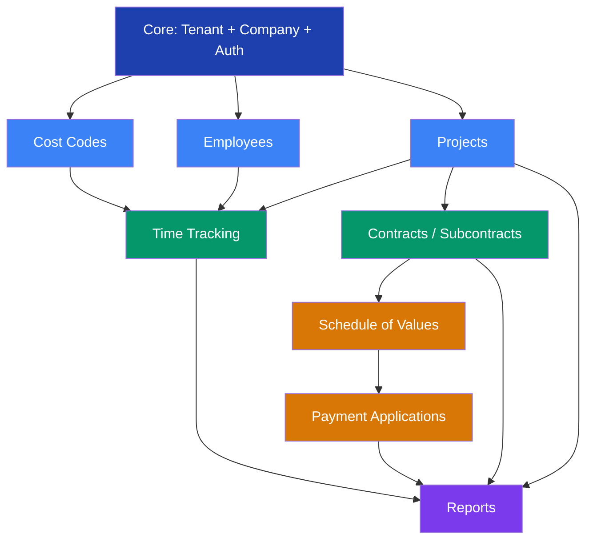

# Onboarding Flow V2: The 2-Hour Construction ERP Activation

**Author:** Product Management (cross-functional team debate synthesis)
**Date:** 2026-02-19
**Status:** Proposed
**Scenario:** 50-employee commercial GC, 10 active projects, $20M annual revenue
**Goal:** Sign up at 9:00 AM, enter timecards + submit pay app + view job cost report by 11:00 AM

---

## Table of Contents

1. [Executive Summary](#1-executive-summary)
2. [Module Activation Order](#2-module-activation-order)
3. [The 2-Hour Flow](#3-the-2-hour-flow)
4. [Data Seeding Strategy](#4-data-seeding-strategy)
5. [The Absolute Minimum Dataset for Day 1](#5-the-absolute-minimum-dataset-for-day-1)
6. [Chicken-and-Egg Resolutions](#6-chicken-and-egg-resolutions)
7. [AI Autonomy Matrix](#7-ai-autonomy-matrix)
8. [Predictive UX: Anticipatory Actions During Onboarding](#8-predictive-ux-anticipatory-actions-during-onboarding)
9. [Debate Resolutions Log](#9-debate-resolutions-log)
10. [Week 1 Deferred Work](#10-week-1-deferred-work)
11. [Implementation Notes: What Exists Today](#11-implementation-notes-what-exists-today)

---

## 1. Executive Summary

This document describes a minute-by-minute onboarding flow for a commercial general contractor signing up for Pitbull. The flow is designed around three immovable Day 1 outcomes:

| # | Outcome | Why It Cannot Wait |
|---|---------|-------------------|
| 1 | **Enter timecards for today's crews** | Crews are in the field right now. Every day without time capture is unrecoverable labor cost data. |
| 2 | **Submit a payment application to an owner** | Cash flow is the bloodstream of a GC. A pay app due this week means money due in 30 days. |
| 3 | **See where money is going (job cost report)** | The owner/PM signed up because they lost visibility. Proving value in 2 hours keeps them. |

Everything else -- full GL setup, OSHA compliance records, workers' comp class codes, bonding/surety, I-9 processing, vendor PO workflows -- is deferred to Week 1. This is a deliberate trade-off. The CFO's audit requirements are real, but a company that churns after Day 1 will never reach their audit.

### The Core Tension

**CFO:** "If cost codes are wrong from Day 1, we spend months re-coding. Get the chart of accounts right first."
**PM:** "If we can't bill the owner this week, we miss a $500K draw. I'll fix cost codes later."
**Resolution:** Seed standard CSI MasterFormat codes automatically. They are correct enough for 90% of commercial GC work. The PM bills immediately with standard codes. The CFO customizes codes in Week 1, and the system provides a re-coding tool for any entries made against deprecated codes.

---

## 2. Module Activation Order

### Dependency Graph



### Activation Phases

| Phase | Time | Modules | Depends On |
|-------|------|---------|------------|
| **Phase 0** | 0:00-0:05 | Core (Tenant, Company, Auth, Roles, Permissions) | Nothing |
| **Phase 1** | 0:05-0:15 | Cost Codes (seeded), Projects (shell), Employees (shell) | Core |
| **Phase 2** | 0:15-0:45 | Time Tracking, Contracts/Subcontracts | Cost Codes + Projects + Employees |
| **Phase 3** | 0:45-1:15 | Schedule of Values, Payment Applications | Contracts |
| **Phase 4** | 1:15-2:00 | Reports, first workflows | All above |

### Why This Order

The dependency graph reveals three parallel tracks that converge at Time Tracking and Reports:

- **Labor track:** Employees + Cost Codes + Projects --> Time Entry
- **Billing track:** Projects + Contracts + SOV --> Payment Application
- **Visibility track:** Everything above --> Reports

The critical insight from the PM: **billing does not depend on employees**. A GC can submit a pay app to an owner without a single employee record, because pay apps are contract-based, not labor-based. This means the labor track and the billing track can run in parallel.

---

## 3. The 2-Hour Flow

### Phase 0: Signup and Tenant Provisioning (0:00 - 0:10)

#### Minute 0:00 - 0:03 | Account Creation

| Attribute | Value |
|-----------|-------|
| **Who** | Human (owner/admin) |
| **Screen** | `/signup` (3-step wizard: Account, Company, Invite Team) |
| **Data Required** | First name, last name, email, password, company name, industry type |
| **Module Activated** | Core (Auth) |
| **AI Role** | None -- this is a trust-establishing moment. Human must own it. |

**What happens on submit:**

1. `POST /api/auth/register` creates:
   - `AppUser` record (Admin role auto-assigned via `RoleSeeder`)
   - `Tenant` record (status: Active, plan: Standard)
   - `Company` record (default company, `IsDefault = true`)
   - `UserCompanyAccess` record linking user to company
2. JWT returned with `tenant_id` and `company_id` claims
3. Frontend redirects to `/settings/company/setup`

**Existing implementation:** `AuthController.Register` already handles all of the above. The 3-step signup wizard at `/signup` collects account + company + team invites.

#### Minute 0:03 - 0:07 | Tenant Provisioning (Background)

| Attribute | Value |
|-----------|-------|
| **Who** | AI Agent (fully autonomous) |
| **What Happens** | `TenantProvisioningService.ProvisionTenantAsync` fires |
| **Module Activated** | Core (Roles, Permissions, Cost Codes) |
| **AI Role** | Autonomous. No human review needed. |
| **Audit Trail** | `CreatedBy = "system"` on all seeded records |

**What gets provisioned automatically:**

| Data | Count | Source |
|------|-------|--------|
| RBAC Roles | 4 (Admin, Manager, Supervisor, Viewer) | `RoleSeeder.EnsureRolesForTenantAsync` |
| Permissions | 20 | `TenantProvisioningService.SeedDefaultPermissionsAsync` |
| Cost Codes (CSI) | 12 divisions | `TenantProvisioningService.SeedDefaultCostCodesAsync` |

> **DEBATE: CFO vs. Speed**
>
> **CFO:** "12 division-level codes are not enough. We need sub-codes for concrete (forming, placing, finishing, rebar), for electrical (rough-in, trim, switchgear), etc. Without sub-codes, labor costs land at the division level and we can't do earned value analysis."
>
> **System Architect:** "We already have `POST /api/cost-codes/seed-csi` that seeds 70 codes across 16 divisions with sub-codes. The provisioning service only seeds 12 as a fallback."
>
> **RESOLUTION:** Upgrade `TenantProvisioningService` to call the full CSI seed (70 codes, 16 divisions) instead of the minimal 12. The full CSI set is still a standard, not a custom chart of accounts. The CFO gets sub-codes from Day 1. Custom codes can be added or imported in Week 1. **This is a code change: replace the inline 12-code seed with a call to the existing `CostCodeService.SeedCsiCodesAsync` method.**

#### Minute 0:07 - 0:10 | Company Setup Wizard

| Attribute | Value |
|-----------|-------|
| **Who** | Human (guided by AI suggestions) |
| **Screen** | `/settings/company/setup` (4-step wizard) |
| **Data Required** | Company address, tax ID, contractor type, module activation, initial settings |
| **Module Activated** | Company profile, module configuration |
| **AI Role** | Suggest -- AI pre-fills settings based on contractor type selection |

**Existing implementation:** The company setup wizard at `/settings/company/setup` already exists with 4 steps:
1. Company Profile (name, address, tax ID, branding)
2. Contractor Type (General, Specialty, Design-Build, CM at Risk)
3. Module Activation (Projects, Contracts, Bids, RFIs, Reports toggles)
4. Initial Settings (per-module defaults)

**AI assist on contractor type selection:**

When the user selects "General Contractor":
- AI pre-enables: Projects, Contracts, Bids, RFIs, Reports, Time Tracking
- AI pre-sets: Retainage default = 10%, billing format = AIA G702/G703
- AI suggests: "Most GCs your size also enable the Documents module for submittals"

> **DEBATE: HR Director vs. Minimal Setup**
>
> **HR Director:** "We need workers' comp class codes configured before employees are added. If an employee is classified as a carpenter but entered without a WC class code, we're out of compliance from Day 1."
>
> **Payroll Manager:** "Workers' comp class codes are irrelevant for time entry. They matter for payroll, which we're deferring anyway."
>
> **RESOLUTION:** Time entry does not require WC class codes. Employee records created during onboarding carry `classification` (Hourly/Salary/Contractor) and `baseHourlyRate` -- that is enough for time tracking and job costing. WC class codes are a Week 1 enrichment task. The HR Director gets a "Compliance Incomplete" badge on the employee list that clears when WC codes are added.

---

### Phase 1: AI-Assisted Data Import (0:10 - 0:30)

This is the critical make-or-break phase. A 50-employee GC with 10 active projects cannot hand-enter that data in 20 minutes. The AI must do the heavy lifting.

#### Minute 0:10 - 0:15 | Data Import Briefing

| Attribute | Value |
|-----------|-------|
| **Who** | Human (decides what to import) + AI (explains options) |
| **Screen** | `/admin/data-import` |
| **AI Role** | Guide -- AI chat explains import options, helps user locate export files from prior system |

The AI assistant (via `/api/ai/chat`) prompts the user:

> "I can help you import your existing data. Here is what I can accept:
>
> **Fastest path (CSV upload):**
> - Employee list (name, number, rate, classification)
> - Project list (number, name, contract amount, client)
> - Cost codes (if you have custom codes beyond CSI standard)
>
> **Already seeded (no action needed):**
> - 70 standard CSI cost codes
> - RBAC roles and permissions
>
> **Can defer to this afternoon:**
> - Equipment list
> - Historical time entries
> - Vendor list
>
> Do you have CSV exports from your current system? Most systems (Sage, Vista, Viewpoint, Foundation) can export employee and project lists."

#### Minute 0:15 - 0:22 | Employee Import

| Attribute | Value |
|-----------|-------|
| **Who** | Human uploads CSV, AI validates and maps columns |
| **API** | `POST /api/import/employees` (preview) then `POST /api/import/employees/confirm/{importId}` |
| **Data Required** | Minimum: employee number, first name, last name, base hourly rate, classification |
| **Module Activated** | Employees (TimeTracking module) |
| **AI Role** | Autonomous validation with human confirmation |
| **Audit Trail** | `ImportBatch` record with row-level status (created/skipped/error) |

**Column mapping intelligence:**

The AI examines the CSV header and maps columns:
- "EMP_NO" or "Employee #" or "ID" --> `employeeNumber`
- "FIRST" or "First Name" or "fname" --> `firstName`
- "RATE" or "Hourly Rate" or "Pay Rate" --> `baseHourlyRate`
- "CLASS" or "Type" or "Employment Type" --> `classification`

**Minimum viable employee record (per Payroll Manager):**

| Field | Required for Day 1? | Required for Payroll? |
|-------|---------------------|----------------------|
| Employee Number | Yes | Yes |
| First Name | Yes | Yes |
| Last Name | Yes | Yes |
| Base Hourly Rate | Yes | Yes |
| Classification (Hourly/Salary) | Yes | Yes |
| Email | No (enrichment) | No |
| SSN | No | Yes (Week 1) |
| Tax Withholding | No | Yes (Week 1) |
| WC Class Code | No | Yes (Week 1) |
| Emergency Contact | No | Yes (Week 1) |
| I-9 Status | No | Yes (Week 1) |
| Union Status | No | Yes (if applicable) |

> **DEBATE: HR Director vs. Payroll Manager**
>
> **HR Director:** "I-9 must be completed within 3 business days of hire. If we import 50 employees without I-9 data, we have 3 days to fill it in. That is a compliance risk."
>
> **Payroll Manager:** "These are existing employees, not new hires. I-9 was completed when they were originally hired. We are importing records, not onboarding new hires."
>
> **HR Director:** "Fair point. But we still need the records digitized eventually."
>
> **RESOLUTION:** Existing employee imports do not trigger I-9 workflows. New employees added after Day 1 will trigger the employee onboarding flow (which already exists at `/employees/onboarding`). The HR Director gets a bulk "compliance audit" tool in Week 1 that flags employees missing critical HR fields.

**If no CSV is available (manual fallback):**

AI suggests: "Let's enter your 5 most active field supervisors first. They can enter time for their crews. You can add the rest later today."

User enters 5 employees via `/employees/new` form. Minimum fields: name, number, rate. Takes approximately 2 minutes per employee = 10 minutes.

#### Minute 0:22 - 0:30 | Project Import

| Attribute | Value |
|-----------|-------|
| **Who** | Human uploads CSV, AI validates |
| **API** | `POST /api/import/projects` (preview) then `POST /api/import/projects/confirm/{importId}` |
| **Data Required** | Minimum: project number, name, type, contract amount, client name |
| **Module Activated** | Projects |
| **AI Role** | Autonomous validation with human confirmation |

**Minimum viable project record (per PM):**

| Field | Required for Day 1? | Required for Billing? |
|-------|---------------------|----------------------|
| Project Number | Yes | Yes |
| Name | Yes | Yes |
| Type (Commercial/Residential) | Yes | No |
| Contract Amount | Yes | Yes (for % complete) |
| Client Name | Yes | Yes (pay app recipient) |
| Start Date | No (defaults today) | No |
| Address | No (enrichment) | No |
| Budget by Phase | No | No (Week 1) |

**Post-import AI action (autonomous):**

After projects are imported, AI automatically:
1. Creates project assignments linking the admin user to all projects (so they appear in the dashboard)
2. Suggests: "Would you like me to assign your supervisors to projects? I can match based on project type."

> **DEBATE: PM vs. CFO on Budget Structure**
>
> **PM:** "I just need project number, name, and contract amount. That is enough to start billing."
>
> **CFO:** "Without a phase-level budget, the job cost report is meaningless. It will show total cost vs. total budget with no drill-down."
>
> **PM:** "The job cost report showing aggregate cost vs. budget is already 10x better than the spreadsheet they are using today."
>
> **RESOLUTION:** Projects import with contract-level budget only. Phase-level budgets are a Week 1 enrichment. The job cost report shows project-level rollup on Day 1. A "Budget Detail Missing" indicator appears on projects without phase budgets, nudging users to add detail. The AI offers to auto-generate a standard phase structure (Preconstruction, Sitework, Foundation, Structure, Envelope, MEP, Finishes, Closeout) for each project.

---

### Phase 2: Core Data Entry (0:30 - 1:00)

#### Minute 0:30 - 0:40 | Project Assignments

| Attribute | Value |
|-----------|-------|
| **Who** | Human (with AI suggestions) |
| **Screen** | `/projects/{id}/team` for each active project |
| **Data Required** | Employee ID, Project ID, Role (Supervisor/Worker), Start Date |
| **Module Activated** | Project Assignments (Projects module) |
| **AI Role** | Suggest assignments based on employee title/classification |

**Why this step exists:**

Time entries require a `ProjectAssignment` record. An employee cannot log time to a project they are not assigned to. This is an intentional constraint (prevents cost leaks) but creates a chicken-and-egg problem during onboarding.

**AI-assisted bulk assignment:**

Rather than assigning one employee at a time, the AI presents a matrix:

```
              Project A   Project B   Project C   ...
Supervisor 1     [x]         [ ]         [x]
Supervisor 2     [ ]         [x]         [ ]
Carpenter 1      [x]         [x]         [ ]
Carpenter 2      [x]         [ ]         [x]
...
```

AI pre-checks assignments based on: supervisors assigned to all projects, hourly workers assigned to 2-3 projects. Human reviews and adjusts.

> **DEBATE: Payroll Manager vs. PM on Assignment Scope**
>
> **Payroll Manager:** "If an employee is assigned to 5 projects but only works on 2 today, the timecard UI shows 5 projects in the dropdown. That is confusing for field supervisors."
>
> **PM:** "Better to over-assign than under-assign. If a carpenter shows up at a project they are not assigned to, the supervisor cannot log their time. That is worse."
>
> **RESOLUTION:** Over-assign on Day 1. The timecard UI shows all assigned projects but uses "recent projects" sorting so the most-used projects bubble to the top. After 2 weeks, AI suggests removing stale assignments where no time has been logged.

#### Minute 0:40 - 0:50 | Pay Period Configuration

| Attribute | Value |
|-----------|-------|
| **Who** | AI (autonomous with human confirmation) |
| **API** | `POST /api/pay-periods` |
| **Data Required** | Start date, end date, frequency (weekly/bi-weekly) |
| **Module Activated** | Pay Periods (TimeTracking module) |
| **AI Role** | Autonomous -- creates current and next pay period |

**What AI does:**

1. Determines today is a weekday
2. Creates current pay period: Monday of this week through Sunday (weekly) or through next Sunday (bi-weekly)
3. Creates next pay period
4. Asks: "Your pay periods are set to weekly (Mon-Sun). Is this correct, or do you use bi-weekly or semi-monthly?"

**Why this cannot be deferred:**

Time entries are associated with pay periods. Without a pay period, the timecard grid has no date range context. The Payroll Manager confirmed: "You can defer payroll processing, but you cannot defer pay period definition. Time entries need to land in a period."

> **DEBATE: Payroll Manager vs. CFO on Pay Period Type**
>
> **Payroll Manager:** "Most construction companies run weekly payroll for hourly field workers and bi-weekly for salaried office staff."
>
> **CFO:** "We need to match the pay period to our existing payroll provider's schedule. If we seed the wrong period type, time exports will not align."
>
> **RESOLUTION:** AI defaults to weekly (the most common for construction field labor). The confirmation prompt explicitly asks the user to verify. Pay period type can be changed before the first payroll export without re-entering time.

#### Minute 0:50 - 1:00 | Verification Checkpoint

| Attribute | Value |
|-----------|-------|
| **Who** | Human (guided by AI) |
| **Screen** | Dashboard with onboarding checklist |
| **AI Role** | Validate -- AI runs a readiness check |

**AI readiness check (autonomous):**

The AI agent calls the following APIs and reports status:

| Check | API | Pass Criteria |
|-------|-----|---------------|
| Cost codes exist | `GET /api/cost-codes?pageSize=1` | At least 1 active code |
| Employees exist | `GET /api/employees?pageSize=1` | At least 1 active employee |
| Projects exist | `GET /api/projects?pageSize=1` | At least 1 active project |
| Assignments exist | (internal query) | At least 1 employee assigned to 1 project |
| Pay period exists | `GET /api/pay-periods/current` | Returns 200 (not 404) |

**If all pass:** "You are ready for time entry. Let's move to financial setup."
**If any fail:** AI identifies the gap and offers to fix it ("No project assignments found. Would you like me to assign all employees to all active projects?")

---

### Phase 3: Financial Setup (1:00 - 1:30)

#### Minute 1:00 - 1:10 | Create Subcontract for Pay App Demo

| Attribute | Value |
|-----------|-------|
| **Who** | Human (with AI pre-fill) |
| **Screen** | `/contracts/new` |
| **API** | `POST /api/subcontracts` |
| **Data Required** | Project ID, subcontract number, subcontractor name, scope of work, original value, retainage % |
| **Module Activated** | Contracts |
| **AI Role** | Pre-fill -- given project selection, AI suggests contract structure |

**Minimum viable subcontract:**

```json
{
  "projectId": "<from import>",
  "subcontractNumber": "SC-001",
  "subcontractorName": "ABC Concrete Inc",
  "scopeOfWork": "Concrete foundations and footings",
  "tradeCode": "03 - Concrete",
  "originalValue": 150000.00,
  "retainagePercent": 10,
  "status": "Executed"
}
```

Note: Status must be "Executed" to create payment applications against it.

> **DEBATE: AP/AR Specialist vs. PM on Vendor Records**
>
> **AP/AR Specialist:** "A subcontract without a proper vendor record is incomplete. We need the sub's tax ID, insurance certs, W-9 on file, and payment terms before we commit to a contract value."
>
> **PM:** "I need to bill the owner. The pay app shows our costs to subs. I don't need the sub's tax ID to bill the owner."
>
> **AP/AR Specialist:** "But when the sub invoices us, we need to cut them a check. Without payment terms and tax ID, we can't process AP."
>
> **RESOLUTION:** Subcontracts on Day 1 use inline vendor data (name + trade only). No separate vendor record required. A "Vendor Record Incomplete" badge appears on subcontracts missing full vendor data. Week 1 task: create proper vendor records and link them to subcontracts. AP processing is deferred -- Day 1 is about billing the owner (AR), not paying subs (AP).

#### Minute 1:10 - 1:20 | Create Schedule of Values

| Attribute | Value |
|-----------|-------|
| **Who** | Human enters line items (AI can suggest from scope) |
| **Screen** | `/contracts/{id}/sov` |
| **API** | `POST /api/contracts/{contractId}/sov` |
| **Data Required** | Line items with description, scheduled value |
| **Module Activated** | Schedule of Values (Contracts module) |
| **AI Role** | Suggest -- given scope of work, AI proposes line items |

**Example SOV for a concrete subcontract:**

| Item # | Description | Scheduled Value |
|--------|-------------|----------------|
| 1 | Mobilization | $15,000 |
| 2 | Footings | $35,000 |
| 3 | Foundation Walls | $45,000 |
| 4 | Slab on Grade | $40,000 |
| 5 | Misc Concrete | $15,000 |
| | **Total** | **$150,000** |

**AI suggestion engine:**

Given `scopeOfWork = "Concrete foundations and footings"` and `originalValue = 150000.00`, the AI suggests a standard SOV breakdown. The user can accept, modify, or replace the suggestions.

> **DEBATE: CFO vs. PM on SOV Granularity**
>
> **CFO:** "The SOV must match the contract exhibit. If we create a simplified SOV for the demo, the real billing will require re-entry."
>
> **PM:** "For the onboarding demo, we need exactly 1 subcontract with an SOV so we can generate a payment application. The user will enter their real SOVs for their real contracts. This is about showing the workflow."
>
> **RESOLUTION:** The onboarding flow creates 1 real subcontract (not demo data) with a user-entered SOV. If the user has a real contract they want to bill against, they enter it. If not, the AI creates a realistic example and labels it clearly. The key point: this is the user's actual data, not a disposable demo.

#### Minute 1:20 - 1:30 | Financial Readiness Check

| Attribute | Value |
|-----------|-------|
| **Who** | AI (autonomous validation) |
| **AI Role** | Validate -- confirm all prerequisites for pay app and reports |

**Billing readiness check:**

| Check | Status | Required For |
|-------|--------|-------------|
| Project with contract amount | Required | Pay app, job cost report |
| Executed subcontract | Required | Pay app |
| SOV with line items | Required | Pay app |
| Cost codes seeded | Required | Job cost report |
| Employees with assignments | Required | Time entry, labor cost report |
| Pay period configured | Required | Time entry |

> **DEBATE: CFO on Chart of Accounts**
>
> **CFO:** "We have spent 30 minutes on financial setup and still have no general ledger. No chart of accounts. No fiscal year. No tax entity structure. This company cannot close a month."
>
> **System Architect:** "The GL module does not exist yet. Pitbull is not an accounting system -- it is a construction management system that feeds data to an accounting system (Sage, QuickBooks, Vista). The job cost report uses cost codes and contract values, not GL accounts."
>
> **CFO:** "Then what is the integration story? How does the labor cost data get from Pitbull into our accounting system?"
>
> **System Architect:** "Today: Vista-format time entry export (`GET /api/export/time-entries?format=vista`). The cost code structure maps to the GL cost code structure in the accounting system. The mapping is a Week 1 configuration task."
>
> **RESOLUTION:** Pitbull is the system of record for field data (time, quantities, pay apps). The accounting system (Sage/Vista/QuickBooks) is the system of record for the GL. Integration is via export (today) and API sync (roadmap). The CFO's GL requirements are satisfied by the accounting system, not by Pitbull. Day 1 focus: capture the field data. Week 1: configure the export mapping.

---

### Phase 4: First Workflows (1:30 - 2:00)

#### Minute 1:30 - 1:40 | Enter First Timecard

| Attribute | Value |
|-----------|-------|
| **Who** | Human (the admin, acting as a superintendent) |
| **Screen** | `/time-entries/new` or crew timecard grid |
| **API** | `POST /api/time-entries` or `POST /api/time-entries/batch` |
| **Data Required** | Date, employee ID, project ID, cost code ID, hours, optional: phase, equipment |
| **Module Activated** | Time Tracking (fully active) |
| **AI Role** | None -- time entry is a human responsibility with legal/audit implications |

**Sample time entry:**

```json
{
  "date": "2026-02-19",
  "employeeId": "<imported employee>",
  "projectId": "<imported project>",
  "costCodeId": "<seeded CSI code>",
  "regularHours": 8.0,
  "overtimeHours": 0,
  "notes": "Foundation forming - grid lines A-D"
}
```

**Batch entry for crew:**

A superintendent enters time for their entire crew using `POST /api/time-entries/batch`:

```json
{
  "entries": [
    { "employeeId": "emp-1", "projectId": "prj-1", "costCodeId": "03-100", "date": "2026-02-19", "regularHours": 8 },
    { "employeeId": "emp-2", "projectId": "prj-1", "costCodeId": "03-100", "date": "2026-02-19", "regularHours": 8 },
    { "employeeId": "emp-3", "projectId": "prj-1", "costCodeId": "03-200", "date": "2026-02-19", "regularHours": 6, "overtimeHours": 2 }
  ]
}
```

> **DEBATE: Payroll Manager on Time Entry Without Payroll**
>
> **Payroll Manager:** "Time entry without payroll processing is a one-legged stool. Who approves the time? What happens to it?"
>
> **System Architect:** "Time entries go through: Draft --> Submitted --> Approved --> Exported. The approval workflow exists (`POST /api/time-entries/review`). The export exists (`GET /api/export/time-entries`). Payroll processing -- calculating gross pay, taxes, deductions -- is deferred. The approved time is exported to the external payroll system."
>
> **Payroll Manager:** "That is acceptable for Day 1. The critical path is: capture time, approve time, export to payroll provider. We do not need to run payroll in Pitbull on Day 1."
>
> **RESOLUTION:** Day 1 time entry workflow: Enter --> Submit --> Approve --> Export to payroll provider. Pitbull is the time capture system, not the payroll system (yet). Payroll module is on the roadmap but not required for the 2-hour onboarding.

#### Minute 1:40 - 1:50 | Submit First Payment Application

| Attribute | Value |
|-----------|-------|
| **Who** | Human (PM or admin) |
| **Screen** | `/payment-applications/new` |
| **API** | `POST /api/paymentapplications` |
| **Data Required** | Subcontract ID, period start/end, work completed this period, stored materials |
| **Module Activated** | Payment Applications (Contracts module) |
| **AI Role** | Pre-fill period dates, calculate retainage automatically |

**Sample payment application:**

```json
{
  "subcontractId": "<from step above>",
  "periodStart": "2026-02-01",
  "periodEnd": "2026-02-28",
  "workCompletedThisPeriod": 45000.00,
  "storedMaterials": 5000.00,
  "invoiceNumber": "INV-2026-001"
}
```

**Automatic calculations:**

| Line | Amount |
|------|--------|
| Work completed this period | $45,000.00 |
| Stored materials | $5,000.00 |
| **Gross amount this period** | **$50,000.00** |
| Less retainage (10%) | ($5,000.00) |
| **Net payment due** | **$45,000.00** |

> **DEBATE: AP/AR Specialist on Retention Tracking**
>
> **AP/AR Specialist:** "Retention tracking is the most construction-specific feature in billing. Standard retainage is 10% until 50% complete, then drops to 5% or releases. Does the system handle variable retainage?"
>
> **System Architect:** "Today, retainage is a flat percentage set on the subcontract. Variable retainage (step-down at 50% complete) is not implemented."
>
> **AP/AR Specialist:** "That is a showstopper for any GC over $10M revenue."
>
> **RESOLUTION:** For the 2-hour onboarding, flat retainage works. Variable retainage (step-down and release) is a Phase 2 feature flagged in the roadmap. The AP/AR Specialist's concern is valid and logged as a high-priority enhancement. Day 1 billing with flat retainage is still dramatically better than no billing at all.

#### Minute 1:50 - 2:00 | View First Job Cost Report

| Attribute | Value |
|-----------|-------|
| **Who** | Human (owner/PM reviewing) |
| **Screen** | `/reports` |
| **API** | `GET /api/reports/labor-cost?projectId={id}` and `GET /api/reports/project-profitability` |
| **Module Activated** | Reports |
| **AI Role** | Interpret -- AI explains the report data in context |

**What the user sees:**

1. **Labor Cost Report** (`/reports/labor-cost`): Shows today's time entries aggregated by employee and cost code. For the first day, this shows the entries just created.

2. **Project Profitability Report** (`/reports/project-profitability`): Shows contract amount vs. costs-to-date for each project. On Day 1, this shows the imported contract amounts with minimal costs.

**AI interpretation (via chat):**

> "Here is your Day 1 snapshot for Project PRJ-2026-001:
>
> - Contract value: $2,500,000
> - Labor costs today: $3,120 (8 workers x 8 hrs x avg $48.75/hr)
> - Subcontract commitments: $150,000 (1 executed subcontract)
> - Billed to owner: $45,000 (Pay App #1 submitted)
>
> You are capturing costs and billing from Day 1. Your job cost visibility will improve as more time entries and subcontracts are added this week."

---

## 4. Data Seeding Strategy

### Tier 1: Automatic (No Human Input)

These are seeded by `TenantProvisioningService` on registration:

| Data | Count | Method | When |
|------|-------|--------|------|
| RBAC Roles | 4 | `RoleSeeder` | On registration |
| RBAC Permissions | 20 | `TenantProvisioningService` | On registration |
| CSI Cost Codes | 70 (16 divisions) | `CostCodeService.SeedCsiCodesAsync` | On registration |
| Default Company | 1 | `AuthController.Register` | On registration |
| Admin User | 1 | `AuthController.Register` | On registration |
| Pay Period (current) | 1 | New: `PayPeriodProvisioningService` | On first dashboard load |

### Tier 2: AI-Assisted Import (Human Provides Source File)

These use the existing data import infrastructure at `/admin/data-import`:

| Data | Source | API | Typical Count |
|------|--------|-----|---------------|
| Employees | CSV from HR/payroll system | `POST /api/import/employees` | 50 |
| Projects | CSV from job cost system | `POST /api/import/projects` | 10 |
| Custom Cost Codes | CSV (optional, if CSI codes insufficient) | `POST /api/import/cost-codes` | 0-100 |
| Equipment | CSV (optional, for equipment tracking) | `POST /api/import/equipment` | 0-50 |
| Historical Time Entries | CSV (optional, for historical reporting) | `POST /api/import/time-entries` | 0-1000 |

### Tier 3: AI Pre-Population (Minimal Human Input)

Given the company profile (name, type, size, location), AI can suggest:

| Data | Input | AI Output |
|------|-------|-----------|
| Module configuration | Contractor type | Pre-enabled modules with sensible defaults |
| Cost code emphasis | Contractor type | Highlight relevant CSI divisions (e.g., highlight Div 03 for concrete contractors) |
| Project phase template | Project type | Standard phase structure (8-12 phases) |
| SOV line items | Subcontract scope text | Suggested breakdown of scheduled value |
| Role assignments | Employee titles from import | Suggested role mapping (Superintendent --> Supervisor, Foreman --> Supervisor, Laborer --> Worker) |
| Project assignments | Employee classification + project list | Suggested assignment matrix |

### Tier 4: Deferred to Week 1

| Data | Owner | Why Deferred |
|------|-------|-------------|
| Full chart of accounts | CFO | Requires coordination with accounting system |
| Vendor records (full) | AP/AR | Tax IDs, insurance certs, payment terms |
| Phase-level budgets | PM/CFO | Requires budget detail from original estimates |
| Workers' comp class codes | HR | Requires WC policy documentation |
| Union status / rates | HR | Requires CBA details |
| Tax withholding tables | Payroll | Requires payroll provider integration |
| I-9 / OSHA compliance records | HR | Existing employees, not new hires |
| Bonding/surety limits | CFO | Requires surety documentation |
| Insurance certificates | AP/AR | Requires document collection from subs |
| Custom approval workflows | Admin | Requires organizational structure definition |
| Document templates (AIA forms) | PM | Requires template customization |

---

## 5. The Absolute Minimum Dataset for Day 1

If the onboarding stalls or the user has no CSV files, this is the bare minimum to achieve all three Day 1 outcomes:

### The 7 Essential Records

| # | Record | Fields | Created By | Time to Create |
|---|--------|--------|-----------|----------------|
| 1 | **Company** | Name, address, tax ID | Human (at signup) | 0 min (already exists) |
| 2 | **CSI Cost Codes** | 70 standard codes | System (auto-seeded) | 0 min (already exists) |
| 3 | **1 Project** | Number, name, contract amount, client | Human | 2 min |
| 4 | **1 Employee** | Number, name, rate, classification | Human | 2 min |
| 5 | **1 Project Assignment** | Employee + Project link | Human or AI | 1 min |
| 6 | **1 Pay Period** | Start date, end date | AI (auto-created) | 0 min |
| 7 | **1 Subcontract + SOV** | Sub name, scope, value, line items | Human | 5 min |

**Total manual effort: approximately 10 minutes.**

With these 7 records, the user can:
- Enter a timecard (Employee + Project + Cost Code + Pay Period)
- Submit a payment application (Subcontract + SOV)
- View a job cost report (Project + Time Entries + Subcontract values)

### What This Looks Like for Our Scenario (50 employees, 10 projects)

| Record Type | Minimum | Ideal Day 1 | Full Setup (Week 1) |
|-------------|---------|-------------|---------------------|
| Company | 1 | 1 | 1 |
| Cost Codes | 70 (seeded) | 70 + custom | 100-200 |
| Projects | 1 | 10 (imported) | 10 + phases + budgets |
| Employees | 1 | 50 (imported) | 50 + full HR data |
| Project Assignments | 1 | 50-100 | 50-100 |
| Pay Periods | 1 | 2 (current + next) | 52 (annual) |
| Subcontracts | 1 | 5-10 | 30-50 |
| SOVs | 1 | 5-10 | 30-50 |
| Vendor Records | 0 | 0 | 30-50 |
| Phase Budgets | 0 | 0 | 80-100 |

---

## 6. Chicken-and-Egg Resolutions

### Problem 1: Time Entry Requires Project Assignment, Project Assignment Requires Both Employee AND Project

**Dependency chain:** Employee + Project --> ProjectAssignment --> TimeEntry

**Resolution:** Import employees and projects in parallel (both depend only on Core). Then batch-create assignments. The onboarding flow handles this by structuring imports before assignments.

**Implementation:** The verification checkpoint at minute 0:50 catches this. If assignments are missing, AI offers to bulk-create them.

### Problem 2: Payment Application Requires Executed Subcontract, But Execution Implies Legal Review

**Dependency chain:** Project --> Subcontract (status: Executed) --> SOV --> PaymentApplication

**Resolution:** During onboarding, subcontracts are created with `status: Executed` directly. There is no draft --> review --> execute workflow for Day 1. The assumption is that the contracts being entered are already executed in the real world -- the user is bringing existing data into the system, not creating new contracts.

**Guard rail:** A "Compliance Note" is attached to subcontracts created during onboarding: "Created during initial setup. Verify contract documentation is on file."

### Problem 3: Job Cost Report Needs Both Labor Costs AND Contract Costs, But They Come From Different Modules

**Dependency chain:**
- Labor costs: Employee + Project + CostCode + TimeEntry
- Contract costs: Project + Subcontract

**Resolution:** The job cost report gracefully handles partial data. If no time entries exist, it shows contract commitments only. If no subcontracts exist, it shows labor costs only. The report is useful from the first data point, not only when all data is complete.

### Problem 4: Cost Codes Must Exist Before Time Entry, But CFO Wants Custom Codes

**Dependency chain:** CostCode --> TimeEntry (FK constraint)

**Resolution:** CSI codes are seeded automatically and are never wrong -- they are an industry standard. Custom codes can be added alongside CSI codes. If the CFO later wants to recode time entries from a CSI code to a custom code, a bulk recode tool is provided (Week 1).

### Problem 5: Pay Period Must Exist Before Time Entry, But Payroll Manager Has Not Configured Pay Frequency

**Dependency chain:** PayPeriod --> TimeEntry (date must fall within an open period)

**Resolution:** AI auto-creates a weekly pay period covering the current week. The Payroll Manager can adjust the frequency later. Time entries are associated with the pay period by date range, so changing the period configuration retroactively reassigns entries.

---

## 7. AI Autonomy Matrix

| Step | AI Can Do Autonomously | Needs Human Review | Must Be Human-Only | Audit Trail |
|------|----------------------|-------------------|-------------------|-------------|
| Tenant provisioning | Yes | No | No | `CreatedBy = "system"` on all records |
| Cost code seeding | Yes | No | No | `CreatedBy = "system"`, seed batch ID |
| Role/permission seeding | Yes | No | No | `CreatedBy = "system"` |
| Pay period creation | Yes | Human confirms frequency | No | `CreatedBy = "system"`, user confirmation timestamp |
| CSV column mapping | Yes (suggest) | Human confirms mapping | No | Import batch with mapping log |
| Employee import | Yes (parse + validate) | Human confirms preview | No | `ImportBatch` with row-level status |
| Project import | Yes (parse + validate) | Human confirms preview | No | `ImportBatch` with row-level status |
| Project assignment suggestions | Yes (suggest) | Human approves matrix | No | `CreatedBy = "ai-assistant"` |
| SOV line item suggestions | Yes (suggest) | Human reviews and edits | No | `CreatedBy` = user (AI suggestion is not persisted separately) |
| Time entry | No | No | Yes | `CreatedBy` = user, legal liability |
| Payment application creation | No | No | Yes | `CreatedBy` = user, financial document |
| Report interpretation | Yes (narrate) | Human reads | No | Chat log retained |
| Company profile | No | No | Yes | `CreatedBy` = user, legal entity data |
| Subcontract creation | No (suggest values) | No | Yes (financial commitment) | `CreatedBy` = user |

### Audit Trail Format

All records include:
- `CreatedBy`: `"system"` | `"ai-assistant"` | `"{user-email}"`
- `CreatedAt`: UTC timestamp
- `TenantId`: Tenant scope
- `CompanyId`: Company scope (where applicable)

AI-suggested records that are human-confirmed use `CreatedBy = "{user-email}"` because the human took the affirmative action. The AI suggestion is logged in the AI chat history, not in the domain record.

---

## 8. Predictive UX: Anticipatory Actions During Onboarding

> **Founder mandate:** The AI isn't answering questions — it's doing the work before you ask. Every module design must answer: *What would a great assistant do BEFORE being asked?*

Predictive UX starts from minute zero. The onboarding flow isn't just data entry — it's teaching the system the patterns it will use to anticipate the customer's needs for the next 10 years.

### Why This Matters During Onboarding

Traditional ERP onboarding: "Enter your data. Click save. Repeat."
AIERP onboarding: "We've already set up your crew sheets for tomorrow morning. Confirm?"

Every piece of data entered during the 2-hour onboarding trains the prediction engine. By Day 2, the system is already working ahead of the user.

### Predictive Actions by Onboarding Phase

#### Phase 0 (Signup & Setup) — Predict the company's profile from its type

| Moment | Anticipatory Action | Data Source |
|---|---|---|
| User selects "General Contractor" | Pre-enable all modules, set 10% retainage, enable sequential approval, set cost code depth to CSI Division + Sub-code | Industry defaults |
| User enters company size "51-200" | Pre-configure: enable batch time entry, enable crew entry (foreman workflow), set pay period to weekly | Company size → workflow heuristics |
| Company address entered (state) | Pre-fill state tax jurisdiction, workers' comp authority, suggest prevailing wage applicability | State → regulatory requirements |
| Industry type "CM at Risk" selected | Adjust module defaults: enable owner billing, disable bid module (CM doesn't bid), enable fee tracking | Contractor type → module presets |

#### Phase 1 (CSV Import) — Predict data structure from file contents

| Moment | Anticipatory Action | Data Source |
|---|---|---|
| Employee CSV uploaded | Auto-detect columns, map fields, infer trade classification from job titles (e.g., "Journeyman Electrician" → `trade: electrical, classification: journeyman`) | AI column detection + NLP on job titles |
| 3+ projects imported with similar names | Suggest project numbering convention (e.g., "2025-001, 2025-002" detected → set `projectNumberFormat: "YYYY-NNN"`) | Pattern recognition on project numbers |
| Imported projects have owner names | Pre-create owner/client stub records for future billing, suggest primary contact | Unique owner names in project data |
| Employee CSV has "Pay Rate" column | Pre-fill `Employee.PayRate` and infer pay type (hourly vs salary based on rate magnitude) | Rate value heuristics ($15-80/hr = hourly, $40K+ = salary) |

#### Phase 2 (Configuration) — Predict assignments from imported data

| Moment | Anticipatory Action | Data Source |
|---|---|---|
| Employees and projects both imported | Pre-generate assignment matrix: suggest which employees work on which projects based on trade matching | Employee trade + project type + CSI codes |
| First pay period created | Pre-fill tomorrow's crew timecard grid with all active employees assigned to their projects | Assignment matrix + pay period dates |
| Equipment records imported | Pre-associate equipment to projects where matching employees are assigned | Equipment type + project cost code correlation |

#### Phase 3 (Financial Setup) — Predict billing structure from contract data

| Moment | Anticipatory Action | Data Source |
|---|---|---|
| Subcontract created with amount | Suggest SOV line items by distributing contract amount across CSI divisions matching the sub's trade | Trade → CSI mapping + contract amount |
| First SOV completed | Pre-fill payment application #1 as draft (all lines at 0%, ready for progress entry) | SOV structure + billing period |
| Multiple subcontracts on same project | Generate subcontractor payment comparison matrix (who's billing what % vs. others) | SOV totals across subs on project |

#### Phase 4 (First Workflows) — Predict the next action after each completed action

| After This Action... | System Pre-Prepares... | Presented As... |
|---|---|---|
| First time entry submitted | Equipment hours entry pre-filled for equipment assigned to same project/employee | "Add equipment hours?" side panel |
| First pay app submitted | Job cost report filtered to that project, auto-opened | Auto-navigate to report |
| First job cost report viewed | Budget variance alert if any cost code > 85% | Inline alert on report |
| Onboarding checklist 100% | "Your First Week" plan with predicted actions ranked by business impact | Dashboard widget |

### The Day 2 Payoff

Because the system learned patterns during onboarding, by Day 2:

- **6:00 AM:** Every foreman's timecard grid is pre-populated with yesterday's crew assignments
- **7:00 AM:** Equipment hours are suggested based on yesterday's labor hours at historical ratio
- **5:00 PM:** Missing timecards flagged for employees who were assigned but didn't submit
- **Monday AM:** Pay period summary pre-assembled for payroll manager
- **20th of month:** Draft pay apps waiting for every PM with active contracts

This is what makes AIERP different: the system observed one day of data entry and started predicting the second day. By Week 2, the user spends more time approving AI-prepared work than entering data.

---

## 9. Debate Resolutions Log

| # | Topic | CFO Position | PM Position | HR Position | Payroll Position | AP/AR Position | Resolution | Risk Accepted |
|---|-------|-------------|-------------|-------------|-----------------|----------------|------------|---------------|
| 1 | Chart of Accounts | Full COA before transactions | Bill immediately, fix later | N/A | N/A | N/A | Seed CSI standard, full COA in Week 1 | Recode risk for early entries |
| 2 | Cost Code Depth | Sub-code level from Day 1 | Division level is fine | N/A | N/A | N/A | Full CSI seed (70 codes, 16 divisions) with sub-codes | Custom codes added Week 1 |
| 3 | Employee Completeness | N/A | N/A | Full compliance records | Minimum for time entry | N/A | 5 fields for Day 1 (number, name, rate, classification), full HR data in Week 1 | I-9/WC compliance deferred |
| 4 | Project Budget Depth | Phase-level budgets | Contract-level is enough | N/A | N/A | N/A | Contract-level Day 1, phase budgets Week 1 | Job cost report lacks drill-down |
| 5 | Vendor Records | N/A | Not needed for billing | N/A | N/A | Full vendor records for AP | Inline vendor data on subcontracts, full vendor records Week 1 | Cannot process AP until Week 1 |
| 6 | Retainage Model | Variable retainage required | Flat is fine | N/A | N/A | Variable retainage critical | Flat retainage Day 1, variable retainage as Phase 2 feature | Manual adjustment for step-down |
| 7 | Pay Period Config | Must match accounting system | Does not care | N/A | Must match payroll provider | N/A | AI defaults weekly, human confirms, changeable before first export | Mismatch risk if not verified |
| 8 | GL Integration | Must exist before close | Not needed for construction ops | N/A | Needed for payroll export | Needed for AP/AR | Pitbull is field system, not GL. Vista export exists. API sync on roadmap. | No month-end close in Pitbull |
| 9 | Project Assignments | N/A | Over-assign, fix later | N/A | Over-assignment confuses timecards | N/A | Over-assign Day 1, AI prunes stale assignments after 2 weeks | Noisy timecard dropdowns |
| 10 | Bonding/Surety | Must know bond limits before bidding | Not relevant for Day 1 | N/A | N/A | N/A | Deferred to Week 1. Bids module exists but is not part of Day 1 flow. | Cannot bid with bond awareness |

---

## 10. Week 1 Deferred Work

### Day 2-3: Data Enrichment

| Task | Owner | Module |
|------|-------|--------|
| Add remaining subcontracts for all 10 projects | PM | Contracts |
| Create SOVs for all subcontracts | PM | Contracts |
| Add phase-level budgets to projects | PM/CFO | Projects |
| Complete employee HR data (WC codes, email, phone) | HR | TimeTracking |
| Create vendor records, link to subcontracts | AP/AR | Contracts (future: Vendors) |
| Import historical time entries (if switching systems mid-period) | Payroll | TimeTracking |

### Day 4-5: Configuration

| Task | Owner | Module |
|------|-------|--------|
| Configure cost code mapping for accounting export | CFO | Core / Reports |
| Set up custom approval workflows | Admin | Core |
| Configure notification preferences | All users | Notifications |
| Set up document templates (AIA G702/G703) | PM | Documents (planned) |
| Add custom cost codes beyond CSI standard | CFO | Core |

### Week 1 End: Validation

| Task | Owner | Module |
|------|-------|--------|
| Run first payroll export and validate against payroll provider | Payroll | TimeTracking |
| Submit first real payment application to owner | PM | Contracts |
| Reconcile job cost report against accounting system | CFO | Reports |
| Complete employee compliance audit | HR | TimeTracking |
| Verify bonding capacity against project commitments | CFO | Projects |

---

## 11. Implementation Notes: What Exists Today

### Existing Infrastructure (Ready to Use)

| Component | Location | Status |
|-----------|----------|--------|
| 3-step signup wizard | `/signup` (frontend) | Implemented |
| Tenant/company auto-provisioning | `AuthController.Register` | Implemented |
| Role seeding | `RoleSeeder.EnsureRolesForTenantAsync` | Implemented |
| Permission seeding | `TenantProvisioningService.SeedDefaultPermissionsAsync` | Implemented |
| Cost code seeding (12 basic) | `TenantProvisioningService.SeedDefaultCostCodesAsync` | Implemented |
| Cost code seeding (70 CSI) | `POST /api/cost-codes/seed-csi` | Implemented |
| Company setup wizard (4-step) | `/settings/company/setup` | Implemented |
| Onboarding checklist | `OnboardingController` + `onboarding-checklist.tsx` | Implemented |
| Welcome tour | `welcome-tour.tsx` | Implemented |
| CSV import (employees, projects, cost codes, equipment, time entries) | `DataImportController` + `/admin/data-import` | Implemented |
| CSV export (Vista format) | `DataImportController` (export endpoints) | Implemented |
| Employee CRUD | `EmployeesController` | Implemented |
| Project CRUD | `ProjectsController` | Implemented |
| Subcontract CRUD | `SubcontractsController` | Implemented |
| SOV CRUD | `ScheduleOfValuesController` | Implemented |
| Payment application CRUD | `PaymentApplicationsController` | Implemented |
| Time entry CRUD + batch + approval | `TimeEntriesController` | Implemented |
| Pay period management | `PayPeriodsController` | Implemented |
| Labor cost report | `GET /api/reports/labor-cost` | Implemented |
| Project profitability report | `GET /api/reports/project-profitability` | Implemented |
| AI chat | `AiChatController` | Implemented |
| Demo bootstrapper (full seed) | `DemoBootstrapper` + `SeedDataService` | Implemented |

### Gaps to Fill (New Development Required)

| Component | Description | Priority | Effort |
|-----------|-------------|----------|--------|
| Upgrade provisioning cost codes | Replace 12-code seed with full CSI 70-code seed in `TenantProvisioningService` | P0 | 2 hours |
| Auto-create pay period on registration | Add `PayPeriodProvisioningService` or extend `TenantProvisioningService` | P0 | 4 hours |
| AI-assisted project assignment matrix | Bulk assignment UI with AI suggestions | P1 | 2 days |
| AI-assisted SOV suggestions | Given scope text, suggest SOV line items via AI | P1 | 1 day |
| Onboarding readiness checker | API endpoint that validates all Day 1 prerequisites | P1 | 1 day |
| Compliance badges on employee list | "Incomplete" indicators for missing HR fields | P2 | 4 hours |
| Vendor record linking on subcontracts | Optional vendor FK, "incomplete" badge | P2 | 1 day |
| Bulk cost code recode tool | Reassign time entries from one cost code to another | P2 | 2 days |
| Variable retainage on subcontracts | Step-down retainage at % complete threshold | P2 | 3 days |
| Onboarding flow orchestrator | Guided sequence that chains setup wizard --> import --> assignment --> first workflow | P1 | 3 days |

### API Endpoints Used in Onboarding Flow

```
POST   /api/auth/register                          # Account creation
GET    /api/onboarding/status                       # Check onboarding state
GET    /api/onboarding/checklist                    # Get/create checklist
PUT    /api/onboarding/checklist/{itemName}         # Update checklist item
POST   /api/cost-codes/seed-csi                     # Seed 70 CSI codes
POST   /api/import/employees                        # Preview employee import
POST   /api/import/employees/confirm/{importId}     # Confirm employee import
POST   /api/import/projects                         # Preview project import
POST   /api/import/projects/confirm/{importId}      # Confirm project import
POST   /api/employees                               # Create single employee
POST   /api/projects                                # Create single project
POST   /api/pay-periods                             # Create pay period
GET    /api/pay-periods/current                     # Check current pay period
POST   /api/subcontracts                            # Create subcontract
POST   /api/contracts/{contractId}/sov              # Create SOV
POST   /api/time-entries                            # Create time entry
POST   /api/time-entries/batch                      # Batch create time entries
POST   /api/paymentapplications                     # Create payment application
GET    /api/reports/labor-cost                       # Labor cost report
GET    /api/reports/project-profitability            # Project profitability report
POST   /api/ai/chat                                 # AI assistant for guidance
```

---

## Appendix A: Onboarding Checklist Item Mapping

The existing onboarding checklist (`OnboardingController`) tracks 8 items. Here is how they map to the 2-hour flow:

| Checklist Item | Flow Phase | Minute | Auto-Completable? |
|----------------|-----------|--------|-------------------|
| `companyProfileCompleted` | Phase 0 | 0:07-0:10 | No (human entry) |
| `contractorTypeSelected` | Phase 0 | 0:07-0:10 | No (human choice) |
| `modulesActivated` | Phase 0 | 0:07-0:10 | Yes (AI pre-enables based on type) |
| `modulesConfigured` | Phase 0 | 0:07-0:10 | Yes (AI applies defaults) |
| `teamMembersInvited` | Phase 0 | 0:00-0:03 | No (human decision, can skip) |
| `firstProjectCreated` | Phase 1 | 0:22-0:30 | Yes (on import confirm) |
| `employeesAdded` | Phase 1 | 0:15-0:22 | Yes (on import confirm) |
| `costCodesConfigured` | Phase 0 | 0:03-0:07 | Yes (auto-seeded) |

## Appendix B: Failure Recovery

| Failure | Impact | Recovery |
|---------|--------|----------|
| CSV import fails (bad format) | Employee/project data not loaded | AI offers manual entry fallback, suggests format corrections |
| No CSV available at all | All data must be hand-entered | AI guides "fast-track": enter 5 employees + 3 projects manually (15 min) |
| User abandons at minute 30 | Partial data, no workflows tested | Onboarding checklist persists state. User resumes from checkpoint on next login. |
| User abandons at minute 60 | Core data present, no financial setup | Time entry works. Pay app and reports wait until user completes financial setup. |
| Cost code seed fails | No cost codes, time entry blocked | Retry seed. If persistent, create 1 manual cost code as emergency fallback. |
| Pay period creation fails | Time entry has no period context | Fallback: time entries without pay period association (query by date range instead). |

## Appendix C: Metrics for Onboarding Success

| Metric | Target | Measurement |
|--------|--------|-------------|
| Time to first time entry | < 45 minutes | Timestamp of first `POST /api/time-entries` minus registration timestamp |
| Time to first payment application | < 90 minutes | Timestamp of first `POST /api/paymentapplications` minus registration timestamp |
| Time to first report view | < 120 minutes | Timestamp of first `GET /api/reports/*` minus registration timestamp |
| Checklist completion rate (Day 1) | > 75% (6/8 items) | `OnboardingChecklist.completedCount / totalItems` |
| Checklist completion rate (Week 1) | > 95% (8/8 items) | Same metric, measured at Day 7 |
| Import success rate | > 90% of rows | `ImportBatch` success count / total rows |
| User retention (Day 7) | > 80% | User has logged in at least 3 times in first 7 days |
| User retention (Day 30) | > 60% | User has created at least 1 record in the last 7 days |
