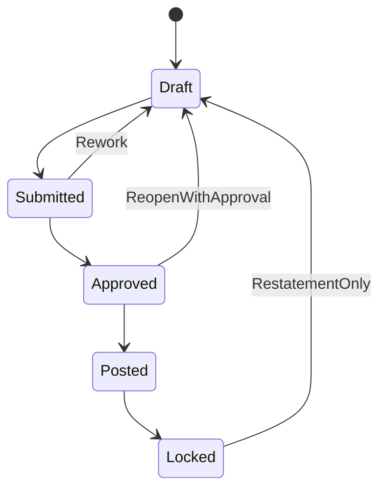
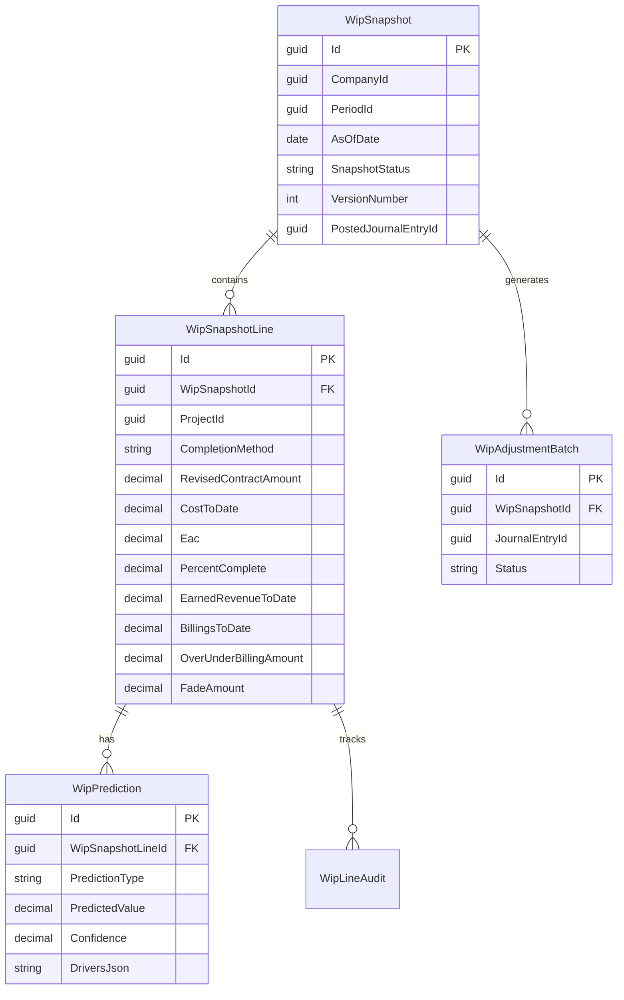

# WIP Schedule Module — Design Spec

**Author:** Codex (for Pitbull team)  
**Date:** 2026-02-19  
**Status:** Ready for implementation planning  
**Target Modules:** `Pitbull.Billing`, `Pitbull.Reports`, `Pitbull.Contracts`, `Pitbull.Projects`, `Pitbull.Core`  
**References:** `docs/PRODUCT-REVIEW-CODEX.md`, `docs/roles/CONTROLLER-CFO.md`  
**Note:** `docs/plans/GL-ACCOUNTING-SPEC.md` was not found in repo at time of writing.

---

## 0) Why This Module Exists
The Work in Progress (WIP) schedule is the single most important construction financial report. It is the bridge between project operations and GAAP financial reporting.

For each active project, WIP must answer:
1. How complete are we (cost and/or production basis)?
2. How much revenue have we earned to date?
3. How much have we billed to date?
4. Are we underbilled (asset) or overbilled (liability)?
5. How has our expected final margin changed (fade/gain)?

This module must be auditable, period-locked, and reconcilable to subledgers + GL.

---

## 1) WIP Calculation Engine

## 1.1 Core Inputs (per project, per period)
- `OriginalContractAmount`
- `ApprovedChangeOrders`
- `RevisedContractAmount = OriginalContractAmount + ApprovedChangeOrders`
- `CostToDate`
- `EstimatedCostAtCompletion (EAC)`
- `BillingsToDate`
- `RetentionHeldReceivable` (owner-side)
- `Method` (`CostToCost`, `UnitsOfDelivery`, `Milestone`)

## 1.2 Core Outputs
- `PercentComplete`
- `EarnedRevenueToDate`
- `CurrentPeriodEarnedRevenue`
- `CurrentPeriodGrossProfit`
- `OverUnderBillingAmount`
- `OverUnderBillingType` (`UnderbillingAsset`, `OverbillingLiability`, `Flat`)
- `GrossProfitToDate`
- `ProjectedGrossProfitAtCompletion`

## 1.3 Formula Set (default cost-to-cost)
For `CostToCost` method:
- `PercentComplete = CostToDate / EAC` (clamped 0..1 unless explicit approved override)
- `EarnedRevenueToDate = RevisedContractAmount * PercentComplete`
- `CurrentPeriodEarnedRevenue = EarnedRevenueToDate - PriorPeriodEarnedRevenue`
- `GrossProfitToDate = EarnedRevenueToDate - CostToDate`
- `ProjectedGrossProfitAtCompletion = RevisedContractAmount - EAC`
- `OverUnderBillingAmount = EarnedRevenueToDate - BillingsToDate`
  - positive = underbilled (costs/earnings in excess)
  - negative = overbilled (billings in excess)

## 1.4 Calculation Controls
1. Hard-stop when required inputs are missing (EAC null, revised contract null, period closed, etc.).
2. Soft warnings when values are suspicious (e.g., % complete > 100%, EAC < CostToDate).
3. Manual override supported with reason code + approver.
4. Every calculation run stores lineage (input snapshot hash + run version).

---

## 2) Completion Methods

## 2.1 Method Definitions
### A) Cost-to-Cost (default)
Best for most lump-sum/GMP projects with reliable job cost capture.
- Completion based on cost incurred versus estimated total cost.

### B) Units of Delivery
Used when contractual units are measurable and production is primary signal.
- Completion based on delivered units / total contracted units.

### C) Milestone Method
Used for design-build or milestone-based revenue contracts.
- Completion based on weighted milestone achievements.

## 2.2 Method-Specific Input Models
### `CostToCostInput`
- `CostToDate`, `EAC`

### `UnitsOfDeliveryInput`
- `TotalContractUnits`
- `UnitsDeliveredToDate`
- `UnitValidationSource`

### `MilestoneInput`
- milestone list with:
  - `MilestoneId`
  - `WeightPercent`
  - `Status` (`NotStarted`, `InProgress`, `Complete`)
  - `CompletionDate`

## 2.3 Method Switch Governance
- Method can be set at project start and changed only with controller approval.
- Method changes are versioned with effective period and restatement option.
- Restatement entry required if method change materially alters prior periods.

---

## 3) Estimated Cost at Completion (EAC) + Fade Analysis

## 3.1 EAC Sources
1. PM forecast (primary)
2. Statistical trend forecast (system-generated)
3. Blended forecast (weighted PM + trend)

## 3.2 EAC Data Model
### `WipEstimate`
- `ProjectId`, `PeriodId`
- `EnteredEac`
- `SystemEac`
- `SelectedEac`
- `SelectionMode` (`Manual`, `System`, `Blend`)
- `Assumptions`
- `EnteredBy`, `ApprovedBy`

## 3.3 Fade / Gain Metrics
- `OriginalEstimatedGrossProfit = RevisedContractAmount - OriginalEstimatedCost`
- `CurrentProjectedGrossProfit = RevisedContractAmount - SelectedEac`
- `FadeAmount = CurrentProjectedGrossProfit - PriorProjectedGrossProfit`
- `FadePercent = FadeAmount / RevisedContractAmount`

Interpretation:
- Negative fade = margin erosion
- Positive fade = margin improvement

## 3.4 Fade Alerts
- Trigger warning at configurable thresholds:
  - `FadePercent <= -1%` warning
  - `FadePercent <= -3%` high risk
  - `FadePercent <= -5%` executive escalation

---

## 4) Monthly WIP Snapshot + Period Comparison

## 4.1 Snapshot Design
WIP is not a live mutable table; it is a period snapshot artifact.

### `WipSnapshot`
- `CompanyId`, `PeriodId`, `SnapshotStatus` (`Draft`, `Submitted`, `Approved`, `Posted`, `Locked`)
- `AsOfDate`
- `GeneratedAt`, `GeneratedBy`
- `ApprovedAt`, `ApprovedBy`
- `PostedJournalEntryId?`
- `VersionNumber`
- `RestatesSnapshotId?`

### `WipSnapshotLine`
- `WipSnapshotId`, `ProjectId`
- `CompletionMethod`
- `RevisedContractAmount`
- `CostToDate`
- `Eac`
- `PercentComplete`
- `EarnedRevenueToDate`
- `BillingsToDate`
- `OverUnderBillingAmount`
- `OverUnderBillingType`
- `CurrentPeriodRevenue`
- `CurrentPeriodGrossProfit`
- `FadeAmount`, `FadePercent`
- `RiskScore`
- `Notes`

## 4.2 Period Comparison Features
1. Side-by-side period deltas by project and portfolio.
2. Delta columns:
- `Δ EAC`
- `Δ PercentComplete`
- `Δ EarnedRevenue`
- `Δ Billings`
- `Δ OverUnder`
- `Δ GrossProfit`
- `Δ Fade`
3. Explainability links to source transactions and forecast updates.

## 4.3 Snapshot Lifecycle

---

## 5) GL Integration (Auto-Generate WIP Adjustments)

## 5.1 Accounting Objective
Convert WIP schedule results into controlled adjusting entries for:
- Costs and estimated earnings in excess of billings (underbilling asset)
- Billings in excess of costs and estimated earnings (overbilling liability)

## 5.2 GL Account Defaults
Company settings must define:
- `UnderbillingAssetAccount` (e.g. 1200)
- `OverbillingLiabilityAccount` (e.g. 2100)
- `ContractRevenueAccount` (e.g. 4000)
- optional `WipClearingAccount`

## 5.3 Journal Generation Rules
For each project line:
1. Compute target over/under position for period.
2. Compute delta versus prior posted position.
3. Generate adjusting JE lines for delta only.
4. Aggregate by project and account (configurable detail level).

Example:
- If project moves from $100k underbilled to $140k underbilled:
  - Dr Underbilling Asset 40k
  - Cr Contract Revenue 40k

If project moves from $50k overbilled to $20k overbilled:
- Dr Overbilling Liability 30k
- Cr Contract Revenue 30k

## 5.4 Posting Workflow
1. `Approve Snapshot` creates pending `WipAdjustmentBatch`.
2. Controller reviews JE preview + project drill-through.
3. `Post Snapshot` posts JE and links `PostedJournalEntryId`.
4. Snapshot locks after successful posting.

## 5.5 Audit Requirements
Every JE line must include:
- source snapshot ID + line ID
- project ID
- period ID
- calculation version
- posted by/approved by timestamps

---

## 6) Bonding Company + Bank Reporting Format

## 6.1 Required Report Pack
Generate exportable package from approved/posted snapshot:
1. WIP Detail Schedule (project-level)
2. WIP Summary Rollup
3. Over/Under Billing Summary
4. Backlog Summary
5. Margin Fade Trend (3/6/12 month)
6. Supporting assumptions log (EAC notes and overrides)

## 6.2 Standard WIP Detail Columns
- Project Number / Name
- Contract Type
- Original Contract
- Approved COs
- Revised Contract
- Cost To Date
- EAC
- % Complete
- Earned Revenue To Date
- Billings To Date
- Over/(Under) Billing
- Gross Profit To Date
- Estimated Gross Profit @ Completion
- Fade This Period
- AR Retention
- AP Retention

## 6.3 Output Formats
- PDF (board-ready)
- XLSX (bonding analyst-friendly)
- CSV (bank covenant ingestion)

## 6.4 Bonding/Bank Notes
- Include signed certification block (Controller/CFO).
- Include period and basis disclosure (method mix by project).
- Include excluded project list (if any) with rationale.

---

## 7) AI Predictions

## 7.1 Cost Overrun Warnings
Use trend + current commitments to predict likely EAC movement.
- Inputs: burn rate, pending COs, schedule slippage, productivity variance.
- Output: projected overrun amount + confidence + top drivers.

## 7.2 Completion Date Estimates
Predict revised completion date based on:
- progress velocity
- schedule variance
- open blockers (RFIs/submittals/change orders)
- crew/equipment utilization

## 7.3 Margin Erosion Alerts
Detect early signs before period close:
- repeated negative fade trend
- rising indirect labor burden
- accelerating subcontract cost creep

## 7.4 AI Governance
Predictions are advisory only unless explicitly approved.
- no autonomous posting
- no autonomous EAC override
- all AI-derived recommendations stored with confidence and reason codes

---

## 8) Predictive Features (Proactive Signals Before PM Notices)

## 8.1 Project-Level Early Warning Signals
1. `EAC Drift Alert`: if live cost trajectory implies >X% increase over selected EAC.
2. `Billing Risk Alert`: if earned revenue growth outpaces billing cadence, likely underbilling cash pressure.
3. `Overbilling Reversal Alert`: if currently overbilled projects are trending into underbilled quickly.
4. `Margin Compression Alert`: if projected GP margin drops by threshold week-over-week.
5. `Close Readiness Alert`: missing required WIP inputs ahead of period close.

## 8.2 Auto-Generated Actions
When threshold exceeded, system can auto-create:
- PM forecast review task
- controller review queue item
- project risk narrative draft
- escalation notification to exec dashboard

## 8.3 Portfolio Heatmap
Provide a ranked view of projects by risk score:
- overrun likelihood
- fade severity
- cash exposure (underbilling)
- forecast confidence

---

## 9) Data Model (Entity Diagram)

---

## 10) API Design

## 10.1 Snapshot lifecycle
- `POST /api/wip/snapshots/generate`
  - body: `{ periodId, asOfDate, projectIds?, options }`
- `GET /api/wip/snapshots/{snapshotId}`
- `GET /api/wip/snapshots/{snapshotId}/lines`
- `POST /api/wip/snapshots/{snapshotId}/submit`
- `POST /api/wip/snapshots/{snapshotId}/approve`
- `POST /api/wip/snapshots/{snapshotId}/post`
- `POST /api/wip/snapshots/{snapshotId}/lock`

## 10.2 Comparison and reporting
- `GET /api/wip/compare?currentSnapshotId=&priorSnapshotId=`
- `GET /api/wip/reports/detail?snapshotId=&format=pdf|xlsx|csv`
- `GET /api/wip/reports/summary?snapshotId=&format=pdf|xlsx|csv`
- `GET /api/wip/reports/bonding-pack?snapshotId=&format=zip`

## 10.3 Forecast and predictions
- `PUT /api/wip/projects/{projectId}/eac`
- `GET /api/wip/snapshots/{snapshotId}/predictions`
- `POST /api/wip/snapshots/{snapshotId}/predictions/refresh`

## 10.4 GL integration
- `GET /api/wip/snapshots/{snapshotId}/journal-preview`
- `POST /api/wip/snapshots/{snapshotId}/journal-post`

---

## 11) Security, Controls, and Compliance

1. Only authorized finance roles can approve/post/lock snapshots.
2. Segregation of duties:
- preparer cannot be final approver by default policy.
3. Period-locked safeguards:
- no posting into closed period without explicit reopen workflow.
4. Immutable audit:
- every recalc, override, and post is logged with before/after values.
5. Source traceability:
- line-level drill-through to project costs, billings, COs, and forecasts.

---

## 12) Implementation Phases

### Phase 1: WIP Core Engine + Snapshot
- core entities + calculation service
- snapshot generation and line outputs
- period comparison API

### Phase 2: EAC + Fade + Forecast Workflow
- EAC input workflow
- fade trend analytics
- risk scoring and alerts

### Phase 3: GL Adjustment Posting
- JE preview and posting pipeline
- account mapping settings
- audit-linking and period lock controls

### Phase 4: Bonding/Bank Pack + AI Predictive Layer
- standardized exports and certification layout
- prediction refresh jobs and proactive notifications

---

## 13) Acceptance Criteria

1. Controller can generate monthly WIP snapshot with per-project over/under billing.
2. Module supports three completion methods with project-level method selection.
3. EAC changes produce measurable fade analysis period-over-period.
4. Snapshot comparison clearly shows deltas in earned revenue, billings, and margin.
5. Approved snapshots can generate and post WIP GL adjustment JEs.
6. Bonding/bank pack exports are available in PDF/XLSX/CSV.
7. AI warnings identify likely overruns and margin erosion with confidence + drivers.
8. Predictive flags surface high-risk projects before monthly close.

---

## 14) Open Decisions

1. Whether to allow mixed completion methods within one project (by phase/cost code).
2. Whether WIP JE posting is one aggregate JE per period or one JE per project.
3. Whether forecast confidence scoring should be deterministic rules only in v1 or include ML model inference.
4. Whether to permit snapshot restatements after financial statements are issued.

