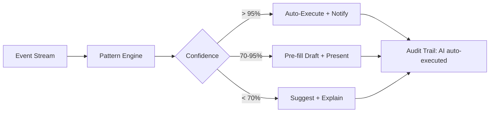

# AI Agent Onboarding Design — Architecture Specification

**Author:** AI Strategy Lead
**Date:** 2026-02-19
**Status:** Proposed
**Thesis:** AI is the architecture, not a feature.

---

## Executive Summary

Pitbull is not an ERP with AI bolted on. It is an AI-first construction ERP (AIERP) where intelligent agents are woven into every operational layer. This document defines how AI agents exist as first-class participants in the system, how their autonomy is governed through supervision tiers, how they integrate into the customer onboarding flow, and how every AI-touched transaction satisfies GAAP compliance requirements.

### Current State

The Pitbull.AI module already provides:

- **Provider abstraction** (`IAiProvider`) with Anthropic and OpenAI implementations (`src/Modules/Pitbull.AI/Providers/`)
- **AiChatController** -- context-aware chat on every page, with page context enrichment from Projects, Bids, Contracts, and more (`src/Pitbull.Api/Controllers/AiChatController.cs`)
- **AiSuggestController** -- field-level AI suggestions and semantically similar RFI detection (`src/Pitbull.Api/Controllers/AiSuggestController.cs`)
- **AiDocumentController** -- document analysis extracting dates, amounts, parties, and key terms from uploaded files (`src/Pitbull.Api/Controllers/AiDocumentController.cs`)
- **AiController** -- daily report summarization, submittal review, and per-tenant API key management (`src/Pitbull.Api/Controllers/AiController.cs`)
- **Per-user rate limiting** via `[EnableRateLimiting("ai-chat")]`, `[EnableRateLimiting("ai-suggest")]`, `[EnableRateLimiting("ai-document")]`
- **AI settings admin panel** at `/admin/ai-settings` for key management
- **CSI cost code seeding** via `POST /api/cost-codes/seed-csi` (`CsiCostCodeData.GetStandardCodes()`)
- **DemoBootstrapper** creating full tenant setup on startup with system user attribution (`CreatedBy = "system"`)
- **AuditInterceptor** capturing all entity creates, updates, and deletes with before/after diffs (`src/Pitbull.Api/Data/AuditInterceptor.cs`)
- **AuditLog** domain entity with action types including Create, Update, Delete, Approval, Rejection, Import (`src/Modules/Pitbull.Core/Domain/AuditLog.cs`)
- **Existing onboarding flow** with checklist, welcome tour, company setup wizard, and tenant provisioning (`src/Pitbull.Api/Controllers/OnboardingController.cs`)
- **Data import infrastructure** with preview/confirm pattern for employees, projects, cost codes, equipment, and time entries (`src/Pitbull.Api/Controllers/DataImportController.cs`)

### What This Document Adds

A governance framework that transforms these isolated AI capabilities into a coordinated agent system with identity, supervision, audit compliance, and a phased implementation roadmap.

---

## 1. AI Agent Identity Model

AI agents are first-class users in Pitbull. They are not anonymous background processes. Every AI action is attributable, auditable, and rate-limited independently from human users.

### 1.1 Agent User Records

AI agents get their own records in the `AppUser` table, following the pattern already established by DemoBootstrapper's system user:

```csharp
public class AiAgentUser
{
    // Stored in AppUser with Type = UserType.AiAgent (new enum value)
    public Guid Id { get; set; }
    public Guid TenantId { get; set; }
    public string UserName { get; set; }       // e.g., "ai-data-entry@pitbull.internal"
    public string Email { get; set; }           // e.g., "ai-data-entry@pitbull.internal"
    public UserType Type { get; set; }          // UserType.AiAgent (new)
    public string FirstName { get; set; }       // "AI Data Entry"
    public string LastName { get; set; }        // "Assistant"
    public UserStatus Status { get; set; }      // Active
}
```

**Extend `UserType` enum:**
```csharp
public enum UserType
{
    Internal,       // Existing: company employees
    External,       // Existing: subcontractor portal users
    AiAgent         // NEW: AI agent service accounts
}
```

### 1.2 Agent Roles

Each AI agent operates under a defined role that constrains its permissions through the existing RBAC system (`src/Pitbull.Api/Infrastructure/RoleSeeder.cs`):

| Agent Name | Role | Purpose | Scope |
|---|---|---|---|
| AI Assistant | `AiAssistant` | Chat, suggestions, report generation | Read-only across all modules |
| AI Data Entry | `AiDataEntry` | CSV import, field population, data seeding | Create drafts, no direct commits |
| AI Auditor | `AiAuditor` | Anomaly detection, compliance monitoring | Read-only, can create alerts |
| AI Document Processor | `AiDocProcessor` | OCR, document analysis, data extraction | Read documents, create drafts |

**Role permissions** follow existing RBAC patterns but with explicit constraints:
- AI roles can never include `Approve`, `Delete`, or `AdminAccess` permissions
- AI roles are scoped to specific modules via `RolePermission` records
- AI roles are provisioned per-tenant during tenant setup (extending `RoleSeeder.EnsureRolesForTenantAsync`)

### 1.3 Agent Attribution

Every action by an AI agent records both the agent identity and the supervising human:

```csharp
// Extended from existing AuditInterceptor pattern
public class AiActionAttribution
{
    public string ActorType { get; set; }        // "AI_AGENT" | "HUMAN"
    public Guid AgentId { get; set; }            // AI agent's AppUser.Id
    public string AgentName { get; set; }        // "AI Data Entry Assistant"
    public string Model { get; set; }            // "claude-sonnet-4-20250514" (from AiCompletionResult.Model)
    public string Provider { get; set; }         // "anthropic" (from AiCompletionResult.Provider)
    public Guid? SupervisorId { get; set; }      // Human user who initiated/approved
    public string? SupervisorName { get; set; }
    public string SupervisionLevel { get; set; } // "TIER_1" | "TIER_2" | "TIER_3"
}
```

This integrates with the existing `AuditLog.Create()` method through the `Metadata` JSON field, requiring no schema migration for the audit_logs table.

### 1.4 Agent Authentication

AI agents use service account authentication, not JWT sessions:

- **Internal agents** (running within the Pitbull API process) authenticate via a scoped `ITenantContext` injection, similar to how `DemoBootstrapper` sets `tenantContext.TenantId` directly
- **External agents** (future: webhook-triggered or scheduled jobs) authenticate via API key in the `X-Agent-Key` header, validated by a new `AiAgentAuthMiddleware`
- Agents never receive JWT tokens, never appear in login/logout audit trails as human sessions
- Agent API keys are stored using the existing `AiApiKey` entity with `Provider = "agent"` and are encrypted via the existing `IDataProtectionProvider` pattern in `AiApiKeyService`

### 1.5 Agent Rate Limits

AI agents have separate rate limit policies from human users, extending the existing `EnableRateLimiting` configuration in `Program.cs`:

| Policy | Window | Limit | Applies To |
|---|---|---|---|
| `ai-agent-tier1` | 1 minute | 120 requests | Autonomous operations |
| `ai-agent-tier2` | 1 minute | 60 requests | Draft creation |
| `ai-agent-external` | 1 minute | 30 requests | External API key agents |
| `ai-chat` | 1 minute | 30 requests | Human chat (existing) |
| `ai-suggest` | 1 minute | 60 requests | Human suggestions (existing) |
| `ai-document` | 1 minute | 10 requests | Human document analysis (existing) |

---

## 2. Supervision Levels

All AI actions fall into one of three supervision tiers. The tier determines whether human approval is required before the action takes effect. This classification is enforced at the handler level, not the controller level, so it cannot be bypassed by direct API calls.

### Tier 1 -- Fully Autonomous

**Definition:** AI performs the action without human approval. The action is logged but takes effect immediately.

**Actions:**

| Action | Current Implementation | Notes |
|---|---|---|
| Seed CSI cost codes | `POST /api/cost-codes/seed-csi` (CostCodesController) | Already exists, idempotent |
| Seed demo/standard data | `ISeedDataService.SeedAsync()` via DemoBootstrapper | Already exists |
| Generate report summaries | `POST /api/ai/projects/{id}/daily-reports/{id}/summary` | Already exists |
| Suggest field values | `POST /api/ai/suggest` (AiSuggestController) | Already exists |
| Answer chat questions | `POST /api/ai/chat` (AiChatController) | Already exists |
| Find similar RFIs | `POST /api/ai/suggest/similar-rfis` | Already exists |
| Analyze document metadata | `POST /api/ai/analyze-document` (AiDocumentController) | Already exists |
| Review submittals (draft recommendation) | `POST /api/ai/projects/{id}/submittals/{id}/review` | Already exists |
| Populate form defaults | New | Extend AiSuggestController |
| Suggest module config by contractor type | New | During onboarding |

**Enforcement pattern:**
```csharp
// Tier 1 actions execute immediately within the handler
public class SeedCsiCodesHandler : IRequestHandler<SeedCsiCodesCommand, Result<int>>
{
    public async Task<Result<int>> Handle(SeedCsiCodesCommand request, CancellationToken ct)
    {
        // No approval gate. Execute directly.
        // AuditInterceptor captures the action automatically.
        var codes = CsiCostCodeData.GetStandardCodes();
        db.Set<CostCode>().AddRange(codes);
        await db.SaveChangesAsync(ct);
        return Result.Success(codes.Count);
    }
}
```

### Tier 2 -- Draft and Review

**Definition:** AI creates a draft record. A human must explicitly approve before the record becomes active. Until approved, the record exists in `Draft` status and has no operational effect.

**Actions:**

| Action | Draft Entity | Approval Required By |
|---|---|---|
| Parse CSV and map columns | `ImportBatch` (existing, status=Preview) | Admin or Manager |
| Create employee records from import | `Employee` with Status=Draft | Admin |
| Draft RFI responses | `RfiResponse` with Status=Draft | Project Manager |
| Suggest cost code assignments for time entries | `TimeEntry.CostCodeId` as suggestion | Supervisor |
| Pre-populate project from bid conversion | `Project` with Status=Draft | Project Manager |
| Generate daily report narratives | `PmDailyReport.WorkNarrative` as draft | Superintendent |
| Suggest change order amounts from RFI cost impact | `ChangeOrder` with Status=Draft | Project Manager |
| Suggest SOV structure from project type | `ScheduleOfValueItem` as draft set | Project Manager |
| Suggest employee-to-project assignments | `ProjectAssignment` as suggestion | Admin or PM |
| Map imported data fields to schema | `ImportFieldMapping` as suggestion | Admin or Manager |

**Enforcement pattern:**
```csharp
// Tier 2 actions create draft records that require human approval
public class AiCreateEmployeeDraftHandler : IRequestHandler<AiCreateEmployeeDraftCommand, Result<EmployeeDraftDto>>
{
    public async Task<Result<EmployeeDraftDto>> Handle(
        AiCreateEmployeeDraftCommand request, CancellationToken ct)
    {
        var employee = new Employee
        {
            // ... mapped fields from CSV
            Status = EmployeeStatus.Draft,           // Not active until approved
            CreatedBy = request.AgentId.ToString(),   // AI agent attribution
            Notes = $"AI-created from CSV import. Confidence: {request.Confidence:P0}. Requires human review."
        };

        db.Set<Employee>().Add(employee);
        await db.SaveChangesAsync(ct);

        // Create pending approval record
        var approval = new PendingApproval
        {
            EntityType = "Employee",
            EntityId = employee.Id,
            RequestedByAgentId = request.AgentId,
            SupervisionLevel = SupervisionLevel.Tier2,
            Confidence = request.Confidence,
            Source = request.Source  // "CSV_IMPORT"
        };

        db.Set<PendingApproval>().Add(approval);
        await db.SaveChangesAsync(ct);

        return Result.Success(employee.ToDto());
    }
}
```

**Approval flow:**
```
POST /api/approvals/{approvalId}/approve   -- Human approves, record becomes Active
POST /api/approvals/{approvalId}/reject    -- Human rejects, record is soft-deleted
GET  /api/approvals?status=pending         -- Dashboard: pending AI-created items
```

### Tier 3 -- Human Only

**Definition:** AI cannot perform these actions, even as a draft. These operations require direct human initiation and, in many cases, multi-person approval chains.

**Actions:**

| Action | Reason | Required Approvers |
|---|---|---|
| Approve payment applications | GAAP segregation of duties | PM + Controller |
| Run payroll | Tax compliance, garnishments, certified payroll | Payroll Manager + Controller |
| Modify pay rates or tax withholding | PII + financial compliance | HR + Controller |
| Sign compliance documents | Legal liability | Authorized signatory |
| Approve change orders above threshold | Material financial impact | PM + Controller (configurable threshold) |
| Delete financial records | Audit trail integrity | Admin (soft-delete only, with reversal entry) |
| Grant admin access | Security escalation | Existing Admin |
| Close accounting periods | Period control enforcement | Controller |
| Release payment batches | Payment authorization | AP Specialist + Controller |
| Modify tenant billing settings | Revenue recognition | System Admin |

**Enforcement pattern:**
```csharp
// Tier 3 actions are protected at the handler level
public class ApprovePaymentApplicationHandler : IRequestHandler<ApprovePayAppCommand, Result<PayAppDto>>
{
    public async Task<Result<PayAppDto>> Handle(
        ApprovePayAppCommand request, CancellationToken ct)
    {
        // Hard block: check that the actor is a human user, not an AI agent
        var user = await db.Set<AppUser>().FindAsync(request.ApprovedByUserId, ct);
        if (user is null || user.Type == UserType.AiAgent)
            return Result.Failure<PayAppDto>(
                "Payment application approval requires a human user",
                "AI_AGENT_BLOCKED");

        // Existing approval logic...
    }
}
```

### Tier Boundary Decisions

The following table resolves edge cases where the tier classification is not obvious:

| Scenario | Tier | Rationale |
|---|---|---|
| AI suggests a cost code for a time entry | Tier 2 | Financial classification requires human judgment |
| AI auto-fills project address from bid data | Tier 1 | Non-financial metadata, easily corrected |
| AI flags an overtime anomaly | Tier 1 | Observation only, no data mutation |
| AI pre-populates a change order from RFI | Tier 2 | Financial record, even as draft |
| AI creates a daily report from crew data | Tier 2 | Becomes a compliance record once filed |
| AI seeds default chart of accounts | Tier 1 | Standard template, easily modified |
| AI adjusts retainage percentage | Tier 3 | Direct financial impact on payment apps |

---

## 3. AI in Onboarding -- Minute-by-Minute Integration

This section maps AI agent participation to the existing onboarding flow defined in `CUSTOMER-ONBOARDING-FLOW.md` and implemented via `OnboardingController`, the company setup wizard, and `DemoBootstrapper`.

### 3.1 Flow Timeline

```
0:00 ─── TENANT PROVISIONING ───────────────────────────────────
  |   AI Agent: AI Data Entry
  |   Tier: 1 (Fully Autonomous)
  |   Actions:
  |     - Create tenant, company, admin user (existing AuthController.Register)
  |     - Seed RBAC roles (existing RoleSeeder.EnsureRolesForTenantAsync)
  |     - Provision AI agent user records for the tenant
  |     - Trigger POST /api/onboarding/provision (existing)
  |
0:05 ─── EMAIL VERIFICATION ────────────────────────────────────
  |   AI Agent: None (human-only flow)
  |   User verifies email, logs in, redirected to /settings/company/setup
  |
0:10 ─── COMPANY SETUP WIZARD ──────────────────────────────────
  |   AI Agent: AI Assistant
  |   Tier: 1 (Suggestions only)
  |   Actions:
  |     Step 1 - Company Profile: No AI (human enters name, address, etc.)
  |     Step 2 - Contractor Type: AI suggests module config based on selection
  |       - "General Contractor" → enable all modules, suggest 10% retainage
  |       - "Specialty Contractor" → disable Bids module, suggest trade-specific codes
  |       - "Design-Build" → enable all modules, suggest design phase codes
  |     Step 3 - Module Activation: AI pre-selects based on contractor type
  |     Step 4 - Initial Settings: AI pre-fills defaults per contractor type
  |       Already implemented: ContractorType presets in setup wizard
  |
0:15 ─── EMPLOYEE IMPORT ───────────────────────────────────────
  |   AI Agent: AI Data Entry
  |   Tier: 2 (Draft and Review)
  |   Actions:
  |     1. User uploads CSV via POST /api/import/employees
  |     2. AI parses CSV, detects column headers, maps to schema fields
  |     3. AI flags issues:
  |        - "Column 'SSN' detected — will be stored encrypted. Confirm?"
  |        - "3 rows have no email address — mark as field-only employees?"
  |        - "Employee 'John Smith' may be duplicate of existing 'J. Smith'"
  |     4. AI creates ImportBatch with status=Preview (existing pattern)
  |     5. Human reviews mapped data in preview grid
  |     6. Human confirms via POST /api/import/employees/confirm/{importId}
  |     7. Employee records created with CreatedBy = "AI Data Entry Assistant"
  |   PII Protection:
  |     - AI parses structure but does NOT process raw SSN/tax ID values
  |     - AI sees field labels ("SSN", "Tax ID") to map columns
  |     - Raw PII values pass through to encrypted storage without AI inspection
  |     - AI confidence score reflects structural mapping quality, not PII validation
  |
0:20 ─── PROJECT IMPORT ────────────────────────────────────────
  |   AI Agent: AI Data Entry
  |   Tier: 2 (Draft and Review)
  |   Actions:
  |     1. User uploads CSV via POST /api/import/projects
  |     2. AI parses and maps columns (name, number, client, contract amount, etc.)
  |     3. AI suggests:
  |        - Project status based on dates ("Start date is past, no end date → Active")
  |        - Phase structure based on project type
  |        - Budget allocation based on contract amount and project type
  |     4. Human reviews and confirms via existing import/confirm pattern
  |
0:25 ─── COST CODE SETUP ──────────────────────────────────────
  |   AI Agent: AI Data Entry
  |   Tier: 1 (seed) + Tier 2 (custom suggestions)
  |   Actions:
  |     1. AI seeds standard CSI MasterFormat codes (existing POST /api/cost-codes/seed-csi)
  |        - 16 divisions, 70+ sub-codes (CsiCostCodeData.GetStandardCodes())
  |        - Tier 1: No approval needed, standard industry data
  |     2. AI suggests custom codes based on contractor type:
  |        - Electrical contractor → expanded Division 16 codes
  |        - Concrete contractor → expanded Division 03 codes
  |        - GC → balanced distribution across all divisions
  |        - Tier 2: Custom codes presented as suggestions, human activates/modifies
  |
0:30 ─── SUBCONTRACT SETUP ────────────────────────────────────
  |   AI Agent: AI Assistant
  |   Tier: 2 (Draft and Review)
  |   Actions:
  |     1. For each imported project, AI suggests SOV structure:
  |        - Based on project type (commercial, residential, industrial)
  |        - Based on contract amount (more line items for larger contracts)
  |        - Based on CSI divisions activated in cost code setup
  |     2. AI suggests retainage schedule based on company settings
  |     3. Human reviews SOV structure, modifies as needed, confirms
  |
0:35 ─── TEAM INVITATIONS ─────────────────────────────────────
  |   AI Agent: AI Assistant
  |   Tier: 1 (Suggestions only)
  |   Actions:
  |     - AI suggests roles based on employee titles from import:
  |       - "Superintendent" → Supervisor role
  |       - "Project Manager" → Manager role
  |       - "Bookkeeper" → Viewer role with finance module access
  |     - Suggestions appear as pre-filled dropdowns, human confirms
  |
0:45 ─── AI CHAT AVAILABLE ────────────────────────────────────
  |   AI Agent: AI Assistant
  |   Tier: 1 (Fully Autonomous)
  |   Actions:
  |     - Chat bubble available on every page (existing AiChatController)
  |     - Context-aware: knows which page user is on, enriches prompts
  |     - Example questions:
  |       "How do I enter crew time?"
  |       "What cost codes should I use for concrete work?"
  |       "How do I set up a payment application?"
  |     - AI responds with Pitbull-specific guidance, links to relevant pages
  |
1:00 ─── AI PROACTIVE SUGGESTIONS ──────────────────────────────
  |   AI Agent: AI Auditor
  |   Tier: 2 (Suggestions requiring confirmation)
  |   Actions:
  |     - AI analyzes imported data and flags gaps:
  |       "You have 10 projects but no employees assigned — want me to suggest assignments?"
  |       "3 projects have no cost codes assigned — want me to suggest based on project type?"
  |       "No pay periods are configured — want me to set up weekly periods?"
  |     - Each suggestion creates a PendingAction visible on dashboard
  |     - Human clicks "Apply" or "Dismiss" for each suggestion
  |
1:15 ─── FIRST TIME ENTRY ─────────────────────────────────────
  |   AI Agent: AI Assistant
  |   Tier: 1 (Suggestions only)
  |   Actions:
  |     - When user opens time tracking, AI pre-fills:
  |       - Date: today
  |       - Project: most recently active project
  |       - Cost code: most commonly used for employee's classification
  |     - AI suggests crew from supervisor's assigned employees
  |     - All pre-fills are suggestions only — user can change anything
  |
1:30 ─── FIRST REPORT ─────────────────────────────────────────
  |   AI Agent: AI Assistant
  |   Tier: 1 (Generation only)
  |   Actions:
  |     - User navigates to Reports, AI offers to generate first report
  |     - Labor cost summary for current pay period
  |     - Project budget snapshot
  |     - AI generates narrative summary (existing daily report summarization)
  |
2:00 ─── ONBOARDING COMPLETE ──────────────────────────────────
      AI marks onboarding checklist items as complete via existing
      PUT /api/onboarding/checklist/{itemName} pattern.
      Dashboard transitions from onboarding mode to operational mode.
```

### 3.2 Onboarding Checklist AI Integration

The existing 8-item checklist (`OnboardingController.GetChecklist`) is extended with AI participation:

| Checklist Item | AI Role | Tier |
|---|---|---|
| Complete company profile | None (human entry) | -- |
| Select contractor type | AI suggests module defaults | Tier 1 |
| Activate modules | AI pre-selects based on type | Tier 1 |
| Configure module settings | AI pre-fills defaults | Tier 1 |
| Invite team members | AI suggests roles from employee data | Tier 1 |
| Create your first project | AI creates from CSV import | Tier 2 |
| Add employees | AI creates from CSV import | Tier 2 |
| Review cost codes | AI seeds CSI + suggests custom | Tier 1/2 |

---

## 4. Audit Trail Format

The audit trail for AI actions extends the existing `AuditLog` entity and `AuditInterceptor`. AI-specific metadata is stored in the existing `Metadata` JSON column, requiring no database migration.

### 4.1 Standard AI Audit Entry

```json
{
  "action": "CREATE",
  "entity": "Employee",
  "entityId": "a1b2c3d4-e5f6-7890-abcd-ef1234567890",
  "actor": {
    "type": "AI_AGENT",
    "agentId": "f0e1d2c3-b4a5-6789-0123-456789abcdef",
    "agentName": "AI Data Entry Assistant",
    "agentRole": "AiDataEntry",
    "model": "claude-sonnet-4-20250514",
    "provider": "anthropic",
    "inputTokens": 1250,
    "outputTokens": 340,
    "latencyMs": 1200
  },
  "supervisor": {
    "type": "HUMAN",
    "userId": "12345678-abcd-ef01-2345-6789abcdef01",
    "userName": "Josh Garrison",
    "userEmail": "josh@example.com",
    "role": "Admin"
  },
  "supervisionLevel": "TIER_2_DRAFT_AND_REVIEW",
  "status": "PENDING_APPROVAL",
  "approvedAt": null,
  "approvedBy": null,
  "source": "CSV_IMPORT",
  "sourceDetail": "employees_2026-02-19.csv, row 15",
  "confidence": 0.95,
  "confidenceFactors": {
    "columnMapping": 0.98,
    "dataValidation": 0.92,
    "duplicateCheck": 0.95
  },
  "changes": {
    "FirstName": { "newValue": "Mike" },
    "LastName": { "newValue": "Rodriguez" },
    "EmployeeNumber": { "newValue": "EMP-042" },
    "Classification": { "newValue": "Journeyman" },
    "BaseHourlyRate": { "newValue": "55.00" }
  },
  "piiRedacted": ["SSN", "TaxId"],
  "timestamp": "2026-02-19T14:30:00.000Z"
}
```

### 4.2 Approval Audit Entry

When a human approves or rejects an AI-created draft:

```json
{
  "action": "APPROVAL",
  "entity": "Employee",
  "entityId": "a1b2c3d4-e5f6-7890-abcd-ef1234567890",
  "actor": {
    "type": "HUMAN",
    "userId": "12345678-abcd-ef01-2345-6789abcdef01",
    "userName": "Josh Garrison",
    "role": "Admin"
  },
  "relatedAiAction": {
    "auditLogId": "original-audit-log-id",
    "agentName": "AI Data Entry Assistant",
    "supervisionLevel": "TIER_2_DRAFT_AND_REVIEW"
  },
  "decision": "APPROVED",
  "modifications": {
    "BaseHourlyRate": { "aiSuggested": "55.00", "humanSet": "58.00" }
  },
  "timestamp": "2026-02-19T14:35:00.000Z"
}
```

### 4.3 Implementation with Existing AuditLog

The metadata JSON is stored in the existing `AuditLog.Metadata` column:

```csharp
// In AiAuditService (new service)
public async Task LogAiActionAsync(AiActionContext context, CancellationToken ct)
{
    var metadata = JsonSerializer.Serialize(new
    {
        actor = new
        {
            type = "AI_AGENT",
            agentId = context.AgentId,
            agentName = context.AgentName,
            model = context.CompletionResult?.Model,
            provider = context.CompletionResult?.Provider,
            inputTokens = context.CompletionResult?.InputTokens,
            outputTokens = context.CompletionResult?.OutputTokens,
            latencyMs = context.CompletionResult?.Latency.TotalMilliseconds
        },
        supervisor = context.SupervisorId.HasValue ? new
        {
            type = "HUMAN",
            userId = context.SupervisorId,
            userName = context.SupervisorName
        } : null,
        supervisionLevel = context.Tier.ToString(),
        source = context.Source,
        confidence = context.Confidence
    });

    var log = AuditLog.Create(
        tenantId: context.TenantId,
        userId: context.AgentUserId,      // AI agent's user ID
        userEmail: context.AgentEmail,
        userName: context.AgentName,
        action: context.AuditAction,
        resourceType: context.EntityType,
        resourceId: context.EntityId?.ToString(),
        description: $"AI Agent '{context.AgentName}' {context.AuditAction} {context.EntityType}",
        metadata: metadata);

    db.Set<AuditLog>().Add(log);
    await db.SaveChangesAsync(ct);
}
```

### 4.4 PII Redaction in Audit Trails

When AI processes records containing PII (employees, payroll, tax information):

- The `piiRedacted` field lists which columns were present but not logged
- AI audit entries never contain raw SSN, tax ID, bank account numbers, or date of birth values
- The `changes` dictionary shows field names but redacts sensitive values: `"SSN": { "newValue": "[REDACTED]" }`
- This satisfies both the HR Director's PII requirements and SOC 2 compliance

---

## 5. GAAP Compliance Requirements for AI Transactions

Every AI action that creates, modifies, or influences a financial record must satisfy Generally Accepted Accounting Principles. These requirements apply to all Tier 2 and Tier 3 actions involving financial entities.

### 5.1 Segregation of Duties

**Principle:** No single actor (human or AI) can both create AND approve a financial transaction.

**Implementation:**

```csharp
public class SegregationOfDutiesValidator
{
    public Result Validate(Guid creatorId, Guid approverId, string entityType)
    {
        // AI agent can never approve its own creation
        if (creatorId == approverId)
            return Result.Failure(
                "The creator and approver must be different users (segregation of duties)",
                "SEGREGATION_VIOLATION");

        // AI agents can never approve financial records regardless
        var approver = db.Set<AppUser>().Find(approverId);
        if (approver?.Type == UserType.AiAgent)
            return Result.Failure(
                "AI agents cannot approve financial transactions",
                "AI_AGENT_BLOCKED");

        return Result.Success();
    }
}
```

**Affected entities:**
- `PaymentApplication` -- AI can draft line items, human must approve
- `ChangeOrder` -- AI can suggest amounts, human must approve
- `TimeEntry` (when linked to labor cost) -- AI can pre-fill, supervisor must approve
- `JournalEntry` (future) -- AI can suggest coding, controller must post
- `Invoice` (future) -- AI can match to PO, AP specialist must approve

### 5.2 Audit Trail Completeness

**Principle:** Every AI-touched record has full provenance from creation through approval.

**Requirements:**
- All AI-created records include `CreatedBy` = agent name (existing `BaseEntity.CreatedBy` field)
- All AI-modified records include `UpdatedBy` = agent name (existing `BaseEntity.UpdatedBy` field)
- The `AuditLog` captures before/after diffs (existing `AuditInterceptor` behavior)
- AI-specific metadata (model, confidence, source) is stored in `AuditLog.Metadata`
- Approval actions create a linked audit entry referencing the original AI action

**Query for auditors:**
```sql
-- Find all AI-created financial records pending approval
SELECT al.*, al.metadata->>'supervisionLevel' as tier
FROM audit_logs al
WHERE al.metadata->>'actor'->>'type' = 'AI_AGENT'
  AND al.resource_type IN ('PaymentApplication', 'ChangeOrder', 'TimeEntry')
  AND al.metadata->>'status' = 'PENDING_APPROVAL'
ORDER BY al.timestamp DESC;
```

### 5.3 Reversibility

**Principle:** AI-created entries are always voidable. Financial records are never hard-deleted; they are voided with a reversal entry.

**Implementation:**
- AI-created records that have been approved follow the existing soft-delete pattern (`IsDeleted = true`)
- Financial records additionally create a reversal entry:

```csharp
public class VoidAiCreatedEntryHandler
{
    public async Task<Result> Handle(VoidEntryCommand command, CancellationToken ct)
    {
        var entry = await db.Set<FinancialEntry>().FindAsync(command.EntryId, ct);
        if (entry is null)
            return Result.Failure("Entry not found", "NOT_FOUND");

        // Soft-delete the original
        entry.IsDeleted = true;
        entry.VoidedAt = DateTime.UtcNow;
        entry.VoidedBy = command.VoidedByUserId.ToString();
        entry.VoidReason = command.Reason;

        // Create reversal entry (negative of original amounts)
        var reversal = entry.CreateReversal(command.VoidedByUserId, command.Reason);
        db.Set<FinancialEntry>().Add(reversal);

        await db.SaveChangesAsync(ct);
        return Result.Success();
    }
}
```

### 5.4 Materiality Threshold

**Principle:** AI can auto-approve below a configurable threshold; above threshold requires human approval.

**Implementation:**
- Configurable per-tenant via `ModuleSettings` (extending existing `ModuleSettingsController`):

```json
{
  "ai": {
    "autoApproveThreshold": {
      "timeEntryLaborCost": 500.00,
      "changeOrderAmount": 0.00,
      "paymentApplicationAmount": 0.00
    }
  }
}
```

- `timeEntryLaborCost`: Time entries under $500 in calculated labor cost can be auto-approved by AI anomaly check (still Tier 2, but auto-confirmed if no anomalies detected)
- `changeOrderAmount`: Default $0 means ALL change orders require human approval
- `paymentApplicationAmount`: Default $0 means ALL pay apps require human approval
- The Payroll Manager's requirement is satisfied: payroll is always Tier 3 regardless of threshold

### 5.5 Period Controls

**Principle:** AI cannot post to closed accounting periods.

**Implementation:**
```csharp
// Added to all AI handlers that create date-stamped financial records
public class PeriodControlValidator
{
    public Result ValidateOpenPeriod(DateTime transactionDate, Guid tenantId)
    {
        var period = db.Set<PayPeriod>()
            .FirstOrDefault(p => p.TenantId == tenantId
                && p.StartDate <= DateOnly.FromDateTime(transactionDate)
                && p.EndDate >= DateOnly.FromDateTime(transactionDate));

        if (period?.Status == PayPeriodStatus.Closed)
            return Result.Failure(
                $"Cannot create entries in closed period {period.StartDate} - {period.EndDate}",
                "PERIOD_CLOSED");

        return Result.Success();
    }
}
```

### 5.6 Dual Control for Payments

**Principle:** Payments over a configurable threshold require two human approvals regardless of AI involvement.

**Implementation:**
- Extends existing `PaymentApplication` approval workflow
- AI can prepare payment batches (Tier 2 draft)
- First human approves the batch (existing approval flow)
- For amounts over threshold: second human must also approve (new `DualApprovalRequired` flag)
- AI involvement does not count as either approval

```json
{
  "payments": {
    "dualApprovalThreshold": 25000.00,
    "dualApprovalRoles": ["Admin", "Controller"]
  }
}
```

---

## 6. AI Agent Workflows for Daily Operations

Beyond onboarding, AI agents participate in ongoing construction operations. Each workflow is a specific agent with a defined trigger, scope, and output.

### 6.1 Morning Briefing Agent

**Agent:** AI Auditor
**Trigger:** Scheduled (daily at 6:00 AM local, or on first login of the day)
**Tier:** 1 (Read-only report generation)

**Inputs:**
- Yesterday's time entries (from `TimeEntry` table)
- Open RFIs approaching due date (from `Rfi` table)
- Project budget vs. actual (from `Project.ContractAmount` vs. committed costs)
- Pending approvals count (from `PendingApproval` or existing approval workflows)
- Weather data for project locations (future external API integration)

**Output:**
```
Good morning, Josh. Here's your briefing for Wednesday, February 19:

YESTERDAY:
- 42 crew hours logged across 3 projects
- Riverside Medical Center: 18 hours (concrete, framing)
- Downtown Office Tower: 16 hours (MEP rough-in)
- Warehouse Renovation: 8 hours (demolition)

ATTENTION NEEDED:
- RFI #12 (Riverside) due tomorrow — no response drafted yet
- Demo Contact logged 12 hours yesterday (overtime threshold: 10)
- Warehouse Renovation budget is 87% consumed with 40% work remaining

TODAY'S PRIORITIES:
- Review 3 pending time entry approvals
- Payment Application #4 for Downtown Office Tower due Friday
- Safety inspection scheduled for Riverside at 2:00 PM
```

**Implementation:** New `MorningBriefingService` that queries existing entities and passes context to `IAiService.CompleteAsync()` with `AiCapability.TextGeneration`.

### 6.2 Anomaly Detection Agent

**Agent:** AI Auditor
**Trigger:** Real-time (on entity save via AuditInterceptor extension) + scheduled (nightly batch)
**Tier:** 1 (creates alerts, no data mutation)

**Detection rules:**

| Anomaly | Trigger | Severity |
|---|---|---|
| Overtime spike | Employee hours > 10/day or > 50/week | Warning |
| Budget overrun trajectory | Project burn rate predicts >100% consumption | Critical |
| Duplicate time entry | Same employee, same project, same date, same hours | Error |
| Cost code misuse | Labor cost code used on equipment rental | Warning |
| Missing daily report | Active project with time entries but no daily report filed | Info |
| Insurance lapse | Subcontractor insurance expires within 30 days | Critical |
| Unusual cost pattern | Single cost code consumes >40% of project budget | Warning |

**Output:** Creates `Notification` entities (using existing notification system) with `Source = "AI_ANOMALY_DETECTION"`.

### 6.3 Document Processing Agent

**Agent:** AI Document Processor
**Trigger:** On file upload via `FilesController`
**Tier:** 2 (extracts data, human confirms before linking)

**Capabilities:**
- Extends existing `AiDocumentController.AnalyzeDocument` with automated extraction
- OCR on uploaded PDFs and images (future: integrate with cloud OCR service)
- Extract structured data (dates, amounts, parties, key terms) -- already implemented
- Suggest entity linking ("This looks like an insurance certificate for ABC Plumbing")
- Suggest cost code assignment for invoices
- Detect document type and route to appropriate workflow

**Flow:**
1. User uploads document via existing `POST /api/files` endpoint
2. AI Document Processor triggers automatically on upload
3. AI analyzes document using existing `AiCapability.DocumentUnderstanding`
4. Extraction results stored as `FileAnalysis` entity linked to `FileAttachment`
5. Human reviews AI extraction on document detail page
6. Human confirms or corrects extracted data
7. Confirmed data links to appropriate entities (subcontract, project, etc.)

### 6.4 Compliance Monitor Agent

**Agent:** AI Auditor
**Trigger:** Scheduled (daily) + on entity update
**Tier:** 1 (creates alerts) + Tier 2 (suggests remediation actions)

**Monitors:**

| Compliance Area | What It Watches | Alert Trigger |
|---|---|---|
| Subcontractor insurance | `ComplianceDocument.ExpirationDate` | 30 days before expiration |
| Contractor licenses | License records per jurisdiction | 60 days before expiration |
| Certified payroll | Projects flagged as prevailing wage | Weekly report not filed |
| Safety certifications | Employee OSHA/safety certs | Expired or expiring |
| Retainage compliance | State-specific retainage limits | Retainage % exceeds state maximum |
| Lien waiver tracking | Payments released without waivers on file | Payment > threshold without waiver |

**Output:**
- Tier 1: `Notification` with compliance alert details
- Tier 2: Suggested remediation action (e.g., "Draft insurance renewal request to ABC Plumbing")

---

## 7. Implementation Roadmap

Phased implementation that builds on the existing codebase. Each phase delivers independently useful functionality.

### Phase 1 -- Foundation (CURRENT STATE)

**Status:** Implemented
**Timeline:** Complete

**What exists today:**
- Pitbull.AI module with provider abstraction (Anthropic + OpenAI)
- AiChatController with page-context enrichment
- AiSuggestController with field suggestions and similar RFI detection
- AiDocumentController with document metadata analysis
- Daily report summarization and submittal review
- Per-tenant AI API key management with encryption
- Per-user rate limiting on all AI endpoints
- AI settings admin panel
- CSI cost code seeding
- AuditInterceptor with full before/after diff capture
- Data import infrastructure with preview/confirm pattern

**What remains in Phase 1:**
- [ ] Add `UserType.AiAgent` enum value
- [ ] Create `AiAgentSeeder` (similar to `RoleSeeder`) that provisions agent user records per tenant
- [ ] Add AI agent roles to `RoleSeeder.EnsureRolesForTenantAsync`
- [ ] Extend `AuditInterceptor` to detect AI agent user IDs and enrich `Metadata` with agent context

### Phase 2 -- AI Import Assistant

**Status:** Next
**Timeline:** 2-3 weeks
**Dependencies:** Phase 1 agent identity

**Scope:**
- [ ] Integrate AI into existing `DataImportController` preview step
- [ ] AI column mapping: when CSV headers don't match schema fields exactly, AI suggests mappings
- [ ] AI data validation: flag anomalies in imported data (duplicate detection, format issues)
- [ ] AI confidence scoring per row and per field
- [ ] PII detection and redaction in AI prompts (SSN, tax ID columns detected but values not sent to AI)
- [ ] Extend `ImportBatch` entity with `AiMappingSuggestions` JSON column
- [ ] Frontend: show AI confidence badges on import preview rows
- [ ] Frontend: highlight AI-flagged issues with suggested corrections

**Technical approach:**
```csharp
// Extend existing DataImportService.PreviewAsync
public async Task<ImportPreviewResponse> PreviewWithAiAsync(
    string importType, Stream csvStream, CancellationToken ct)
{
    // 1. Existing CSV parsing
    var rawPreview = await ParseCsvAsync(csvStream, ct);

    // 2. NEW: AI column mapping
    var mappingPrompt = BuildColumnMappingPrompt(rawPreview.Headers, importType);
    var aiResult = await aiService.CompleteAsync(tenantId, new AiCompletionRequest(
        SystemPrompt: "You are a data import assistant for a construction management system...",
        UserPrompt: mappingPrompt,
        Capability: AiCapability.Analysis,
        MaxTokens: 1024,
        Temperature: 0.1m  // Low temperature for deterministic mapping
    ), ct: ct);

    // 3. NEW: AI anomaly detection on preview data
    var anomalies = await DetectAnomaliesAsync(rawPreview, ct);

    // 4. Return enriched preview
    return rawPreview with
    {
        AiColumnMappings = ParseMappings(aiResult),
        AiAnomalies = anomalies,
        AiConfidence = CalculateOverallConfidence(aiResult, anomalies)
    };
}
```

### Phase 3 -- AI Draft Generation

**Status:** Planned
**Timeline:** 3-4 weeks
**Dependencies:** Phase 2

**Scope:**
- [ ] RFI response drafting: AI generates draft response based on RFI subject, description, and similar past RFIs
- [ ] Daily report narratives: AI generates work narrative from crew/time entry data (extends existing summarization)
- [ ] Change order amount suggestions: AI analyzes RFI cost impact and suggests change order line items
- [ ] Project setup from bid conversion: AI pre-populates project fields from bid data during `POST /api/bids/{id}/convert-to-project`
- [ ] SOV structure suggestions: AI suggests schedule of values based on project type and cost codes
- [ ] `PendingApproval` entity and approval workflow endpoints
- [ ] Frontend: "AI Draft" badge on generated content with accept/edit/reject controls
- [ ] Frontend: approval queue dashboard widget

**Key integration point -- Bid to Project conversion:**
```csharp
// Extend existing BidsController convert-to-project endpoint
// Currently creates project directly; new flow creates draft with AI enrichment
public async Task<IActionResult> ConvertToProject(Guid id, CancellationToken ct)
{
    var bid = await db.Set<Bid>().FindAsync(id, ct);
    // ... existing validation ...

    // NEW: AI enriches the conversion with suggested phases, cost codes, SOV
    var aiSuggestions = await aiService.CompleteAsync(tenantId, new AiCompletionRequest(
        SystemPrompt: "Analyze this bid and suggest project setup...",
        UserPrompt: BuildBidConversionPrompt(bid),
        Capability: AiCapability.Analysis), ct: ct);

    // Create project as draft with AI suggestions
    var project = new Project
    {
        Name = bid.Name,
        Number = GenerateProjectNumber(),
        Status = ProjectStatus.Draft,  // NEW: Draft until human confirms
        // ... AI-suggested fields stored as suggestions, not committed values
    };
}
```

### Phase 4 -- Anomaly Detection and Morning Briefing

**Status:** Planned
**Timeline:** 2-3 weeks
**Dependencies:** Phase 1 (agent identity), existing notification system

**Scope:**
- [ ] `AnomalyDetectionService` with configurable rules (overtime, budget, duplicates)
- [ ] `MorningBriefingService` that generates daily summary using `IAiService`
- [ ] Integration with existing `NotificationsController` for anomaly alerts
- [ ] Scheduled job infrastructure (Hangfire or `IHostedService` with cron)
- [ ] Configurable anomaly thresholds per tenant via `ModuleSettings`
- [ ] Frontend: morning briefing widget on dashboard
- [ ] Frontend: anomaly alerts in notification center

### Phase 5 -- Document Processing

**Status:** Planned
**Timeline:** 4-6 weeks
**Dependencies:** Phase 3 (draft workflow), Phase 4 (anomaly detection)

**Scope:**
- [ ] OCR integration for uploaded PDFs and images (external service: Azure Document Intelligence or AWS Textract)
- [ ] Automatic document classification on upload (insurance cert, lien waiver, pay app, submittal, etc.)
- [ ] Structured data extraction from classified documents
- [ ] Auto-linking extracted data to existing entities (subcontractor, project, etc.)
- [ ] Compliance document expiration tracking with automated alerts
- [ ] Invoice-to-PO matching with discrepancy flagging
- [ ] Frontend: document analysis panel on file detail page
- [ ] Frontend: extracted data confirmation workflow

**Integration with existing infrastructure:**
```csharp
// Extend existing FilesController upload endpoint
[HttpPost]
public async Task<IActionResult> Upload([FromForm] IFormFile file, ...)
{
    // ... existing upload logic ...

    // NEW: Trigger async document processing
    await mediator.Publish(new FileUploadedNotification(fileAttachment.Id), ct);
    // AiDocumentProcessor handles this notification
}
```

### Phase 6 -- Compliance Monitoring (Future)

**Status:** Future
**Timeline:** 3-4 weeks
**Dependencies:** Phase 5 (document processing)

**Scope:**
- [ ] Insurance certificate expiration monitoring
- [ ] License and certification tracking
- [ ] Certified payroll compliance checks
- [ ] State-specific retainage limit enforcement
- [ ] Lien waiver tracking
- [ ] Automated compliance report generation

---

## 8. New Domain Entities

Summary of new entities required across all phases:

### PendingApproval (Phase 3)

```csharp
public class PendingApproval : BaseEntity
{
    public string EntityType { get; set; }           // "Employee", "Project", "ChangeOrder"
    public Guid EntityId { get; set; }               // FK to the draft entity
    public Guid RequestedByAgentId { get; set; }     // AI agent's AppUser.Id
    public string AgentName { get; set; }            // "AI Data Entry Assistant"
    public SupervisionLevel SupervisionLevel { get; set; }
    public decimal Confidence { get; set; }          // 0.0 to 1.0
    public string Source { get; set; }               // "CSV_IMPORT", "BID_CONVERSION", "AI_SUGGESTION"
    public string? SourceDetail { get; set; }        // "employees.csv, row 15"
    public ApprovalStatus Status { get; set; }       // Pending, Approved, Rejected
    public Guid? ApprovedByUserId { get; set; }
    public DateTime? ApprovedAt { get; set; }
    public string? ApprovalNotes { get; set; }
    public string? AiMetadata { get; set; }          // JSON: model, tokens, rationale
}

public enum SupervisionLevel { Tier1, Tier2, Tier3 }
public enum ApprovalStatus { Pending, Approved, Rejected, Expired }
```

### AiAnomaly (Phase 4)

```csharp
public class AiAnomaly : BaseEntity
{
    public string AnomalyType { get; set; }          // "OVERTIME_SPIKE", "BUDGET_OVERRUN", etc.
    public string Severity { get; set; }             // "Info", "Warning", "Error", "Critical"
    public string EntityType { get; set; }           // "TimeEntry", "Project", etc.
    public Guid EntityId { get; set; }
    public string Description { get; set; }          // Human-readable description
    public string? SuggestedAction { get; set; }     // AI-suggested remediation
    public decimal Confidence { get; set; }
    public bool IsResolved { get; set; }
    public Guid? ResolvedByUserId { get; set; }
    public DateTime? ResolvedAt { get; set; }
    public string? ResolutionNotes { get; set; }
}
```

### FileAnalysis (Phase 5)

```csharp
public class FileAnalysis : BaseEntity
{
    public Guid FileAttachmentId { get; set; }       // FK to FileAttachment
    public string DocumentType { get; set; }         // "Insurance Certificate", "Lien Waiver", etc.
    public string? ExtractedData { get; set; }       // JSON: dates, amounts, parties, terms
    public string? Summary { get; set; }             // AI-generated 2-3 sentence summary
    public decimal Confidence { get; set; }
    public string Model { get; set; }                // "claude-sonnet-4-20250514"
    public string Provider { get; set; }             // "anthropic"
    public bool IsConfirmed { get; set; }            // Human confirmed extraction
    public Guid? ConfirmedByUserId { get; set; }
    public DateTime? ConfirmedAt { get; set; }
}
```

---

## 9. Security Considerations

### 9.1 AI Agent Privilege Escalation Prevention

- AI agent users are created with `Type = UserType.AiAgent` which cannot be changed via any user management endpoint
- AI agent passwords are randomly generated 128-character strings that are never exposed -- agents authenticate via API key only
- The `UserType.AiAgent` check is enforced at the handler level for Tier 3 operations, not at the middleware level, so it cannot be bypassed by manipulating request headers
- AI agents cannot create other AI agents
- AI agents cannot modify their own role assignments

### 9.2 Prompt Injection Defense

The existing `AiInputSanitizer` (used across all AI controllers) provides the first layer of defense. Additional measures for agent operations:

- All AI prompts that include user-provided data use structured delimiters to separate instructions from data
- AI-generated output that will be stored in the database is validated against expected schema before persistence
- AI-generated SQL (if ever implemented) is never executed directly -- it is always parameterized and validated

### 9.3 Data Exfiltration Prevention

- AI agents operate within the existing RLS boundary -- they can only access data for their tenant
- AI prompts never include data from other tenants
- AI completion results are logged with token counts for cost monitoring but response content is not persisted in audit logs (to prevent storing tenant data in a shared audit context)
- External AI API calls (to Anthropic/OpenAI) are made with the minimum context necessary

### 9.4 PII Handling

Per the HR Director's requirements:

- AI can see field labels (e.g., "SSN", "Tax ID") to perform column mapping during import
- AI never sees raw PII values -- these are replaced with `[REDACTED]` in prompts
- PII field detection is based on a configurable allowlist of sensitive column names
- After import confirmation, PII values pass directly from the CSV to encrypted database storage without transiting through the AI provider

```csharp
public static class PiiDetector
{
    private static readonly HashSet<string> SensitiveFields = new(StringComparer.OrdinalIgnoreCase)
    {
        "ssn", "social_security", "social security number", "tax_id", "tax id",
        "ein", "bank_account", "bank account", "routing_number", "routing number",
        "date_of_birth", "dob", "drivers_license", "dl_number"
    };

    public static bool IsSensitive(string fieldName)
        => SensitiveFields.Any(s => fieldName.Contains(s, StringComparison.OrdinalIgnoreCase));
}
```

---

## 10. Configuration

All AI agent settings are tenant-configurable via the existing `ModuleSettings` pattern:

```json
{
  "module": "ai",
  "settings": {
    "enabled": true,
    "defaultProvider": "anthropic",
    "agents": {
      "assistant": { "enabled": true, "model": "claude-sonnet-4-20250514" },
      "dataEntry": { "enabled": true, "model": "claude-sonnet-4-20250514" },
      "auditor": { "enabled": true, "model": "claude-sonnet-4-20250514" },
      "docProcessor": { "enabled": false, "model": "claude-sonnet-4-20250514" }
    },
    "supervision": {
      "autoApproveThreshold": {
        "timeEntryLaborCost": 500.00,
        "changeOrderAmount": 0.00,
        "paymentApplicationAmount": 0.00
      },
      "dualApprovalThreshold": 25000.00
    },
    "anomalyDetection": {
      "enabled": true,
      "overtimeHoursPerDay": 10,
      "overtimeHoursPerWeek": 50,
      "budgetOverrunPercent": 85,
      "duplicateCheckEnabled": true
    },
    "morningBriefing": {
      "enabled": true,
      "deliveryTime": "06:00",
      "timezone": "America/Los_Angeles"
    },
    "pii": {
      "redactInPrompts": true,
      "sensitiveFieldPatterns": ["ssn", "tax_id", "bank_account", "routing_number"]
    }
  }
}
```

---

## 11. Predictive UX: Anticipatory Agent Behaviors

> **Founder mandate:** The AI isn't answering questions — it's doing the work before you ask. This is what makes AIERP different from ERP+chatbot. Every module must answer: *What would a great assistant do BEFORE being asked?*

Predictive UX is the defining characteristic of Pitbull. Where traditional ERPs are reactive (user clicks, system responds) and ERP+chatbot is responsive (user asks, AI answers), AIERP is **anticipatory** (AI observes patterns, prepares work, presents completed drafts). The human's role shifts from *data entry operator* to *approver of pre-assembled work*.

### 11.1 Predictive UX Architecture



**Implementation:** Predictive actions are powered by the CAP event bus (`Pitbull.Messaging`). When a domain event fires (e.g., `TimeEntryApproved`), predictive handlers evaluate historical patterns and queue anticipatory actions. The existing `AuditInterceptor` captures all AI-initiated writes with the agent's `AppUser` identity.

**Confidence thresholds are tenant-configurable** via `ModuleSettings`:
- **Auto-execute** (> 95% confidence): System acts autonomously, user sees notification only
- **Pre-fill draft** (70-95%): System prepares the record, user reviews and submits with one click
- **Suggest** (< 70%): System recommends action with explanation, user decides

### 11.2 Module-by-Module Predictive Behaviors

#### Time Tracking — "The crew sheet is ready before the foreman opens the app"

| Trigger | Prediction | Action | Confidence Source |
|---|---|---|---|
| 6:00 AM daily | Pre-fill today's crew timecard from yesterday's entries | Draft `TimeEntry[]` for each employee on same project/cost code | Last 5 days of entries per employee |
| Labor hours submitted | Suggest equipment hours for equipment assigned to that project | Pre-fill `TimeEntry` with `EquipmentId` and estimated hours | Equipment assignment + labor hours correlation |
| Time entry without cost code | Auto-assign most-likely cost code based on employee's recent pattern | Pre-select cost code in form | Employee's last 10 entries for this project |
| End of day (5:00 PM) | Flag missing timecards for employees who worked yesterday but not today | Dashboard alert + draft entries | Assignment matrix + attendance pattern |
| Overtime threshold crossed | Alert supervisor before it happens, not after | Push notification at 38 hours (before 40) | Running weekly total |

**What a great assistant does before being asked:** At 6:00 AM, every foreman's crew timecard grid is pre-populated with yesterday's crew on yesterday's projects. The foreman makes 3-4 corrections instead of entering 15 records from scratch. Equipment hours are pre-filled based on labor hours at the historical ratio for that project.

#### Contracts & Billing — "The pay app is drafted before the PM remembers it's due"

| Trigger | Prediction | Action | Confidence Source |
|---|---|---|---|
| Pay app due in 7 days | Pre-fill payment application with progress from time entries | Draft `PaymentApplication` with `LineItems` | SOV + cumulative labor costs since last billing |
| Pay app due in 3 days (not started) | Nudge PM with pre-filled draft and one-click submit | Dashboard banner + email notification | Due date from contract terms |
| Subcontractor invoice received | Auto-match to PO/subcontract line items | Pre-fill `SubcontractorPayment` with matched amounts | Invoice line items vs. SOV line items (fuzzy match) |
| Change order approved | Update SOV, adjust remaining budget, update projected final cost | Draft SOV amendment + budget revision | Change order amount + affected cost codes |
| Retainage threshold reached | Alert PM that retainage release is available | Dashboard notification + draft retainage release | Cumulative billed vs. contract value |

**What a great assistant does before being asked:** On the 20th of every month, every PM with an active contract sees a pre-filled pay app on their dashboard. The system calculated progress-to-date from labor and material entries, applied retainage, and generated the AIA G702/G703 format. The PM reviews percentages, adjusts 2-3 lines, and submits.

#### HR & Compliance — "The expiring cert alert arrives before the site visit"

| Trigger | Prediction | Action | Confidence Source |
|---|---|---|---|
| Certification expires in 30 days | Alert employee + supervisor + HR | Email + dashboard badge + block-list for new assignments | `EmployeeCertification.ExpiresDate` |
| Certification expires in 7 days | Escalate: block employee from time entry on certified-required projects | Enforcement + auto-reassignment suggestion | Cert type + project compliance requirements |
| New employee created (CSV import) | Pre-fill compliance checklist based on role/trade | Draft `EmployeeTaxCompliance` + `EmployeeCertification` stubs | Employee trade/classification + state requirements |
| I-9 Section 1 > 3 days old without Section 2 | Alert HR of federal compliance deadline | Dashboard alert + email to HR Director | `EmployeeTaxCompliance.I9Section1Date` |
| Workers' comp audit approaching | Pre-assemble hours-by-classification report | Draft report in Reports module | Historical audit schedule + current classification data |

**What a great assistant does before being asked:** 30 days before an OSHA cert expires, the employee, their supervisor, and HR all get notified. 7 days before, the employee is blocked from being assigned to projects requiring that cert. The system already identified a renewal class happening next week and included the registration link.

#### Projects & Cost Codes — "The budget alert fires at 85%, not 100%"

| Trigger | Prediction | Action | Confidence Source |
|---|---|---|---|
| Cost code hits 85% of budget | Alert PM + suggest reallocation from under-budget codes | Dashboard alert + draft budget transfer | `ProjectBudget` vs. actual costs from `TimeEntry` + equipment |
| Project created from bid | Pre-populate phases, cost codes, and budget from bid items | Draft `Phase[]` + `ProjectBudget` from `BidItem[]` | Bid-to-project conversion data |
| Similar project detected (same owner, type) | Suggest budget template from historical project | "Use budget from [Project X]?" prompt | Owner + project type + size correlation |
| Weekly: project has labor but no daily reports | Nudge field superintendent to file daily report | Push notification + pre-filled report template | Missing `PmDailyReport` vs. `TimeEntry` dates |
| RFI aging > 7 days without response | Escalate to PM + suggest follow-up email | Dashboard alert + draft email | `Rfi.Status == Open` + `Rfi.CreatedAt` age |

#### Payroll — "The payroll dashboard is ready before the pay period closes"

| Trigger | Prediction | Action | Confidence Source |
|---|---|---|---|
| Pay period end date - 1 day | Pre-assemble payroll summary dashboard | Draft summary with unapproved time flagged | `PayPeriod.EndDate` + unapproved `TimeEntry` count |
| Pay period closes | Generate Vista/Viewpoint export file automatically | Draft export ready for download | Historical export pattern + pay period status |
| Unapproved time > 24 hours before close | Escalate approval reminders to supervisors | Email + push notification per supervisor | Approval queue grouped by approver |
| Certified payroll project detected | Pre-fill WH-347 (Davis-Bacon) form | Draft certified payroll report | `EmployeeTaxCompliance.CertifiedPayrollRequired` + project flags |
| Payroll anomaly: employee hours inconsistent with last 4 periods | Flag for review before payroll run | Dashboard warning on payroll review screen | Statistical deviation from employee's rolling average |

#### AP/AR — "The invoice is coded before AP opens it"

| Trigger | Prediction | Action | Confidence Source |
|---|---|---|---|
| Vendor invoice uploaded (PDF) | AI extracts amounts, dates, PO# and auto-matches to subcontract | Pre-fill payment record with matched data | `AiDocumentController` extraction + fuzzy match to open POs |
| Receivable aging > 45 days | Alert AR + draft follow-up email to owner/GC | Dashboard alert + email draft | `PaymentApplication.SubmittedDate` + payment terms |
| Subcontractor payment application received | Cross-reference against SOV progress and approved change orders | Pre-fill review form with variance highlights | Sub's claimed % vs. field-observed % from daily reports |
| Month-end approaching | Pre-assemble AR aging, AP aging, and cash position reports | Draft reports on dashboard | Calendar trigger + historical close pattern |

### 11.3 Predictive UX During Onboarding (First 2 Hours)

Predictive UX starts from minute zero:

| Onboarding Moment | Anticipatory Action |
|---|---|
| User selects "General Contractor" as type | Pre-enable all modules, set 10% retainage, enable approval workflows |
| Employee CSV uploaded | AI detects column headers, maps fields, flags missing SSNs, suggests trade classifications from job titles |
| First 3 projects imported | AI suggests cost code structure based on project types, pre-creates phases from project names |
| First employee assigned to project | AI pre-fills tomorrow's timecard grid for that employee on that project |
| First subcontract created | AI suggests SOV line items based on contract amount + project type + CSI codes |
| Setup wizard completed | AI generates a "Your First Week" dashboard with predicted next actions ranked by business impact |

### 11.4 Learning Loop

Predictive accuracy improves over time through a feedback loop:

```
Action Suggested → User Accepts/Modifies/Rejects → Feedback Stored → Model Adjusts
```

- **Accepted unchanged:** Confidence +5% for this pattern
- **Accepted with modifications:** Learn the modification pattern (e.g., "PM always changes retainage to 5% on residential projects")
- **Rejected:** Confidence -15%, review pattern for errors

All learning is **per-tenant** — one company's patterns don't leak to another. Stored in `ModuleSettings` metadata as JSON, not in the AI model itself. No training data ever leaves the tenant boundary.

### 11.5 The Predictive UX Manifesto

> 1. **Don't ask — present.** Never show an empty form when you have data to pre-fill it.
> 2. **Alert early, not late.** Budget warnings at 85%, not 100%. Cert expiry at 30 days, not expired.
> 3. **Do the math.** If the system can calculate it, the user shouldn't type it.
> 4. **Draft, don't suggest.** "Here's your pay app" beats "You should create a pay app."
> 5. **Time-aware.** Know the pay period schedule, billing cycle, and certification calendar. Act on the calendar.
> 6. **Role-aware.** A foreman sees crew timecards. A PM sees pay apps. A CFO sees job cost reports. Predict for the role.
> 7. **Pattern-aware.** If this crew worked the same project the last 5 days, they're working it today.
> 8. **Failure-aware.** If a prediction was wrong, learn from the correction immediately. Don't repeat mistakes.

---

## 13. Success Metrics

| Metric | Target | Measurement |
|---|---|---|
| Onboarding time (signup to first time entry) | < 2 hours | Timestamp delta in onboarding checklist |
| AI suggestion acceptance rate | > 70% | PendingApproval approved vs. total |
| AI import column mapping accuracy | > 90% | Human corrections / total mapped fields |
| Morning briefing engagement | > 60% daily open rate | Dashboard widget interaction tracking |
| Anomaly false positive rate | < 20% | Dismissed anomalies / total flagged |
| GAAP audit findings related to AI | 0 | Annual audit results |
| AI-created draft correction rate | < 30% | Modifications at approval time |
| **Predictive crew timecard acceptance** | **> 80%** | Drafts accepted unchanged / total presented |
| **Predictive pay app draft usage** | **> 60%** | PMs who submit AI-drafted pay app vs. blank |
| **Equipment hours suggestion uptake** | **> 50%** | Suggested entries confirmed / total suggested |
| **Proactive cert alert → renewal action** | **> 70%** | Certs renewed before expiry / total alerts sent |
| **Time saved per user per day (Week 2+)** | **> 30 min** | Pre-filled entries × avg manual entry time |

---

## 14. Open Questions

1. **Cost allocation:** Should AI API costs (Anthropic/OpenAI token usage) be tracked per-tenant for billing purposes, or absorbed as platform cost?
2. **Agent model selection:** Should different agents use different models (e.g., Haiku for anomaly detection, Sonnet for draft generation) to optimize cost vs. quality?
3. **Offline mode:** If the AI provider is unavailable (API down, rate limited), should the system degrade gracefully (skip AI features) or block operations that normally have AI participation?
4. **Multi-model consensus:** For high-stakes Tier 2 actions (e.g., change order amounts), should we require agreement between two different AI models before presenting a suggestion?
5. **Training data:** Should anonymized, tenant-approved historical data be used to fine-tune domain-specific models for better construction industry accuracy?

---

## References

- `src/Modules/Pitbull.AI/` -- AI module with provider abstraction
- `src/Pitbull.Api/Controllers/AiChatController.cs` -- Context-aware chat
- `src/Pitbull.Api/Controllers/AiSuggestController.cs` -- Field suggestions
- `src/Pitbull.Api/Controllers/AiDocumentController.cs` -- Document analysis
- `src/Pitbull.Api/Controllers/AiController.cs` -- AI settings and domain-specific AI endpoints
- `src/Pitbull.Api/Data/AuditInterceptor.cs` -- Automatic audit trail capture
- `src/Modules/Pitbull.Core/Domain/AuditLog.cs` -- Audit log entity
- `src/Pitbull.Api/Demo/DemoBootstrapper.cs` -- System user pattern for agent identity
- `src/Pitbull.Api/Controllers/OnboardingController.cs` -- Onboarding flow
- `src/Pitbull.Api/Controllers/DataImportController.cs` -- Import infrastructure
- `src/Pitbull.Api/Controllers/CostCodesController.cs` -- CSI seeding
- `docs/plans/CUSTOMER-ONBOARDING-FLOW.md` -- Onboarding flow specification
- `docs/plans/USER-JOURNEY-DAY1-TO-MONTH1.md` -- User journey reference
