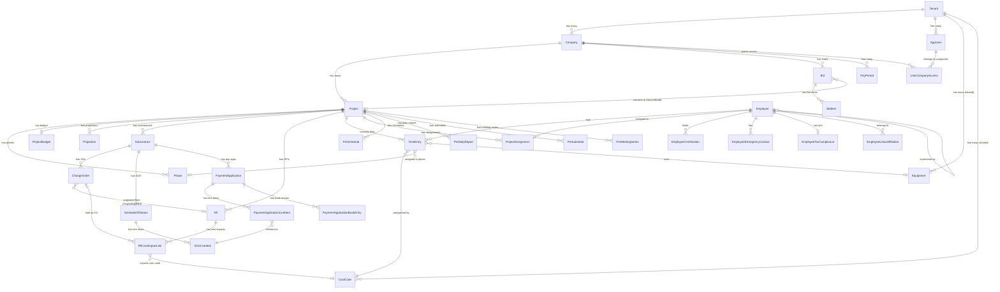
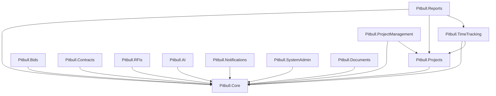
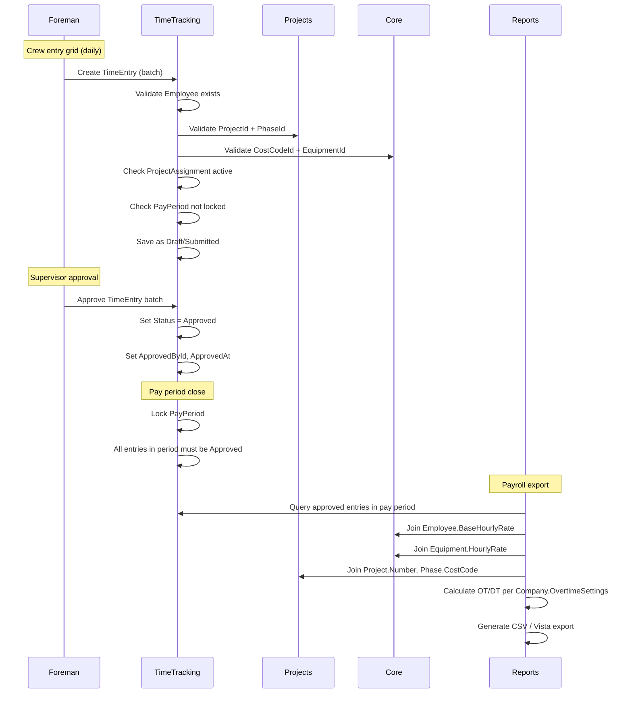
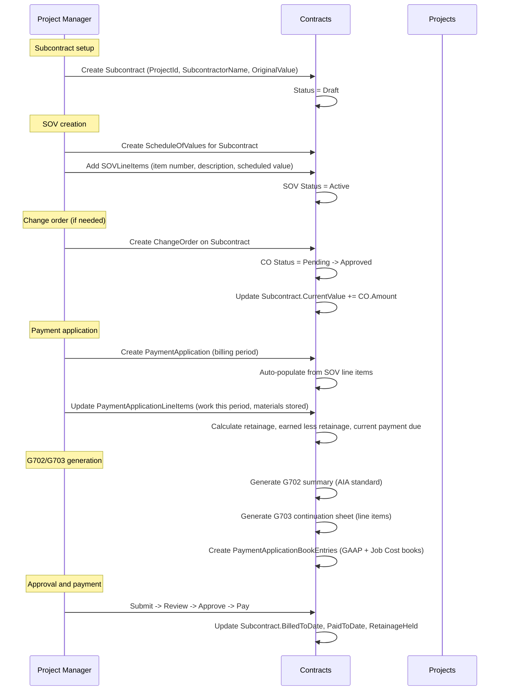
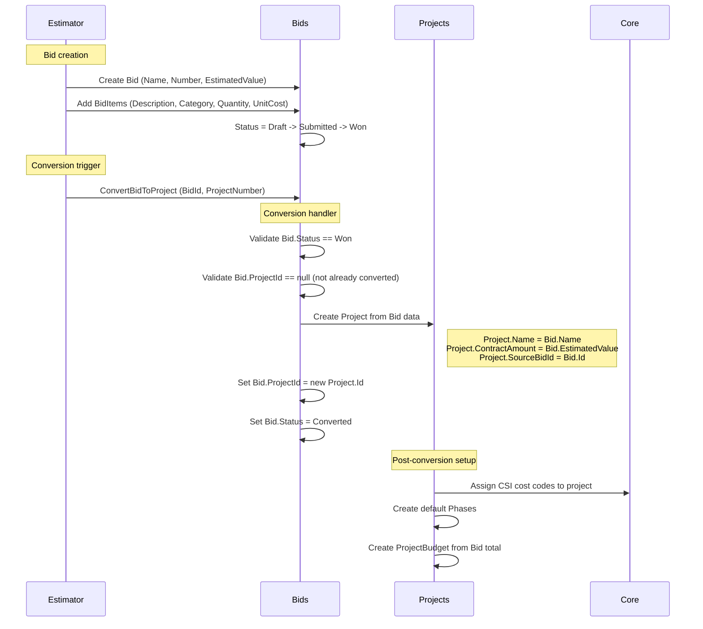
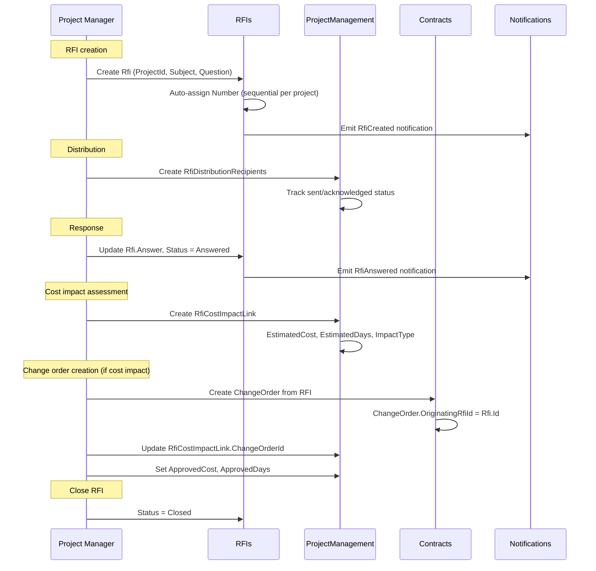
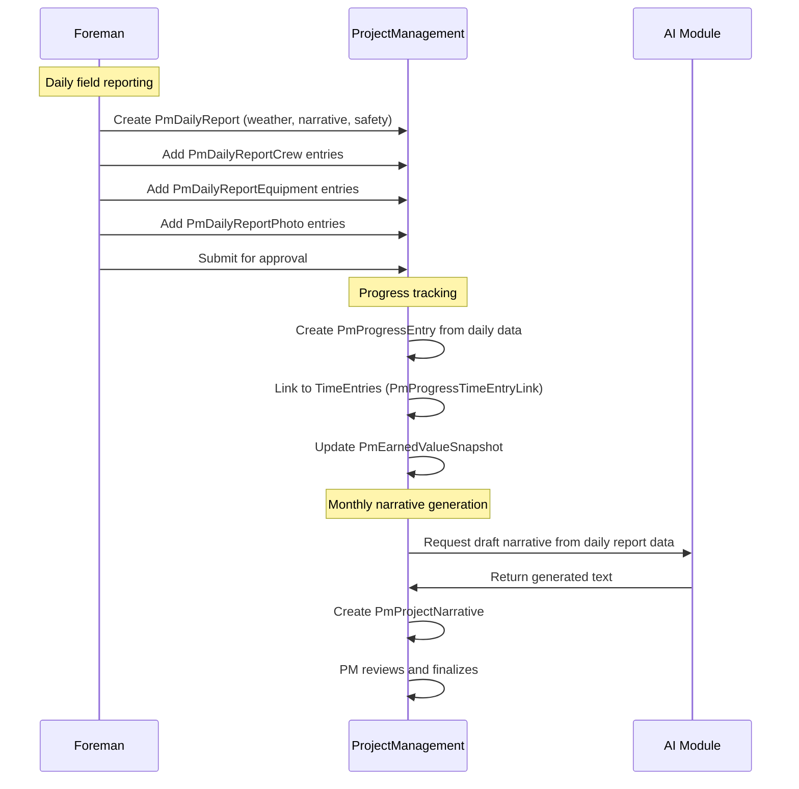
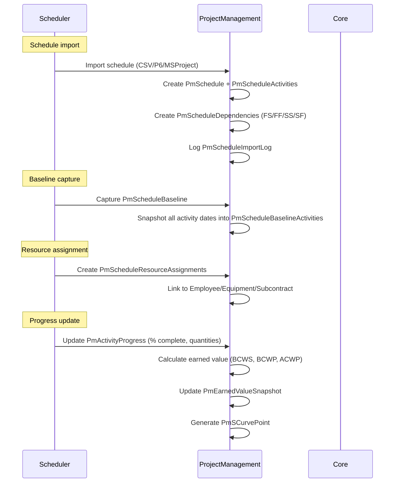
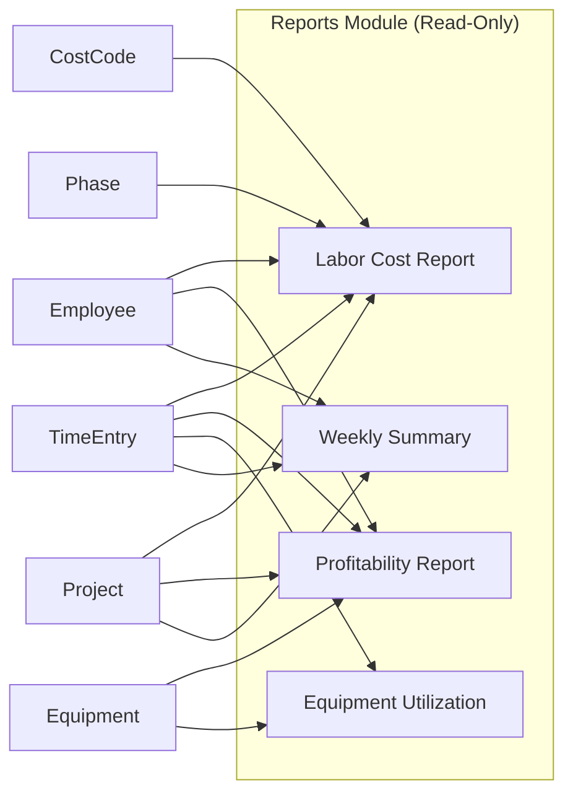
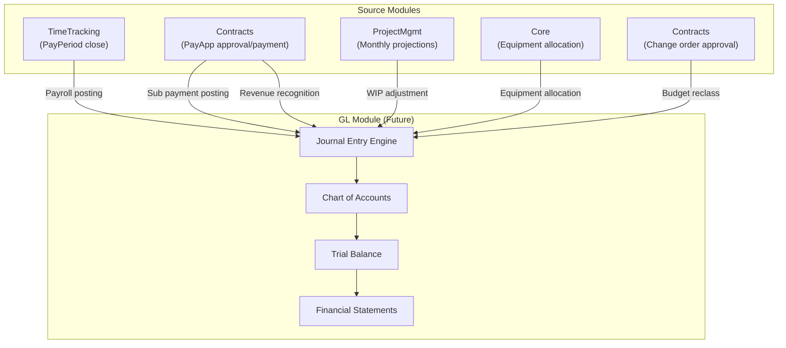

# Data Flow Architecture

> System Architect perspective for Pitbull Construction Solutions
> Last updated: 2026-02-19

This document maps every entity relationship, module dependency, and business workflow
in the Pitbull codebase. It is the single source of truth for understanding how data
moves from tenant provisioning through financial close.

---

## Table of Contents

1. [Entity Dependency Graph](#1-entity-dependency-graph)
2. [Module Dependency Matrix](#2-module-dependency-matrix)
3. [Data Flow Chains](#3-data-flow-chains)
4. [Cross-Module Data Contracts](#4-cross-module-data-contracts)
5. [The Chicken-and-Egg Problems](#5-the-chicken-and-egg-problems)
6. [Future: GL Integration Points](#6-future-gl-integration-points)

---

## 1. Entity Dependency Graph

### 1.1 Isolation Hierarchy

Every piece of data flows through a three-layer isolation hierarchy:

```
Tenant (RLS + global query filter)
  -> Company (ICompanyScoped filter, or tenant-wide for shared entities)
    -> User / Employee (RBAC + row-level ownership)
```

**Tenant** is the root. It does not extend `BaseEntity`; it is the container for everything.
**Company** extends `BaseEntity` and is tenant-scoped. It is the financial/legal entity boundary.
**AppUser** extends ASP.NET `IdentityUser` and is linked to a tenant via FK.

### 1.2 Entity Creation Order (What Depends on What)

#### Tier 0 -- No FK Dependencies (Root Entities)

These can be created with only a TenantId:

| Entity | Module | Scoping | Notes |
|--------|--------|---------|-------|
| `Tenant` | Core | Global | Root container. Not BaseEntity. |
| `AppUser` | Core (Identity) | Tenant | FK to Tenant only. |
| `Company` | Core | Tenant | FK to Tenant only. The financial entity. |
| `Permission` | Core (RBAC) | Tenant | Static seed data. |
| `TenantSettings` | SystemAdmin | Tenant | Feature flags, locale. |
| `ApiKey` | SystemAdmin | Tenant | External integration keys. |
| `AiApiKey` | AI | Tenant | AI provider credentials. |

#### Tier 1 -- Depends on Tier 0

| Entity | Module | Hard Dependencies | Scoping |
|--------|--------|-------------------|---------|
| `UserCompanyAccess` | Core | AppUser, Company | Tenant |
| `Role` | Core (RBAC) | (none beyond tenant) | Tenant |
| `Equipment` | Core | (none beyond tenant) | Tenant (shared across companies) |
| `CostCode` | Core | (none beyond tenant) | Tenant (company-wide standards) |
| `Employee` | TimeTracking | (none beyond tenant) | Tenant (shared, HomeCompanyId optional) |
| `NotificationPreference` | Core | AppUser | Tenant |
| `EmailDigestSetting` | Core | AppUser | Tenant |
| `TeamInvitation` | Core | Company | Tenant |
| `OnboardingChecklist` | Core | AppUser, Company | Tenant |
| `ImportBatch` | Core | (none beyond tenant) | Tenant |

#### Tier 2 -- Depends on Tier 1

| Entity | Module | Hard Dependencies | Scoping |
|--------|--------|-------------------|---------|
| `Project` | Projects | Company | Company |
| `Bid` | Bids | Company | Company |
| `RolePermission` | Core (RBAC) | Role, Permission | Tenant |
| `UserRole` | Core (RBAC) | AppUser, Role | Tenant |
| `PayPeriod` | TimeTracking | Company | Company |
| `EmployeeCertification` | TimeTracking | Employee | Tenant |
| `EmployeeEmergencyContact` | TimeTracking | Employee | Tenant |
| `EmployeeTaxCompliance` | TimeTracking | Employee | Tenant |
| `EmployeeUnionAffiliation` | TimeTracking | Employee | Tenant |
| `Notification` | Notifications | AppUser | Tenant |
| `FileAttachment` | Documents | (polymorphic reference) | Tenant |
| `ComplianceDocument` | Core | (none beyond tenant) | Tenant |

#### Tier 3 -- Depends on Tier 2

| Entity | Module | Hard Dependencies | Scoping |
|--------|--------|-------------------|---------|
| `Phase` | Projects | Project | Company |
| `ProjectBudget` | Projects | Project (1:1) | Company |
| `Projection` | Projects | Project | Company |
| `BidItem` | Bids | Bid | Company |
| `ProjectAssignment` | TimeTracking | Employee, Project | Company |
| `Subcontract` | Contracts | Project (via ProjectId) | Company |
| `Rfi` | RFIs | Project | Company |
| `PmSchedule` | ProjectMgmt | Project | Company |
| `PmDailyReport` | ProjectMgmt | Project | Company |
| `PmMeetingSeries` | ProjectMgmt | Project | Company |
| `PmSubmittal` | ProjectMgmt | Project | Company |
| `PmDocumentFolder` | ProjectMgmt | Project | Company |
| `PmPlanSet` | ProjectMgmt | Project | Company |
| `PmSpecSection` | ProjectMgmt | Project | Company |
| `PmCommunication` | ProjectMgmt | Project | Company |
| `PmJobCostBudget` | ProjectMgmt | Project, CostCode | Company |
| `PmTask` | ProjectMgmt | (Project optional) | Company |
| `PmProjectNarrative` | ProjectMgmt | Project | Company |
| `PmDocument` | ProjectMgmt | Project | Company |
| `PmDocumentTemplate` | ProjectMgmt | (none beyond company) | Company |
| `PmLetterheadConfig` | ProjectMgmt | (none beyond company) | Company |
| `AuditLog` | Core | Tenant (not BaseEntity) | Tenant |

#### Tier 4 -- Depends on Tier 3

| Entity | Module | Hard Dependencies | Scoping |
|--------|--------|-------------------|---------|
| `TimeEntry` | TimeTracking | Employee, Project, CostCode | Company |
| `ChangeOrder` | Contracts | Subcontract | Company |
| `ScheduleOfValues` | Contracts | Subcontract | Tenant |
| `RfiDistributionRecipient` | ProjectMgmt | Rfi | Company |
| `RfiAttachment` | ProjectMgmt | Rfi | Company |
| `RfiCostImpactLink` | ProjectMgmt | Rfi (CO optional) | Company |
| `PmScheduleActivity` | ProjectMgmt | Schedule, Project | Company |
| `PmMeeting` | ProjectMgmt | Project (Series optional) | Company |
| `PmDailyReportCrew` | ProjectMgmt | DailyReport | Company |
| `PmDailyReportEquipment` | ProjectMgmt | DailyReport | Company |
| `PmMonthlyProjection` | ProjectMgmt | Project | Company |
| `PmJobCostActual` | ProjectMgmt | Project, CostCode | Company |
| `PmJobCostCommitment` | ProjectMgmt | Project, CostCode | Company |
| `PmEarnedValueSnapshot` | ProjectMgmt | Project | Company |

#### Tier 5 -- Depends on Tier 4

| Entity | Module | Hard Dependencies | Scoping |
|--------|--------|-------------------|---------|
| `SOVLineItem` | Contracts | ScheduleOfValues | Tenant |
| `PaymentApplication` | Contracts | Subcontract (SOV optional) | Company |
| `PmScheduleDependency` | ProjectMgmt | Schedule, Activities (x2) | Company |
| `PmScheduleBaseline` | ProjectMgmt | Schedule, Project | Company |
| `PmActivityProgress` | ProjectMgmt | ProgressEntry, Activity | Company |
| `PmProgressTimeEntryLink` | ProjectMgmt | ProgressEntry, TimeEntry | Company |

#### Tier 6 -- Depends on Tier 5

| Entity | Module | Hard Dependencies | Scoping |
|--------|--------|-------------------|---------|
| `PaymentApplicationLineItem` | Contracts | PaymentApplication, SOVLineItem | Company |
| `PaymentApplicationBookEntry` | Contracts | PaymentApplication | Company |

### 1.3 Full Entity Relationship Diagram



### 1.4 Optional vs Required Dependencies

**Required (FK enforced, creation blocks without parent):**

| Child Entity | Required Parent | Constraint |
|-------------|----------------|------------|
| TimeEntry | Employee | FK_time_entries_employees |
| TimeEntry | Project | FK_time_entries_projects |
| TimeEntry | CostCode | FK_time_entries_cost_codes |
| Phase | Project | CASCADE delete |
| ProjectBudget | Project | CASCADE delete (1:1) |
| BidItem | Bid | CASCADE delete |
| Subcontract | Project | ProjectId indexed |
| ChangeOrder | Subcontract | CASCADE delete |
| ScheduleOfValues | Subcontract | CASCADE delete |
| SOVLineItem | ScheduleOfValues | CASCADE delete |
| PaymentApplication | Subcontract | CASCADE delete |
| PaymentApplicationLineItem | PaymentApplication | CASCADE delete |
| PaymentApplicationLineItem | SOVLineItem | RESTRICT delete |
| Rfi | Project | ProjectId indexed |

**Optional (enhance but do not block):**

| Child Entity | Optional Parent | Purpose |
|-------------|----------------|---------|
| TimeEntry | Phase | Phase-level labor breakdown |
| TimeEntry | Equipment | Equipment cost allocation |
| Project | SourceBidId | Traceability to originating bid |
| Project | ProjectManagerId | PM assignment |
| Project | SuperintendentId | Super assignment |
| Employee | SupervisorId | Approval chain |
| Employee | HomeCompanyId | Payroll company |
| ChangeOrder | OriginatingRfiId | RFI-to-CO traceability |
| PaymentApplication | ScheduleOfValuesId | G703 line-item billing |
| RfiCostImpactLink | ChangeOrderId | Cost impact tracking |
| PmScheduleActivity | CostCodeId | Schedule-to-cost linking |
| PmScheduleActivity | PhaseId | Schedule-to-phase linking |

---

## 2. Module Dependency Matrix

### 2.1 Compile-Time Dependencies (Project References)

These are actual .csproj references. All modules depend on `Pitbull.Core`.



### 2.2 Full Dependency Matrix

| Module (Row depends on Column) | Core | Projects | Bids | TimeTracking | Contracts | RFIs | Reports | ProjectMgmt | AI | Notifications | SystemAdmin | Documents |
|-------------------------------|------|----------|------|-------------|-----------|------|---------|-------------|-----|--------------|-------------|-----------|
| **Core** | -- | | | | | | | | | | | |
| **Projects** | HARD | -- | | | | | | | | | | |
| **Bids** | HARD | soft | -- | | | | | | | | | |
| **TimeTracking** | HARD | HARD | | -- | | | | | | | | |
| **Contracts** | HARD | soft | | | -- | | | | | | | |
| **RFIs** | HARD | soft | | | | -- | | | | | | |
| **Reports** | HARD | HARD | | HARD | | | -- | | | | | |
| **ProjectMgmt** | HARD | HARD | | soft | soft | soft | | -- | | | | |
| **AI** | HARD | | | | | | | | -- | | | |
| **Notifications** | HARD | | | | | | | | | -- | | |
| **SystemAdmin** | HARD | | | | | | | | | | -- | |
| **Documents** | HARD | | | | | | | | | | | -- |

**HARD** = Compile-time project reference. The module directly uses types from the dependency.
**soft** = Runtime data dependency. The module queries tables owned by another module via `PitbullDbContext` (shared DbContext pattern), but does not have a compile-time project reference. The FK relationship is enforced at the database level.

### 2.3 What Each Module Needs from Others

| Consumer | Provider | Data Needed | Access Method |
|----------|----------|-------------|---------------|
| TimeTracking | Projects | `Project`, `Phase` entities for FK on TimeEntry | Direct EF navigation (Project reference) |
| TimeTracking | Core | `CostCode`, `Equipment` for FK on TimeEntry | Direct EF navigation |
| Contracts | Core | Company settings (retainage defaults) | `PitbullDbContext.Companies` |
| Contracts | Projects | ProjectId on Subcontract (soft FK) | Guid FK, no navigation property |
| Bids | Projects | Creates Project during bid conversion | Direct `db.Set<Project>()` |
| RFIs | Projects | ProjectId on Rfi (soft FK) | Guid FK, no navigation property |
| Reports | TimeTracking | `TimeEntry`, `Employee` for labor reports | Direct EF query with navigation |
| Reports | Projects | `Project` for profitability reports | Direct EF query |
| Reports | Core | `Equipment` for utilization reports | Direct EF query |
| ProjectMgmt | Projects | ProjectId on all PM entities | Guid FK |
| ProjectMgmt | Core | CostCode, Equipment references | Guid FK |
| ProjectMgmt | RFIs | RfiId on distribution/attachment entities | Guid FK |
| ProjectMgmt | Contracts | SubcontractId on resource assignments | Guid FK |
| ProjectMgmt | TimeTracking | TimeEntryId on progress links | Guid FK |
| Notifications | All | Polymorphic `RelatedEntityType`/`RelatedEntityId` | String-based type reference |
| AI | All | Reads any entity for smart field context | `PitbullDbContext` |

### 2.4 Domain Events (Current and Planned)

The system uses MediatR `INotification` for domain events dispatched via `BaseEntity.AddDomainEvent()`.
Events are dispatched in `SaveChangesAsync` after the database commit.

| Event (Current/Planned) | Emitted By | Consumed By | Purpose |
|------------------------|------------|-------------|---------|
| TimeEntrySubmitted | TimeTracking | Notifications | Notify supervisor of pending approval |
| TimeEntryApproved | TimeTracking | Notifications | Notify employee of approval |
| TimeEntryRejected | TimeTracking | Notifications | Notify employee with rejection reason |
| RfiCreated | RFIs | Notifications | Notify assignee |
| RfiAnswered | RFIs | Notifications | Notify originator |
| ChangeOrderCreated | Contracts | Notifications, ProjectMgmt | Update project budget, notify PM |
| PayAppSubmitted | Contracts | Notifications | Notify reviewer |
| PayPeriodLocked | TimeTracking | Reports | Trigger payroll export availability |
| BidConverted | Bids | Notifications | Notify team of new project |
| *OverdueRfi* | *RFIs (planned)* | *Notifications* | *Escalation notification* |

---

## 3. Data Flow Chains

### 3.1 Workflow 1: Time Entry to Payroll Export

This is the most frequently executed workflow in the system. Every field worker
generates time entries daily.



**Data chain:**

```
Employee (Tier 1)
  + Project (Tier 2) via ProjectAssignment (Tier 3)
    + CostCode (Tier 1) + Phase (Tier 3, optional) + Equipment (Tier 1, optional)
      -> TimeEntry (Tier 4)
        -> Approval (status change on TimeEntry)
          -> PayPeriod.Lock (Tier 2)
            -> Report query (Reports module)
              -> CSV / Vista export
```

**Key constraints:**
- TimeEntry requires: EmployeeId (NOT NULL), ProjectId (NOT NULL), CostCodeId (NOT NULL)
- Employee must have an active ProjectAssignment for the target project
- PayPeriod must be Open (not Locked/Closed) to accept new entries
- Unique constraint: `(Date, EmployeeId, ProjectId, CostCodeId, PhaseId)` per day
- Company.OvertimeSettings controls OT calculation (daily 8h, weekly 40h, California rules)

### 3.2 Workflow 2: Subcontract to Payment Application (AIA G702/G703)

This is the financial workflow for paying subcontractors.



**Data chain:**

```
Project (Tier 2)
  -> Subcontract (Tier 3)
    -> ScheduleOfValues (Tier 4)
      -> SOVLineItem (Tier 5)
    -> ChangeOrder (Tier 4, optional)
    -> PaymentApplication (Tier 5)
      -> PaymentApplicationLineItem (Tier 6) <-> SOVLineItem (FK)
      -> PaymentApplicationBookEntry (Tier 6)
```

**Key constraints:**
- Subcontract requires ProjectId
- SOV requires SubcontractId
- PayApp requires SubcontractId, optionally ScheduleOfValuesId
- PayAppLineItem has dual FK: PaymentApplicationId + SOVLineItemId (RESTRICT delete on SOV)
- G702/G703 calculations are period-cumulative (previous + this period)
- BookEntries track GAAP vs Job Cost books separately (dual-book accounting)
- Retainage defaults from Company.PaymentApplicationSettings.DefaultRetainagePercent

### 3.3 Workflow 3: Bid to Project Conversion

This is the sales-to-operations handoff.



**Data chain:**

```
Bid (Tier 2) + BidItems (Tier 3)
  -> ConvertBidToProject command
    -> Project (Tier 2, new) + ProjectBudget (Tier 3, new)
      -> Bid.ProjectId updated (bidirectional link)
        -> CostCodes assigned from company standards
          -> Phases created from bid categories
```

**Key constraints:**
- Bid must be in `Won` status to convert
- Bid can only be converted once (ProjectId must be null)
- ConvertBidToProjectCommand requires a unique ProjectNumber
- After conversion, Bid.Status becomes `Converted`
- Project.SourceBidId provides forward traceability

### 3.4 Workflow 4: RFI Lifecycle with Cost Impact

RFIs drive change orders when they reveal scope gaps.



**Data chain:**

```
Project (Tier 2)
  -> Rfi (Tier 3)
    -> RfiDistributionRecipient (Tier 4)
    -> RfiAttachment (Tier 4)
    -> RfiCostImpactLink (Tier 4)
      -> ChangeOrder (Tier 4, cross-module link via OriginatingRfiId)
        -> Subcontract.CurrentValue updated
          -> SOV adjusted for next PaymentApplication
```

**Key constraints:**
- Rfi requires ProjectId
- RFI number is unique per (TenantId, ProjectId)
- ChangeOrder.OriginatingRfiId is optional (not all COs come from RFIs)
- RfiCostImpactLink bridges RFI and Contracts modules
- Cost impact can exist without a change order (estimated vs approved)

### 3.5 Workflow 5: Daily Report to Project Narrative

Field data flows up to executive reporting.



**Data chain:**

```
PmDailyReport (Tier 3)
  -> PmDailyReportCrew + Equipment + Photos (Tier 4)
    -> PmProgressEntry (Tier 4)
      -> PmProgressTimeEntryLink (Tier 5) <-> TimeEntry
      -> PmEarnedValueSnapshot (Tier 4)
        -> PmMonthlyProjection (Tier 4)
          -> PmProjectNarrative (Tier 3)
```

### 3.6 Workflow 6: Schedule Management with Earned Value



---

## 4. Cross-Module Data Contracts

### 4.1 Core Exports

Core is the shared kernel. It exports foundational types consumed by every module.

| Export | Type | Consumers | Notes |
|--------|------|-----------|-------|
| `TenantId` (via ITenantContext) | Guid | All modules | Set by TenantMiddleware from JWT |
| `CompanyId` (via ICompanyContext) | Guid | All ICompanyScoped entities | Set by CompanyMiddleware from header/JWT |
| `BaseEntity` | Abstract class | All entity types | TenantId, audit fields, soft delete |
| `ICompanyScoped` | Interface | Company-scoped entities | Adds CompanyId + query filter |
| `Company` | Entity | All modules for settings | Owns TimecardSettings, OvertimeSettings, PaymentApplicationSettings, etc. |
| `CostCode` | Entity | TimeTracking, Projects, ProjectMgmt | Job cost categorization |
| `Equipment` | Entity | TimeTracking, Reports, ProjectMgmt | Equipment tracking, hourly rates |
| `AppUser` | Entity (Identity) | All modules for user references | Auth, ownership, audit |
| `Result<T>` | CQRS type | All handlers | Standard success/failure wrapper |
| `ICommand<T>` / `IQuery<T>` | CQRS interfaces | All handlers | MediatR request types |
| `ValidationBehavior` | Pipeline behavior | All handlers | FluentValidation integration |
| `IDomainEvent` | Interface | All modules | MediatR notification for events |
| `AuditLog` | Entity | SystemAdmin (writes), all (generates) | Immutable audit trail |

### 4.2 Projects Exports

| Export | Type | Consumers | Notes |
|--------|------|-----------|-------|
| `Project` | Entity | TimeTracking, Contracts, RFIs, Reports, ProjectMgmt, Bids | The central hub entity |
| `Phase` | Entity | TimeTracking (optional FK on TimeEntry) | Phase-level labor breakdown |
| `ProjectBudget` | Entity | ProjectMgmt (job cost calculations) | Financial summary |
| `ProjectStatus` | Enum | Bids (set on conversion), all UIs | Status workflow |
| `Projection` | Entity | ProjectMgmt | Cash flow forecasting |

### 4.3 TimeTracking Exports

| Export | Type | Consumers | Notes |
|--------|------|-----------|-------|
| `Employee` | Entity | Reports (joins for rates), ProjectMgmt (resource assignments) | Employee master data |
| `TimeEntry` | Entity | Reports (labor cost calc), ProjectMgmt (progress links) | The core labor record |
| `TimeEntryStatus` | Enum | Reports (filter to Approved), Notifications (status events) | Approval workflow |
| `PayPeriod` | Entity | Reports (export boundary) | Payroll period lock |
| `ProjectAssignment` | Entity | TimeTracking internal | Controls who can log where |

### 4.4 Contracts Exports

| Export | Type | Consumers | Notes |
|--------|------|-----------|-------|
| `Subcontract` | Entity | ProjectMgmt (resource assignments, commitments) | Sub agreement |
| `ChangeOrder` | Entity | ProjectMgmt (RFI cost impact links), RFIs (OriginatingRfiId) | Scope/value modifications |
| `PaymentApplication` | Entity | (self-contained within Contracts) | G702/G703 billing |
| `ScheduleOfValues` | Entity | (self-contained within Contracts) | SOV billing breakdown |

### 4.5 RFIs Exports

| Export | Type | Consumers | Notes |
|--------|------|-----------|-------|
| `Rfi` | Entity | ProjectMgmt (distribution, attachments, cost impact) | Formal information requests |
| `RfiStatus` | Enum | Notifications (overdue detection) | Lifecycle tracking |

### 4.6 Reports Consumes (Read-Only Aggregation)

Reports has no exports. It is a pure consumer that reads across modules:



### 4.7 Infrastructure Layer Contracts

| Service | Interface | Used By | Notes |
|---------|-----------|---------|-------|
| Email (Resend) | `IEmailService` | Notifications, SystemAdmin (invitations) | Transactional email delivery |
| Storage | `IStorageService` | Documents, ProjectMgmt (attachments) | File upload/download |
| Messaging (CAP) | `IEventBus` | All modules (planned) | Cross-module event bus |

---

## 5. The Chicken-and-Egg Problems

### 5.1 Entering Time Without Projects

**Problem:** TimeEntry requires ProjectId (NOT NULL FK). Cannot log time without at least one project.

**Resolution:** The onboarding flow creates a company with a default "Overhead" or "General" project
during initial setup. The `SeedDataController` provides standard CSI cost codes and a starter project.
Company.TimecardSettings.DefaultProjectId points to this fallback project.

**Rule:** Minimum viable time tracking requires:
1. One Company (created at registration)
2. One Project (created during onboarding or seed)
3. One Employee (created from user profile)
4. One CostCode (seeded from CSI standards)

### 5.2 Running Payroll Without Approved Time

**Problem:** PayPeriod cannot close if entries are unapproved. But entries require supervisor approval,
and some crews may not have supervisors set up yet.

**Resolution:**
- Company admins can approve any time entry (RBAC permission: `timeentry.approve`)
- The foreman who submits via crew entry grid is recorded as `SubmittedById`
- In the absence of a supervisor chain, the admin user who created the employee can approve
- PayPeriod.Lock validates all entries in the period are Approved status
- Rejected entries must be corrected and re-approved before period close

**Rule:** Cannot lock a pay period while any TimeEntry in the period has Status != Approved.

### 5.3 Billing Projects Without Employee Time (SOV Billing)

**Problem:** Payment applications are subcontractor billing, not labor-based. SOV billing measures
percent complete on scheduled line items, not employee hours worked.

**Resolution:** There is no conflict. The Contracts module operates independently of TimeTracking:

```
Subcontract -> SOV -> PaymentApplication (independent of TimeEntry)
TimeEntry -> Reports (independent of PaymentApplication)
```

These are parallel financial streams:
- **Labor cost (TimeTracking):** Employee hours x rate = internal cost
- **Sub billing (Contracts):** SOV progress x scheduled value = subcontractor payment
- **Job costing (ProjectMgmt):** Combines both streams via PmJobCostActual

### 5.4 Paying Subs Without Vendor Records

**Problem:** Subcontract stores vendor info as denormalized strings (SubcontractorName, SubcontractorEmail, etc.)
rather than a separate Vendor entity. No vendor master table exists.

**Resolution:** This is intentional for the current architecture. Subcontract IS the vendor record
for the scope of that contract. Benefits:
- No vendor master to maintain
- Each subcontract captures the vendor details at the time of execution
- Different contacts per subcontract (field super vs accounts payable)

**Future consideration:** When the Portal module ships, a Vendor entity may be introduced.
The migration path would be:
1. Create `vendors` table
2. Add `VendorId` nullable FK to Subcontract
3. Backfill from unique SubcontractorName values
4. Make VendorId required in a later migration

### 5.5 Job Costing Without Cost Codes

**Problem:** TimeEntry requires CostCodeId (NOT NULL). CostCodes must exist before any time can be logged.

**Resolution:** The `SeedDataController` provides a full CSI MasterFormat seed:
- 16 standard CSI divisions (01 through 49)
- Each division has standard subdivision codes
- CostCode.IsCompanyStandard = true for seeded codes
- Companies can add custom codes (IsCompanyStandard = false)

**Rule:** Every tenant must seed cost codes during onboarding. The onboarding checklist tracks this step.

### 5.6 Schedules Without Activities

**Problem:** PmSchedule is a container; it is useless without PmScheduleActivities.

**Resolution:** Schedule import (CSV, P6 XML, MS Project) is the primary creation path.
The import creates both the PmSchedule and all PmScheduleActivities atomically.
Manual activity creation is also supported but is a secondary path.

### 5.7 RFI Cost Impact Without Change Orders

**Problem:** An RFI may identify a cost impact before a formal change order is created.

**Resolution:** `RfiCostImpactLink.ChangeOrderId` is nullable. The workflow is:
1. RFI created, cost impact estimated (`EstimatedCost`, `EstimatedDays`)
2. ChangeOrder created later from the RFI
3. RfiCostImpactLink updated with `ChangeOrderId` and `ApprovedCost`/`ApprovedDays`

The estimated-to-approved gap is a feature, not a bug. PMs track this variance.

---

## 6. Future: GL Integration Points

### 6.1 Journal Entry Creation Points

When the General Ledger module is built, it will consume financial events from
existing modules and create journal entries. The GL module will be a pure consumer,
similar to Reports.



### 6.2 Payroll Posting (Labor Distribution)

**Trigger:** PayPeriod status changes to Closed
**Source data:** Approved TimeEntries in the period
**Journal entries per employee per project per cost code:**

| Account | Debit | Credit |
|---------|-------|--------|
| Direct Labor (Project.CostCode) | Hours x Rate | |
| Accrued Payroll | | Hours x Rate |
| OT Premium (if OT) | OT Hours x 0.5 x Rate | |
| Accrued Payroll | | OT Premium |

**GL account mapping:**
- Project + CostCode + CostType.Labor -> Direct Labor GL account
- Company payroll clearing account -> Credit side
- OT premium allocated to same project cost code

### 6.3 Payment Application Posting (Sub Payment)

**Trigger:** PaymentApplication status changes to Approved or Paid
**Source data:** PaymentApplication amounts, PaymentApplicationBookEntries

**On Approval (accrue liability):**

| Account | Debit | Credit |
|---------|-------|--------|
| Subcontract Expense (Project.CostCode) | WorkCompletedThisPeriod | |
| Accounts Payable - Retainage | | RetainageThisPeriod |
| Accounts Payable - Sub | | CurrentPaymentDue |

**On Payment:**

| Account | Debit | Credit |
|---------|-------|--------|
| Accounts Payable - Sub | PaidAmount | |
| Cash | | PaidAmount |

### 6.4 Revenue Recognition (Owner Billing)

**Trigger:** Monthly close or PmMonthlyProjection finalization
**Source data:** PmMonthlyProjection, PaymentApplicationBookEntries (GAAP book)
**Method:** Percentage of completion (ASC 606 / construction standard)

| Account | Debit | Credit |
|---------|-------|--------|
| Accounts Receivable | CurrentPeriodBilling | |
| Billings in Excess / CIE | (adjustment) | |
| Revenue | | CurrentPeriodRevenue |

**The GAAP vs Job Cost dual-book in PaymentApplicationBookEntry directly feeds this:**
- GAAP book -> Financial statement revenue recognition
- Job Cost book -> Internal profitability tracking

### 6.5 Equipment Allocation

**Trigger:** PayPeriod close (same as payroll)
**Source data:** TimeEntry.EquipmentId + EquipmentHours + Equipment.HourlyRate

| Account | Debit | Credit |
|---------|-------|--------|
| Equipment Expense (Project.CostCode) | Hours x HourlyRate | |
| Equipment Clearing | | Hours x HourlyRate |

**Note:** Equipment.BillingRate (if set) may differ from HourlyRate for T&M contracts.
The internal cost uses HourlyRate; client billing uses BillingRate.

### 6.6 Change Order Impact

**Trigger:** ChangeOrder status changes to Approved
**Source data:** ChangeOrder.Amount, Subcontract.ProjectId

**Journal entries:**

| Account | Debit | Credit |
|---------|-------|--------|
| Committed Cost (Project.CostCode) | CO Amount (if positive) | |
| Subcontract Commitment | | CO Amount (if positive) |

**Budget impact:** ProjectBudget.ApprovedChangeOrders += ChangeOrder.Amount
**Forecast impact:** PmJobCostForecast.EstimatedFinalCost recalculated

### 6.7 GL Integration Architecture

The GL module should follow the established patterns:

```
src/Modules/Pitbull.GL/
  Domain/
    ChartOfAccount.cs          # GL account master
    JournalEntry.cs            # Header entity
    JournalEntryLine.cs        # Debit/credit lines
    FiscalPeriod.cs            # Monthly close tracking
    AccountMapping.cs          # CostCode -> GL Account rules
  Features/
    PostPayroll/               # Consumes PayPeriod close
    PostSubPayment/            # Consumes PayApp approval/payment
    PostRevenueRecognition/    # Consumes monthly projection
    PostEquipmentAllocation/   # Consumes time entries with equipment
    GenerateTrialBalance/      # Aggregation query
  Data/
    GLConfigurations.cs
```

**Key design decisions for GL:**
- GL module depends on Core, Projects, TimeTracking, Contracts (compile-time)
- All postings are idempotent (can re-run without duplication)
- Journal entries reference source via `SourceType` + `SourceReferenceId` (polymorphic)
- Account mappings are per-Company (different companies may have different chart of accounts)
- FiscalPeriod uses Company.FiscalYearStartMonth for period boundaries
- Vista/Viewpoint export format is already partially implemented in Reports module

---

## Appendix A: Database Table to Module Mapping

| Table Name | Entity | Module | Scoping |
|-----------|--------|--------|---------|
| `tenants` | Tenant | Core | Global |
| `users` | AppUser | Core (Identity) | Tenant |
| `companies` | Company | Core | Tenant |
| `user_company_access` | UserCompanyAccess | Core | Tenant |
| `rbac_roles` | Role | Core | Tenant |
| `rbac_permissions` | Permission | Core | Tenant |
| `rbac_role_permissions` | RolePermission | Core | Tenant |
| `rbac_user_roles` | UserRole | Core | Tenant |
| `cost_codes` | CostCode | Core | Tenant |
| `equipment` | Equipment | Core | Tenant |
| `notification_preferences` | NotificationPreference | Core | Tenant |
| `team_invitations` | TeamInvitation | Core | Tenant |
| `onboarding_checklists` | OnboardingChecklist | Core | Tenant |
| `compliance_documents` | ComplianceDocument | Core | Tenant |
| `import_batches` | ImportBatch | Core | Tenant |
| `audit_logs` | AuditLog | Core | Tenant |
| `projects` | Project | Projects | Company |
| `project_phases` | Phase | Projects | Company |
| `project_budgets` | ProjectBudget | Projects | Company |
| `project_projections` | Projection | Projects | Company |
| `bids` | Bid | Bids | Company |
| `bid_items` | BidItem | Bids | Company |
| `employees` | Employee | TimeTracking | Tenant |
| `time_entries` | TimeEntry | TimeTracking | Company |
| `project_assignments` | ProjectAssignment | TimeTracking | Company |
| `pay_periods` | PayPeriod | TimeTracking | Company |
| `subcontracts` | Subcontract | Contracts | Company |
| `change_orders` | ChangeOrder | Contracts | Company |
| `schedule_of_values` | ScheduleOfValues | Contracts | Tenant |
| `sov_line_items` | SOVLineItem | Contracts | Tenant |
| `payment_applications` | PaymentApplication | Contracts | Company |
| `payment_application_line_items` | PaymentApplicationLineItem | Contracts | Company |
| `payment_application_book_entries` | PaymentApplicationBookEntry | Contracts | Company |
| `rfis` | Rfi | RFIs | Company |
| `file_attachments` | FileAttachment | Documents | Tenant |
| `notifications` | Notification | Notifications | Tenant |
| `api_keys` | ApiKey | SystemAdmin | Tenant |
| `tenant_settings` | TenantSettings | SystemAdmin | Tenant |
| `ai_api_keys` | AiApiKey | AI | Tenant |

Plus 40+ ProjectManagement tables (pm_schedules, pm_daily_reports, pm_submittals, etc.)
all Company-scoped.

## Appendix B: Entity Count by Module

| Module | Entity Count | Company-Scoped | Tenant-Scoped |
|--------|-------------|---------------|---------------|
| Core | 16 | 0 | 16 |
| Projects | 4 | 4 | 0 |
| Bids | 2 | 2 | 0 |
| TimeTracking | 8 | 3 | 5 |
| Contracts | 7 | 4 | 3 |
| RFIs | 1 | 1 | 0 |
| ProjectManagement | 38 | 38 | 0 |
| Documents | 1 | 0 | 1 |
| Notifications | 1 | 0 | 1 |
| SystemAdmin | 2 | 0 | 2 |
| AI | 1 | 0 | 1 |
| **Total** | **81** | **52** | **29** |
